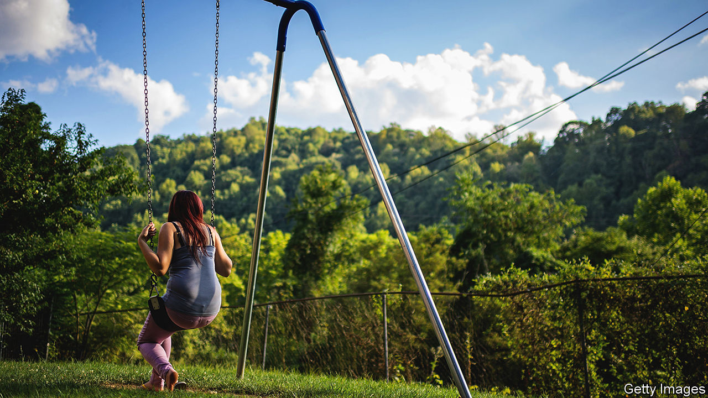

###### Relative safety

# For foster children, relatives can make all the difference 

##### America’s care system should strive harder to keep more children with their families 

 

> Jun 9th 2022 

Daniel kelly, an assistant professor of stem education at Texas Tech University, spent nearly two years in a care home as a teenager. When he was 17 his grandmother, who had long sought custody, took him in. She made sure he finished school and helped him start a business and buy his first house. “If she had not interceded, there is no way I would be where I am,” he says. “I cannot imagine a scenario in which my outcome would have been promising.”

Among the many ways in which children in care get off to a bad start is in their education. About half do not finish high school. Only 3% get a college degree. Living with a relative, however, especially at the age when a child is moving out of the care system but has not yet finished education, can make a crucial difference.

Research shows that children who have been removed from their parents but brought up by relatives do better in myriad other ways. They are less likely to have a criminal record or become homeless (as more than a quarter of those who have been in foster care or institutions do). Research also suggests why that might be so. Relatives are less likely than foster parents to request that poorly behaved children be removed. And they are more likely to take in groups of siblings, who are routinely separated in the care system.

About 424,000 children are in care in America, most of them with foster parents. Because demand for foster parents exceeds supply in many places, recruitment and vetting can be inadequate. Too many children end up in group homes, meant as a stopgap, for the long term.

A growing awareness that family placements are preferable has prompted federal and state laws which say they should be prioritised. Yet it does not happen enough. Casey Family Programmes, a charity that works to reduce the need for foster care in America, says nearly a third of children removed from the care of their parents are placed with relatives. But in a handful of states, fewer than 10% are placed with family. Why does it not happen more?

Grandmother knows best

The first problem concerns the way “kinship” care is regulated. If the arrangement is not formalised in some way, relatives cannot access the funding and other support given to foster parents. The majority of children who are taken into care come from low-income families, which helps to explain why black children make up 14% of the child population but 23% of the foster-care population.

One solution is to make it easier for relatives to become licensed as foster parents. This can be an onerous process, some parts of which make little sense when applied to relatives. A requirement to provide a certain amount of living space, for example, should not prevent a woman living in a modest two-bedroom flat from taking in her four grandchildren. Such stipulations make it likelier that a child will be separated from siblings and end up with strangers, miles away from each other and from home. Some states now issue provisional licences that allow relatives to take in children while becoming licensed; others have waived some licensing requirements for relatives altogether.

Sixto Cancel, the founder and chief executive of Think of Us, a non-profit group that works with children in care, says even when requirements are loosened many relative-carers are hesitant about becoming licensed foster carers. It puts them at the mercy of a court system that too often makes bad decisions, he says. He cites the example of a grandmother in Texas who had her six grandchildren taken away after a court decided she was unable to cope. After a long court battle she has just got three of them back. It is better, he says, to pay relatives as if they were foster parents without requiring them to become licensed (as happens in some places).

Poverty itself can be a reason why children are removed from their families. America has one of the highest child-poverty rates in the industrialised world. Many people who work with children say it is commonly assumed that a child living in a house in which the electricity has been turned off or the fridge is empty should be removed. It would often be better (and cheaper) to provide financial support, says Mr Sixto, including to those family members who might take a child in. Tracking down relatives and establishing that they are able to look after children takes time and effort. In many cases it also means finding them extra help. 

Mr Sixto has direct experience of this. When he was 11 months old he and his four siblings were removed from their mother and separated from one another. Mr Sixto went through a brief and disastrous adoption, followed by periods of homelessness and foster care. Later, as an adult, he tracked down his mother’s case notes. He reads them often, he says, and sees nothing in them that suggests he and his siblings would not have been better off if they had stayed with her and she had been given “more support and less judgment”.

Yet it was another experience that convinced Mr Sixto that authorities should make greater efforts to find relatives of children who are taken into care. Three years ago he discovered he had several aunts and uncles on his father’s side. He had no idea they existed. They had no idea he existed either (nor did his father). One of his aunts, who lived only 58 miles (93km) away from one of the foster homes in which he had spent several years, had fostered and adopted several children, he learned. She told him she would have done the same for him. ■


