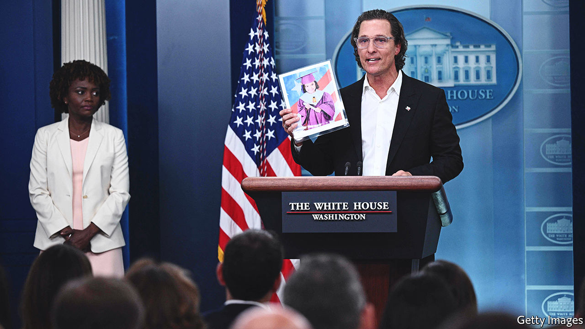

###### High noon in America

# Gun reform finally seems possible, though it’s no silver bullet 

##### A possible gun deal has momentum 

 

> Jun 9th 2022 

When a gunman fatally shot 19 children and two teachers in an elementary school in Uvalde, Texas, 11-year-old Miah Cerrillo covered herself in the blood of a dead classmate and played dead to save herself. On June 8th a House committee watched Miah’s video testimony on what happened. She said she does not feel safe. When asked if she thinks it will happen again, she firmly nodded. Elsewhere in the Capitol, a bipartisan group of senators may be inching closer to a gun-reform deal.

For the first time in years senators from both parties are talking about gun reforms, albeit narrow ones. Chuck Schumer, the Democratic Senate majority leader, wanted a deal by June 10th, but has loosened this timeline at the request of Chris Murphy, a Democratic senator from Connecticut, who is leading the delicate negotiations along with John Cornyn, a Republican senator from Texas. “This moment requires urgency,” says Christian Heyne of Brady, a gun-control group. “The longer we wait, more Americans are dying.” On an average day in America more than 320 people are shot, 111 of them fatally, calculates Brady.

Politicians reacted to past massacres with condemnations of the violence, but did little. After Sandy Hook, a school where 20 six- and seven-year-olds and six adults were killed in 2012, a bill to expand background checks was defeated. Might this time be different? Mr Murphy, no stranger to failed talks, has said: “I’ve never been part of negotiations as serious as these.”

Red-flag laws might be part of the reform. These laws, which are active in 19 states, allow a judge to order the seizure of guns from people deemed a danger to themselves or others. Florida, with a Republican governor and legislature, passed a red-flag law after the mass shooting at Parkland, where 17 were killed at a high school in 2018. Since then judges have issued more than 8,000 gun-seizure orders.

The senators are also said to be considering funding for mental-health care, more security at schools and a possible expansion of background checks, something favoured by a majority of Americans, including most gun-owners. Mr Cornyn wants some juvenile records to be available in the fbi’s background-check system. 

Raising the minimum age for buying an assault weapon from 18 to 21 may prove harder. The gunmen in the recent massacres in Buffalo and Texas were both 18. Florida made it illegal to buy firearms until the age of 21. Florida’s template “is the right one, which is: do some significant mental-health investment, some school-safety money and some modest, but impactful, changes in gun laws,” said Mr Murphy on cnn. “That’s the kind of package I think can pass the Senate.” The sweeping bill passed by the House on June 8th, meanwhile, will probably falter in the Senate.

Modest reforms may not curb the violence plaguing America’s cities—such as the gunfight in Philadelphia on June 4th that left three people dead and 11 others injured. Three-quarters of New Yorkers fear being a victim of violence. That threat may increase if the Supreme Court strikes down a law limiting “open carry” of guns. 

Gabby Giffords, a former congresswoman from Arizona who was shot in the head in 2011, has called on lawmakers to “be bold”. Robin Lloyd of Giffords, the gun-reform group Ms Giffords founded, says if Republican senators who have historically voted against gun-safety legislation did something, even if it was modest, it would be meaningful. On June 7th Matthew McConaughey, a Hollywood actor and gun-owner who was born in Uvalde, made an emotional speech at the White House calling for “gun laws that won’t make it so easy for the bad guys to get these damn guns”. He angrily slammed the podium as he described how the green Converse trainers a ten-year-old Uvalde victim always wore were used to identify her body. 

Hundreds of thousands of people are expected to march in Washington, dc, and more than 450 other cities on June 11th to push for gun-safety laws. The son of Ruth Whitfield, an 86-year-old murdered in the Buffalo mass shooting, also called on Congress to act. “My mother’s life mattered,” he said during a congressional-committee hearing. “Your actions here today will tell us how much it matters to you.” ■


