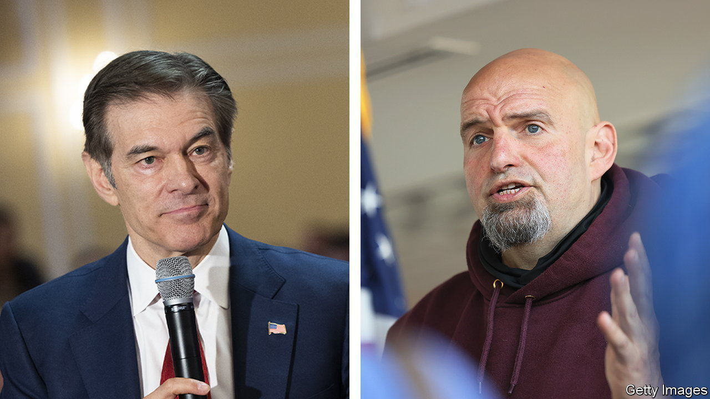

###### The Pennsylvania Senate race

# Mehmet Oz and John Fetterman square off in Pennsylvania 

##### Two unconventional candidates pose risks for the parties’ Senate hopes 

 

> Jun 9th 2022 

Three weeks after a primary election, victorious Senate candidates have typically already logged many miles on the road to make their pitch to the broader electorate. Not so in Pennsylvania, where both candidates have been in limbo. On the Republican side Mehmet Oz, a cardiothoracic surgeon and former television host, finally claimed victory on June 3rd after his principal opponent, David McCormick, conceded amid a recount. The Democratic nominee, the state’s lieutenant-governor, John Fetterman, remains sidelined after suffering a stroke days before the primary. 

The stakes are high. In Pennsylvania Democrats have a rare opportunity to poach a Senate seat (currently held by a retiring Republican) that could enable them to preserve their narrow majority. The race may well decide control of the upper chamber. Both parties have gambled on unorthodox candidates. Despite winning the Republican nomination, Dr Oz remains unloved by the party faithful, and is a political neophyte untested in a general election. And though Democrats adore the hulking Mr Fetterman, his health struggles threaten his campaign. 

Whatever thin political profile Dr Oz had before announcing his candidacy was coloured by his affiliation with left-leaning celebrities like Oprah Winfrey, whose show elevated him to fame. Many Republicans found the former television host’s zeal for conservative causes such as draconian restrictions on abortion hard to believe when, in some cases, he had previously spoken in support of the opposite view. His past advocacy for questionable medical remedies and scant history in the state added to his image as a charlatan. Having reinvented himself once for the primary, Dr Oz must now perform a similar feat in tacking to the centre to woo Pennsylvania’s many independent voters, without alienating conservatives.

He will have the campaign trail to himself for a while as Mr Fetterman continues his recovery. The Democratic nominee’s health concerns have only grown in the public eye. After initially concealing the full details of his stroke, his campaign eventually disclosed that he also had a pre-existing heart condition called cardiomyopathy, which makes it harder for the heart to pump blood. Mr Fetterman claimed that, foolishly, he had been leery of seeing his doctor, despite not feeling well. But the episode calls into question his reputation for candour and strength. He has yet to say when he expects to return.

Pennsylvania lifted Joe Biden to victory in 2020 by just over one percentage point, but the president’s net approval rating in the state is now a dismal -14%, according to Morning Consult. Democrats are betting that Mr Fetterman’s down-to-earth demeanour can lift them. “He challenges traditional notions of what political leaders look like,” says Shawn Rosenberg, of the University of California, Irvine. Mr Fetterman’s first general-election ad aired on the conservative Fox News, a sign of the campaign’s confidence in his broad appeal. But his health troubles, and obfuscation over them, hardly help.

The Senate campaign committees for Republicans and Democrats have pledged $8m and $3m, respectively, in early advertising. Both sides have reasons to be nervous. How well can a celebrity heart surgeon and current heart patient perform? ■


