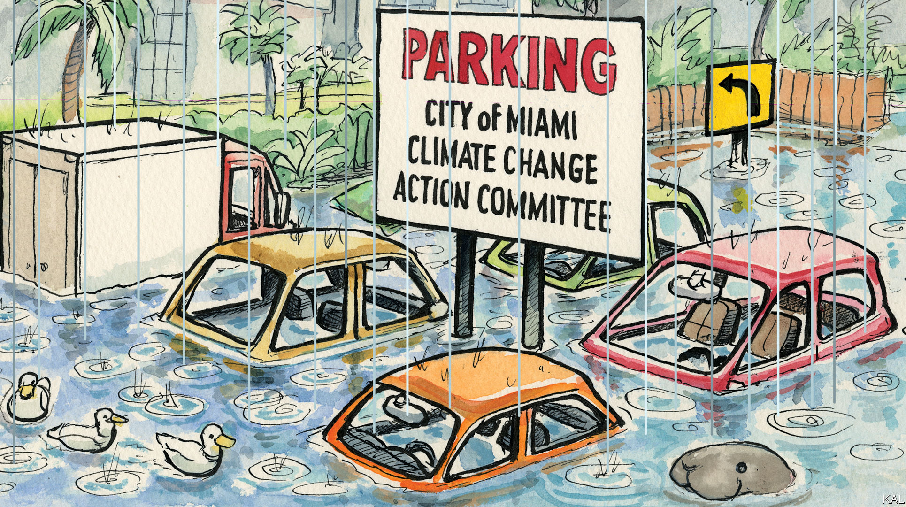

###### Lexington

# Miami’s submarine future 

##### American government is no match for global warming 

 

> Jun 9th 2022 

Even before it started raining, there were puddles by the roadside in the Little River area of Miami. Then the heavens opened and before Lexington’s eyes, on June 3rd, the puddles became pools. It was a timely display of the process his guide was in the middle of explaining. “Sea-level rise, as I was saying, is not our only source of inundation,” Katherine Hagemann, head of climate adaptation for Miami-Dade County, noted drily.

The threat Miami faces from rising sea-level is well-known. The seas off South Florida have risen by almost a foot (30cm) in a century, more than the global average. Parts of Miami are close to sea-level, so prone to flooding at high tide. As the ice sheets melt, another couple of feet of sea-level rise is expected by 2060; perhaps six by 2100. Yet this calamity is only half the city’s problem.

Whenever the water-table rises, groundwater seeps up through the porous limestone on which it sits. This phenomenon, visible as the rain fell in the Little River area, causes additional flooding during the storms that climate change is intensifying. Sure enough, over the next 48 hours, Tropical Storm Alex dropped 11 inches of water on Miami-Dade, a region of 3m people that includes Miami. Its streets turned to rivers, dotted with semi-submerged cars and noxious with run-off from thousands of septic tanks, whose soakaway systems are often below the water-table.

Miami has no answer to this inundation from without and within. A seawall, analogous to the Netherlands’ dykes, could make groundwater flooding worse, by stopping it draining away. The best course is a medley of partial fixes. These would include heavy investment in practical solutions, such as extending the sewer system; long-term planning for higher sea-levels, including a rethinking of building codes and the habitability of parts of Miami; and aggressive steps to mitigate global emissions. Yet none of these is happening to anything like the necessary degree, because of Miami’s third disaster: an American governing system that appears incapable of adapting to climate-induced disasters estimated to cost $2trn a year by the end of the century.

If any city should be able to buck that failure, it is Miami. Loved by the mega-rich, it has a strong tax base and an economy dependent on the threatened real estate. A rational state would scramble to save it. Yet the policy response to its inundations is defined by short-termism, vested interests, inadequate resources, a Hobbesian scrum of federal, state, county and city agencies, and denial.

Starting with the obvious, the Republicans, who have run Florida since 1999, are an impediment to cutting emissions. The previous governor, Rick Scott, was a climate-change denier. The current one, Ron DeSantis, is better on local environmental problems, yet while recently releasing a sea-level plan he dismissed “things like global warming” as a “pretext to do a bunch of left-wing things”.

That encapsulates not merely the right’s lack of seriousness about climate but the anti-government attitude that has driven it to abandon policymaking generally. Brink Lindsey of the Niskanen Centre, a think-tank, identifies this as one of the main drivers of a collapse in state capacity, illustrated, among much else, by America’s inability to build critical infrastructure, including the power plants and transmission lines upon which decarbonisation depends. Such failures do not denote the smaller government Republicans claim to want; they represent terrible government, wrought by their negligence, excessive Democratic faith in regulation, and 1,001 bureaucratic workarounds. It amounts, writes Mr Lindsey, to a “fracturing of government activity into large numbers of overlapping programmes with responsibility divided up, and blurred, across multiple agencies and levels of government.”

He might have had Miami’s response to its watery future in mind. Drive around it with an informed guide and illustrations of administrative chaos and make-and-mend are everywhere. A state-run causeway across Biscayne Bay is being raised in expectation of 0.7 feet of sea-level rise; a county one in expectation of six feet. A mile-long roadway parallel to the bay marks the route of a $4.6bn seawall proposed by the Army Corps of Engineers. It was such a bad idea that the county rejected it—reluctantly, as the feds would have footed two-thirds of the bill, and may not support a better stormwater proposal from a non-federal agency.

Last year Miami-Dade tried to get a grip on the chaos by releasing its own sea-level strategy. Yet the projects it outlines would cost billions, making it dependent on federal and state funds that are only minimally available and can take years to arrive. To eradicate the septic-tank problem would cost $4bn. Miami-Dade has so far been promised $100m of the total, from the feds, via the state.

Not that local government is blameless. The closer to voters government gets, the more it is prey to nimbyism. And because Florida collects most of its tax revenue from property taxes, its pandering to property-owners is especially intense. This might account for the modesty of Miami-Dade’s strategy. An upbeat vision of Floridians working with their watery environment, it had little to say about the probability of four or six feet of sea-level rise and the calamity that would entail for the real-estate market.

Blame the manatees

In the county’s 34 municipalities, such pressures are even fiercer. Last year residents of King’s Bay, a rich neighbourhood, were offered a $2.75m subsidy to swap their leaky septic tanks for sewer linkage. They objected furiously to being asked to make a small contribution to the scheme and blamed faecal pollution of the local canal on manatees defecating in it. The scheme was scrapped. 

The mantra among Miami’s investors is that a solution will be found. America is innovative and Miami one of its jewels. Yet it is also a country whose dysfunction has made it almost incapable of long-term planning—a country, Miami’s visitors should know, that permits its streets to run with sewage when it rains. Lexington would put his millions, if they existed, on higher ground. ■


