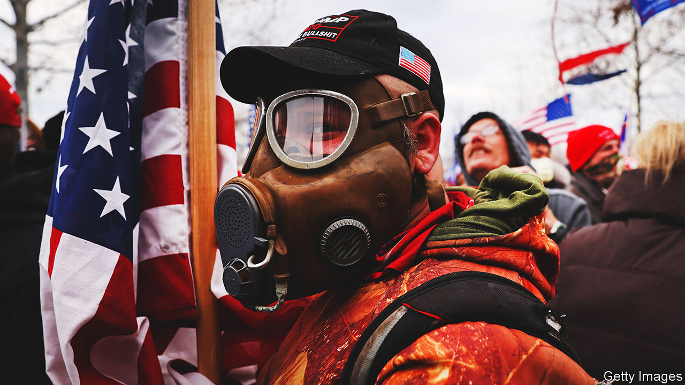
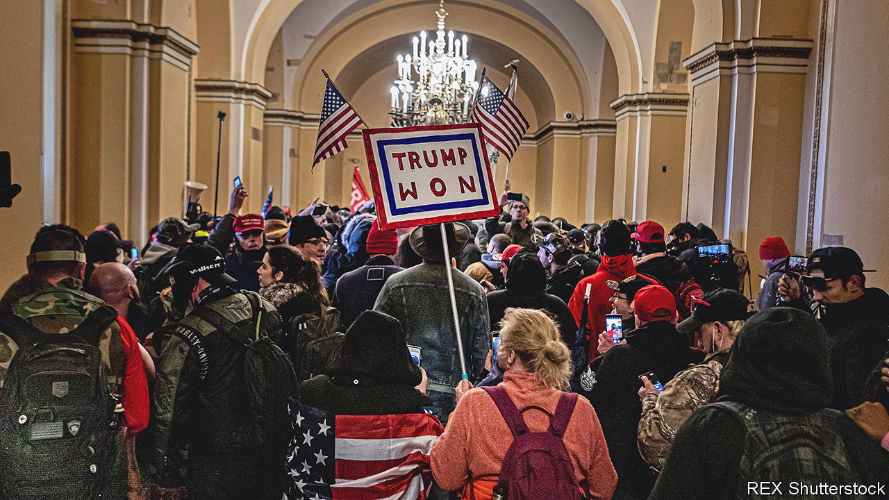

###### The insurrection televised

# The January 6th committee is about to reveal its findings 

##### The hearings are probably the Democrats’ last best hope of rallying complacent voters 

 

> Jun 7th 2022 

Congressional hearings have provided some of the great dramas of American politics. A Senate probe in 1923 into the corrupt sale of oil leases at Teapot Dome, Wyoming, sullied the reputation of President Warren Harding and was considered “the greatest and most sensational scandal”. Then the Watergate hearings, in 1973, raised the bar. Tens of millions of people tuned in to watch live broadcasts of Richard Nixon’s slow-drip demise.

Massive public interest was in both cases justified by the gravity of the issue in hand—probity at the highest levels of government—and by Congress’s success in upholding it. The same can be said of the Senate’s Army-McCarthy hearings of 1954, and, less resoundingly, of the Iran-Contra hearings of 1987, from which Ronald Reagan’s reputation never fully recovered. Box-office value aside, such hearings were an advert for congressional oversight and a tribute to the American system.

The public hearings that the House’s January 6th select committee will hold from June 9th are arguably more important than all the above combined. For the past year the committee’s nine members—seven Democrats and two Republicans—and its investigators have been working to uncover the circumstances that gave rise to a multipronged effort to stop the transfer of power after the 2020 presidential election.

As with the Watergate hearings, the committee’s investigation is much broader than the incident—an attack on the Capitol by 2,500 of Donald Trump’s supporters—that it was named after. Divided into colour-coded teams, its members have investigated the campaign by Mr Trump and his coterie to press state, local and federal officials to overturn the election result; the role of right-wing extremist groups in reinforcing that effort; the “Save America” Trump rally outside the White House that preceded the Capitol riot; and the financing of all of this. The issue in hand is accordingly not mere probity, a quality no one expects of Mr Trump, but the continuing threat to democratic government that he and his supporters represent.

Despite fierce pushback from the former president and Republicans at large, the committee has conducted more than 1,000 interviews—including with insurrectionists, intelligence agents and the few senior members of Mr Trump’s retinue willing to testify. Having also reviewed over 140,000 documents, it is due to release a report on its findings in September. The impending six public sessions will therefore be less like the usual congressional inquiry than an impeachment trial. They will not invite Americans to witness the process of investigation so much as show them what has already been discovered.

“The hearings will tell a story that will really blow the roof off the House,” predicted one of the committee’s members, Jamie Raskin. “People must watch, and they must understand how easily our democratic system can unravel if we don’t defend it,” enjoined its Republican vice-chairwoman, Liz Cheney, on June 5th.

The committee’s only previous public hearing, in July last year, combined footage of the insurrection with harrowing testimony from four of the law-enforcement officers who fought it. This month’s hearings will contain a similar mix of live testimony, recorded interviews and other video footage. The first, jointly led by Ms Cheney and the committee’s Democratic chairman, Bennie Thompson, will air at prime time, from 8pm local time; the second will take place on June 13th. Fresh revelations about the attempted coup are promised.

 


The opening promises to be quite a show. The committee is reportedly planning to play snippets of testimony from Ivanka Trump, presumably describing her unsuccessful efforts to persuade her father to call off his supporters during the two hours he sat watching them ransacking the Capitol. The sessions will feature little of the partisan bickering and self-regarding questioning that bedevils most congressional hearings. No big differences divide the committee’s two Republicans, Adam Kinzinger and Ms Cheney, from its Democrats. Most of the questions will be asked by professional investigators, as they were during Mr Trump’s second impeachment trial, also prompted by the riot.

What we know, and when we knew it

Briefings and leaks of the committee’s work suggest it aims to prosecute a much fuller and more detailed case against him and his cronies than the Senate did. The committee will aim to show that the Trump team’s machinations were meticulously planned and orchestrated, and criminal in intent. In an email contained in court documents, a lawyer advising Mr Trump, John Eastman, argued that Mike Pence should delay certifying the election on January 6th 2021, and acknowledged that this would be illegal. (He claimed it would be only a “minor violation”.) On the basis of this and other evidence, the committee argued in a civil court filing in March that it had “a good-faith basis for concluding that [Mr Trump] and members of his Campaign engaged in a criminal conspiracy to defraud the United States”.

Yet the fact that Ms Cheney’s exhortation needs underlining, when so much about Mr Trump’s subversion is already known, points to another huge difference between this hearing and previous ones. The campaign to overthrow the election was publicised in detail at the time. Audio tape of Mr Trump pushing Georgia’s secretary of state to help him “find 11,780 votes” was leaked the following day. Planning for the Capitol riot was reported weeks before it took place. “On January 6th, armed Trumpist militias will be rallying in dc at Trump’s orders,” tweeted Arieh Kovler, a political scientist who studies far-right groups. “It’s highly likely that they’ll try to storm the Capitol…And people will die.”

The riot that ensued was broadcast live and was so obviously the culmination of Mr Trump’s efforts that even most Republican leaders at first said as much. Kevin McCarthy, the Republican leader in the House, said publicly that the former president was responsible and told colleagues he would instruct Mr Trump to resign. Yet it quickly transpired that most Republican voters preferred Mr Trump’s version of reality to the evidence of their eyes. So Mr McCarthy and most other Republican lawmakers back-pedalled, leaving Ms Cheney and Mr Kinzinger among the few in their party willing to stand against insurrection.

Democrats and some Republicans had pushed for a more powerful independent inquiry, along the lines of the commission on the September 11th attacks. Republican senators nixed that, so House Democrats launched the committee as a second-best option. It is by definition more partisan than the independent inquiry would have been, notwithstanding the brave participation of Ms Cheney, who is likely to be drummed out of Congress in November’s mid-term elections, and Mr Kinzinger, who has said he will not run for re-election. In February, the Republican National Committee voted to censure them for engaging in the “persecution of ordinary citizens engaged in legitimate political discourse”—an apparent reference to the riot.

Mr McCarthy and other leading Republicans have refused to comply with the committee’s summonses. Their hostility has also imposed an unofficial time-limit on its investigations. The Republicans will probably take the House at the mid-terms and, under the likely Speakership of Mr McCarthy, would sabotage the committee given the chance. With such leadership, Republican voters have become even less convinced that Mr Trump has anything to answer for than they were immediately after the riot. Around 55% of Americans say he was not mainly responsible for it.

The forthcoming hearings are extremely unlikely to persuade many of them otherwise. Reality denial has become a dominant feature of American conservatism. And Republican lawmakers and allied media are labouring to ensure it remains so. Mr McCarthy and his crew have for weeks been rubbishing the hearings as a partisan witch-hunt. Fox News, the country’s most watched cable-news channel, will not broadcast them live. How easily the democratic system can unravel, indeed.

Yet the hearings represent much more than a chronicle of democratic decline. They may be the Democrats’ last best hope of rallying complacent voters against Mr Trump and his supporters ahead of the mid-terms. Perhaps more important, they and the report that follow will offer the fullest historical record of the riot, Mr Trump’s wider attack on democracy and how near or far it came to succeeding. ■


