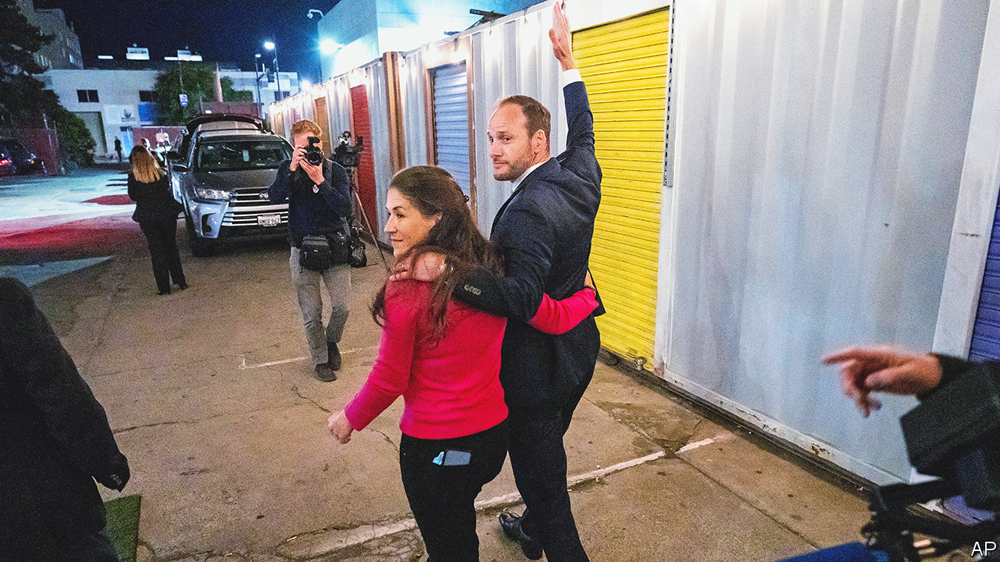
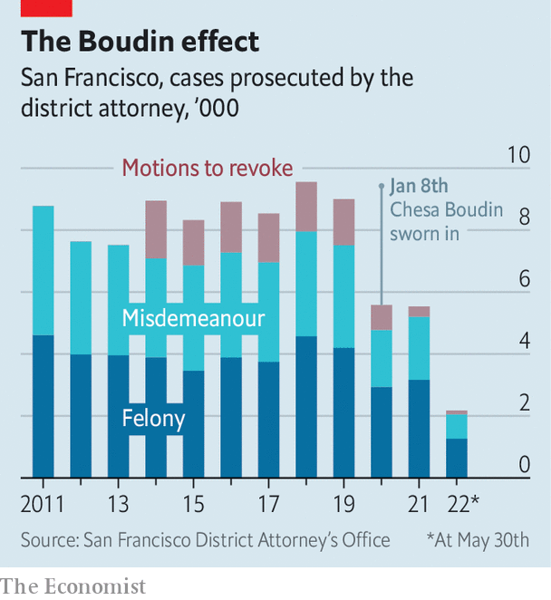

###### Backlash against progressivism

# Why San Francisco’s clash with its district attorney matters 

##### A progressive city’s fraught relationship with Chesa Boudin holds lessons for the whole country 

 

> Jun 5th 2022 

Before chesa boudin was sworn in as San Francisco’s district attorney in January 2020, he once served as a translator for Hugo Chávez, the autocratic former president of Venezuela, and co-wrote a book about the Bolivarian revolution. Now Mr Boudin has experienced his own revolt—by voters. On June 7th a majority of San Francisco voters decided to “” him from office. The mayor will appoint an interim district attorney, with a permanent replacement elected in November.

What may sound like a provincial spat is anything but. This was a litmus of values in a city that has always been on the bleeding edge of social and political change.

 


In 2019, when Mr Boudin was campaigning as a progressive promising to revolutionise criminal justice, his offbeat pedigree was an asset. He is a Rhodes scholar, a former public defender and the son of two members of the leftist Weather Underground, who were sentenced to prison for their role as getaway drivers in an armed robbery that led to two police officers and a security guard being killed. Mr Boudin promised to end cash bail and put fewer people in jail. Prosecutions have indeed fallen since he took office (see chart).

If he did what he said he would, why did he come under fire? His rhetoric and brash manner alienated many from the start. At his election-night party in 2019, people lashed out at the Police Officers Association, chanting “Fuck the poa”, which had spent heavily to try to defeat Mr Boudin. Since then, the relationship between Mr Boudin’s office and the police has been about as cosy as an old jail cell on Alcatraz. Morale in the district attorney’s office is “terrible”, says Michael Swart, one of seven prosecutors Mr Boudin fired after assuming office. By October 2021, 59 attorneys, or around 40% of the prosecutors in his office, had either quit or been sacked.

Some who have worked with Mr Boudin felt he was too quick to side with defendants, when his job was to prosecute crimes and represent victims. The recall campaign gained steam after a few incidents in which his office’s choice not to keep people in jail carried deadly consequences. One paroled felon stole a car, drove while drunk and killed two young women crossing a street (earlier that year the man had been arrested five times, and each time the district attorney’s office had declined to file charges).

The degraded state of San Francisco has left a lot of inhabitants angry—and blaming Mr Boudin. “People are really sick of living in chaos,” says Michael Shellenberger, author of a book, “”, which argues that progressives are mishandling cities, who ran unsuccessfully for governor as an independent. Downtown, drugstores have closed or refused to stock goods on shelves, due to shoplifting. Rising crime has led some to avoid walking or driving around whole neighbourhoods.

The question of  is especially controversial. The city has opened a supervised drug-injection centre in United Nations Plaza, just down the road from City Hall, contravening federal and state law. This has done nothing to change the open use and sale of drugs on the street, which Mr Boudin chose not to prioritise for prosecution.

When your correspondent walked around the Tenderloin district for an hour from 11am, she counted more than 20 drug-dealers, recognisable in a “uniform” of black clothes and hats, with grey or black backpacks. Being noticed did not seem to worry them, and there’s a reason. In 2021 Mr Boudin’s office managed only three convictions for drug-dealing, despite a record 711 overdose deaths the previous year. His predecessor achieved 90 convictions for drug-dealing in 2018.

Supporters felt Mr Boudin was a scapegoat for the city’s problems of homelessness, addiction and crime, which have been stirred by covid-19 but preceded it. Recalls should be reserved for booting someone out of office after they commit a specific crime, they said. Yet Mr Boudin’s was the fifth recall election in California this year, including a successful vote against three school-board members who had refused to reopen schools while debating name changes for them, says Josh Spivak, an expert on recalls.

Some 60% of voters chose to give Mr Boudin the boot. Asians, who account for more than a third of San Francisco’s population, were unhappy with his handling of several assaults. Mr Boudin painted the recall as a partisan drive, but San Franciscans of all political persuasions supported it. They will continue to argue over whether the city suffered due to his specific policies or plain incompetence. (The answer is probably both.) And the story may not be over. Mr Boudin may try to run again for his old job in November.

The recall election has wider lessons. First, it highlights the conflict within the Democratic Party that . In San Francisco Democrats have unilateral control, but progressives are butting heads with moderates, trying to cast them as closet Republicans. Recent redistricting conversations became “borderline violent”, says one observer. Sheriffs had to be called in. This reflects a degradation of discourse that is occurring not just between parties but within them.

Second, it shows that voters are cooling on progressive policies, after seeing real-world consequences. There is pushback in other cities with progressive district attorneys, including Philadelphia and Los Angeles. Calls to “defund the police” have shifted to “”. “The problem is, many progressive policies don’t appear to be very effective,” says Jonathan Weber, editor-in-chief of the San Francisco Standard, a news site. “I don’t think this is a blip,” Mr Weber predicts. San Franciscans, known for their embrace of progressivism, may be turning towards moderation. ■


