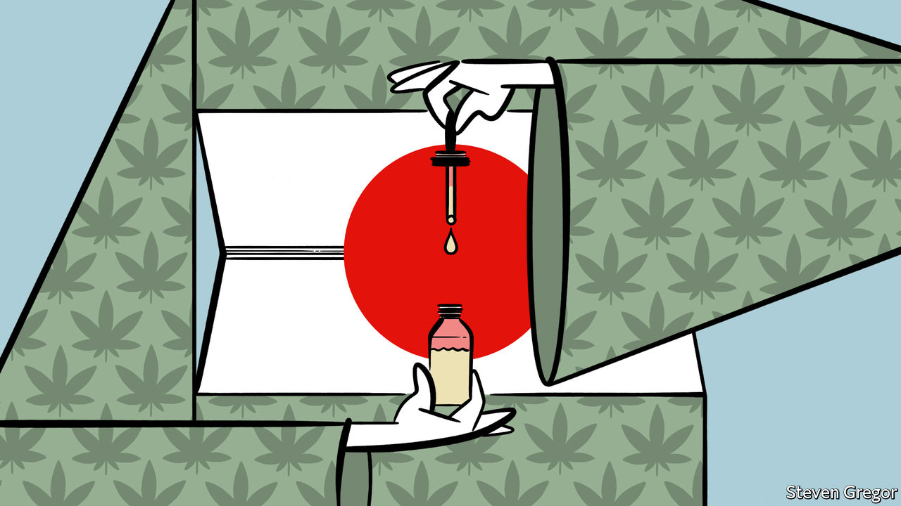

###### Halfway high

# Elderly Japanese are discovering the benefits of cannabis products 

##### But the government remains hesitant to legalise marijuana 

 

> Jun 16th 2022 

For most of her life Yoshimura Hiroko, an 81-year-old woman in Hadano near Tokyo, had never given a thought to cannabis. But when she started suffering pain and paralysis caused by multiple sclerosis three years ago, Kazuyoshi, her 51-year-old son, stumbled upon cannabidiol (cbd), a non-psychoactive cannabis compound. He started dropping a dose of cbd oil under her tongue each day; a month later the pain had faded.

Ms Yoshimura belongs to a growing club of elderly Japanese who have discovered cbd. Marijuana remains illegal in Japan, including for medical use. But a global trend towards its liberalisation has reduced the stigma associated with cbd products, which are legal. As a result, the local market is expected to grow to some $800m by 2024, up from a mere $59m in 2019. That suggests faster growth even than the global market, which could reach $47bn over the next six years, from $4.9bn in 2021.

The newfound love for cannabis has historical echoes. Hemp was present in “all corners of Japanese life” going back to the Jomon era, as early as 14,000 bc, says Takayasu Junichi, who runs a cannabis museum near Tokyo. The plant was used to make clothes and to construct buildings. It was a symbol of purity in religious rituals. Even today sumo wrestlers wear white hemp rope around their waists as a tribute to Shinto gods. 

It was only after the second world war, when America’s occupying forces banned possession and unlicensed cultivation of the plant, that cannabis became stigmatised. “Japanese have demonised cannabis ever since,” laments Mr Takayasu. Celebrities caught with weed face intense public shaming.

The new “green rush” is helping to erode that stigma. Younger Japanese, many of whom have travelled abroad to countries where drug laws are more liberal, were the fastest to embrace cbd. Hipster cafés offering it have proliferated across Tokyo over the past few years. A popular discount chain sells cbd gummies and vape pens.

Yet it is Japan’s elderly who stand to benefit most, says Masataka Yuji, a doctor who founded a pro-marijuana advocacy group. He thinks that cannabis, which has shown promise against pain, inflammation and muscle stiffness, could be an alternative to administering different drugs for multiple conditions. Businesses have caught on already: they now advertise cbd products around , a holiday that honours the elderly. A plan by the government to legalise other hemp-derived medicines will probably fuel the craze.

The authorities have warmed to cbd, but they have doubled down on punishing those who use marijuana, ramping up arrests and mulling new laws even as other countries have relaxed their rules. Neighbouring South Korea legalised medical marijuana in 2018. Thailand this month made it legal to grow and possess the plant. Japanese cannabis fans can only hope that their government chills out like its neighbours.

