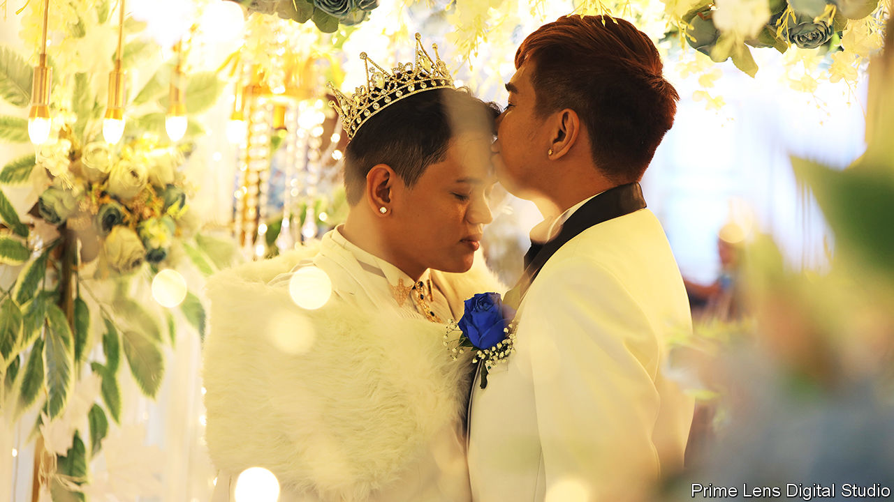

###### Pride and groom

# South-East Asia is beginning to accept same-sex relationships 

##### Lawmakers are catching up with public attitudes 

 

> Jun 16th 2022 

It was a beautiful spot for a wedding. In the hills of Antipolo, a city east of Manila, the Philippines’ capital, friends and family of Jownie Reyes and Josh Prado Tupaz (pictured) gathered to celebrate the holy union of the two men. Mr Tupaz, keeping his cool in a white suit, matching fur stole and glittering tiara despite the 34-degree heat, posed for photographs with his squad of bridesmaids, all in matching blue gowns. Then the ceremony began. Reverend Crescencio Agbayani, a gay priest and activist, led a service involving both Catholic and Protestant rites. The grooms declared their vows through tears. “If you’re gay, being in love is a joke to many…or worse, you are a secret,” said Mr Reyes, “You love me out loud without disgrace.” 

Ceremonies like this are happening in countries across South-East Asia. They carry no legal weight, but they are often officiated by religious or local leaders. In Cambodia couples can sign documents that outline mutual obligations and shared ownership of assets. It is a symbolic protection rather than an enforceable marriage contract. But it gives couples an excuse to throw a traditional wedding ceremony, with local officials and monks in attendance and guests tying red string around the wrists of the spouses. 

The ceremonies reflect changing social mores. Fully 73% of Filipinos think that society should accept homosexuality; 70% of Vietnamese say they would be happy to have gay neighbours. In Thailand 91% of people polled in June said they would accept a gay person in their family. Reverend Agbayani in Antipolo has officiated at services for around 3,000 couples since he was ordained in 2008. “Fifteen years ago people in the provinces were curious. Now they see it as ordinary.” 

Lawmakers are slowly catching up. In 2019 the Philippine Supreme Court rejected a petition to declare the ban on gay marriage unconstitutional, but acknowledged that same-sex couples deserve some legal recognition. The same year two bills seeking to institute civil unions between same-sex couples were introduced to the Philippine Congress. Vietnam lifted a ban on same-sex marriages in 2015. Cambodia committed in 2019 to amending its constitution to ensure marriage equality. Thailand’s cabinet sent a same-sex union bill to Parliament on June 7th. 

Increasing acceptance is not limited to same-sex unions. More than 20 municipalities in the Philippines have passed anti-discrimination rules. A bill prohibiting discrimination based on sexual orientation or gender identity is being considered at a national level, too. Labour laws in Thailand already forbid discrimination on the basis of sexual orientation. In 2015 the government gave similar protections to expressions of gender identity. That decision has been particularly useful for trans people. In 2016 Nada Chaiyajit, a trans woman in Bangkok, won a case against her university, which had refused to issue a graduation certificate because her photograph showed her presenting as female, when her legal gender is male. That encouraged trans people at other universities to challenge similar rules, she says.

Not all countries in the region are similarly accommodating. Malaysia, Myanmar, Singapore and Sri Lanka still maintain laws introduced by British colonial officials that criminalise sex between men. An Indonesian province has adopted a law against gay sex based on Islamic precepts. Some governments claim such laws do not matter because they are not enforced. But activists say they create feelings of insecurity in the gay community and give officials an easy means to blackmail people. They also serve as an implicit obstacle to more ambitious reforms.

Some of the region’s more liberal countries have seen a backlash against recent advances. Religious groups in Thailand have recently begun to object to the law on civil unions. They often attack rights for queer people as “white supremacy”, or as incompatible with traditional Asian values, says Ms Chayajit. In the Philippines, Reverend Agbayani chuckles at such arguments. “Love is an Asian value,” he says. More and more people across the region agree with him. ■

