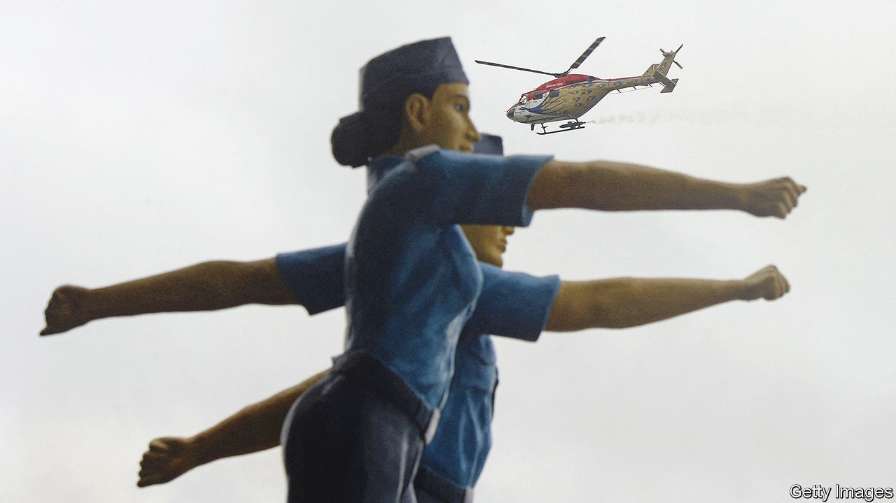

###### Take my arms

# The West has a chance to wean India off Russian weaponry 

##### But co-operation on defence with America, in particular, remains fraught 

 

> Jun 13th 2022 

Joint weapons production between India and the West has a long and chequered history. Consider the Tejas fighter jet, whose development was approved in 1983 by Indira Gandhi, the prime minister of the day, to replace ageing Soviet-made migs. Two years later her son, Rajiv, persuaded Ronald Reagan to provide “fly-by-wire” technology allowing pilots to control the plane electronically. Keen to erode Soviet influence in India, America supplied engines too. French engineers were sent to help an Indian state-owned defence company design the new aircraft. 

Yet the Tejas entered service only in 2016, around 20 years later than planned. India’s navy cancelled its order when it found that the plane was too heavy to take off fully fuelled and armed from aircraft-carriers. An updated model looks more promising, but won’t be ready in time to tackle India’s shortfall of more than 100 fighter jets over the coming decade.

Perturbed by  to condemn the Russian invasion of Ukraine and keen to bind the country closer in confronting China, Western governments have launched a fresh push to wean India, the world’s biggest importer of arms, off its long dependence on Russian weaponry. As they cannot compete with Russia on price and remain reluctant to share their most cutting-edge technology, they are counting on joint arms production. 

India, for its part, has grown increasingly alarmed about China, following deadly border clashes in 2020. Since the war in Ukraine began, it has also worried about Russia’s reliability as an arms supplier and about the quality of some of its weapons. But both India and Western countries would do well to remember the story of the Tejas and try to resolve some of the problems that hampered co-operation in the past.

Western leaders have been vocal about their willingness to help India arm itself. At a ministerial meeting in Washington in April, American officials discussed helping India to make advanced weapons, including reconnaissance aircraft and a system for combating aerial drones. On visits to Delhi that month, Boris Johnson, Britain’s prime minister, and Ursula von der Leyen, the European Commission’s president, also proposed joint arms ventures.

India, though insistent that it has every right to choose its own suppliers, is already . It is buying more from France and Israel, in particular. The share of weapons it imports from Russia has fallen sharply, to around 50% between 2016 and 2021, down from 70% during the previous five-year period. It has welcomed Western help in fulfilling its ambition to make more of its own weapons. “American defence companies are welcome to establish manufacturing facilities in India,” the defence minister, Rajnath Singh, said in April. The best way for America to support India, he reckoned, would be to turn it into a manufacturing hub for defence equipment in Asia.

Despite avowed interest from both sides, such a shift faces many challenges. India’s arms industry, technically open to private investment since 2001, has long been hampered by the dominance of a small number of state-owned giants such as Hindustan Aeronautics Limited (hal), the company that produces the ill-fated Tejas jet. State-owned arms-makers remain notoriously inefficient. They also retain long-running tie-ups with Russia, including one to assemble Su-30 fighter jets, making Western governments wary of accepting India’s demands for the transfer of more advanced technology. 

Meanwhile the share of defence production in the hands of the private sector, which is a more natural partner for big Western defence manufacturers, is about a fifth—scarcely higher than it was five years ago. Private firms, both Indian and foreign, complain of widespread corruption and an excessively cumbersome procurement system. A Western defence executive says the government is “glacially slow to get things done” and describes “a lot of talk and disappointment”. Both the state and private sector still lack the industrial capacity and skilled workers to produce highly specialised defence technology at scale—especially military aircraft. 

Narendra Modi, the prime minister, has taken steps to liberalise the industry as part of his push towards . In 2020 he raised the limit on foreign ownership of defence firms from 49% to 74%. Last year he broke up a loss-making ordnance outfit run by the defence ministry into smaller units, the bulk of which now claim to be profitable. Yet liberalisation will have to go much further for the industry to be able to meet the demands of India’s future armed forces, says Chitrapu Uday Bhaskar, a retired commodore at the Society for Policy Studies, a think-tank. Even now, India’s state-owned weapons makers “are not able to deliver what the armed forces want”, he says.

Some change is afoot. Lockheed Martin, a big American defence manufacturer, last year approved the manufacture of wings for the f-16 fighter jet by its joint venture with Tata, a big Indian conglomerate. It says more than 70% of the wings’ parts are sourced locally. The company has also pledged to produce a more advanced fighter, the f-21, in India, provided it wins a multi-billion-dollar contract to supply 114 fighter jets (other contenders include French, Russian and Swedish companies).

Big deals like those would provide incentives for foreign governments to approve more technology transfer and for Western manufacturers to make the investments needed to spur India’s indigenisation drive. They may also go some way towards overcoming the deficit of trust that still exists between India and the West. While Western companies worry about inadvertent technology transfers to Russia, India worries about the reliability of its Western partners. Many in the elite see America, which in the past has imposed sanctions on India for its nuclear-weapons programme, as a fickle supplier. More recently it refused to sell India its Patriot missile system, prompting India to fall back on a Russian alternative and thereby put itself at risk of American sanctions once more. 

There is often a trade-off between co-operation on indigenisation, which takes time, and short-term operational needs. Lockheed Martin promised to build an f-16 production line in India when it bid for a 126-fighter deal during a previous wave of optimism about India-America ties. India ended up buying 36 French jets off the shelf instead, in a deal that has been the subject of a corruption probe in France. Russia’s war and China’s muscle-flexing have opened a door for India and the West to walk through, but crossing the threshold will require some resolve on both sides. ■


