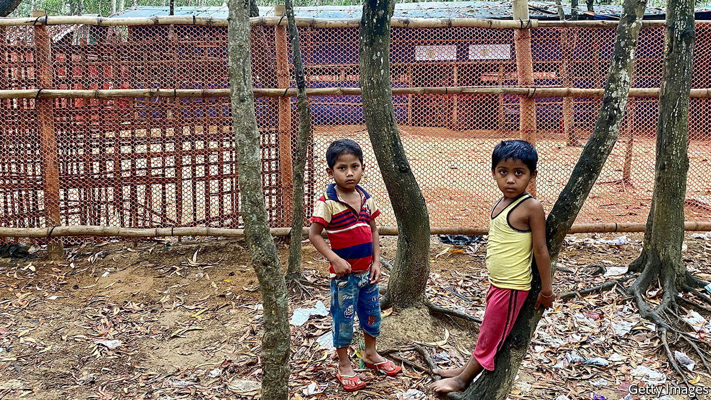

###### School’s out

# Unable to send Rohingyas home, Bangladesh circumscribes their lives 

##### The government is particularly worried about the draw of a decent education 

 

> Jun 16th 2022 

Noor kaiser knew his dream of becoming a doctor was ambitious for a boy living in a refugee camp. He studied hard nonetheless, hoping it would one day become reality. But that was before authorities in his camp in Bangladesh’s south-eastern region of Cox’s Bazar bulldozed his school in April. “Now I don’t do anything all day,” says the 13-year-old Rohingya boy. “My dream ended in Class 6.” 

The demolition of Noor’s school reflects a wider policy to discourage Rohingya refugees from settling permanently in Cox’s Bazar. Since 2017 Bangladesh has admitted some 700,000 members of the Muslim minority after they were driven from neighbouring Myanmar in a brutal campaign by the Burmese army. America and the un considered the violence systematic enough to call it genocide. But the government has always insisted that refuge would be temporary. The army’s return to power in Myanmar in a coup last year and the reign of terror the new junta has unleashed on the country since then means the Rohingyas will not return home soon. Fearing integration, Bangladesh’s government has opted to circumscribe their lives ever more tightly.

Following a ban on home-schooling and private education in December, the government has closed some 30 schools in recent months. But the policy is not limited to education. Some 3,000 Rohingya-run shops have also been bulldozed. In May the authorities detained 650 refugees who had left their camp to celebrate Eid on a nearby beach. They subsequently prohibited movement in and out of two camps. Rohingyas now have to get written permission to leave, or risk being beaten at checkpoints. That is uncomfortably close to their treatment in Myanmar, where the junta has imposed a similar permit system for Rohingyas wishing to leave their districts. The conditions the government is creating are “unliveable”, says John Quinley of Fortify Rights, a pressure group.

Rohingya children, who make up more than half the camps’ 1m residents (including some refugees from earlier waves of violence), suffer most. ngos are limited to teaching basic maths and reading; a unicef pilot to instruct 10,000 children using Myanmar’s curriculum is only just getting off the ground. Private, Rohingya-run schools around the refugee settlements had been filling some of the gaps. Noor’s school, which taught some 600 pupils before it was torn down, was set up in 2020 by Mohib Ullah, a Rohingya community leader who was killed by militants last year.

The government, claiming the school was shut because it lacked a permit, says that its aim is to stamp out extremism and profiteering. It worries that the refugee-run schools, many of which are attached to makeshift mosques, may be incubators of Islamist ideology. Islamists have found fertile ground for recruitment in the camps, lending some legitimacy to such concerns. But shutting the schools is likely to exacerbate the problem, says Mohammad Showfie, Noor’s former headmaster. Studying kept young people out of trouble. Now they risk getting caught up in crime or militancy in the camps.

More than extremism, the government seems to fear permanent settlement. Keen to dissolve the refugee camps on the mainland, it has spent $300m developing Bhasan Char, a tiny island 30km off the coast of Cox’s Bazar in the Bay of Bengal. Under an agreement with the un, those who move there are promised an education. But people have not been eager to go: reports abound of forced relocations and escape attempts from the island. If a decent education could be had in the camps in Cox’s Bazar, there would be even less reason to move to the island, says Saad Hammadi of Amnesty International. 

Mr Showfie says that giving people the opportunity to study and earn a living by doing business in the camps would make life there more bearable. “Here, as in Myanmar, we want education, movement and safe living opportunities.” For now, that hope remains elusive. ■

