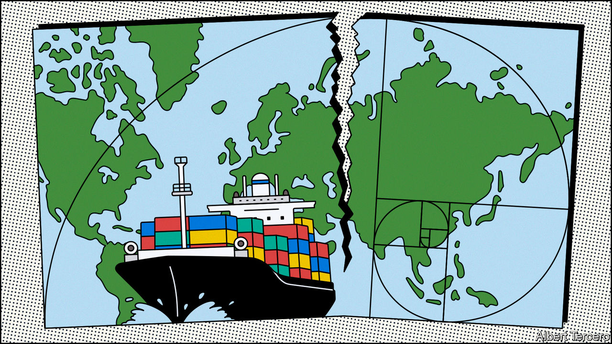
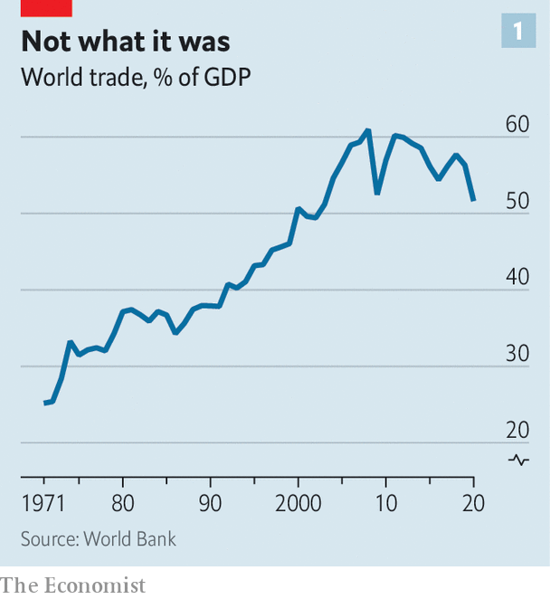
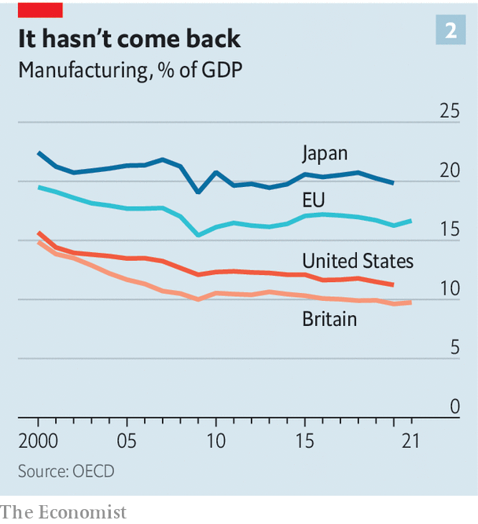
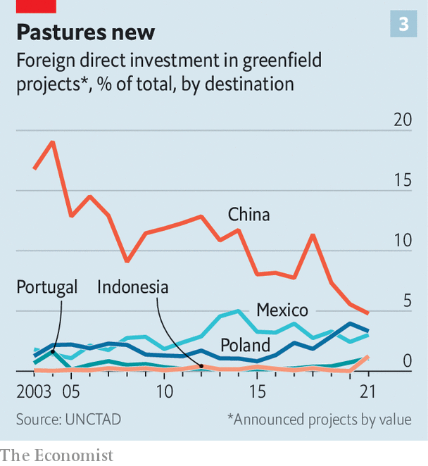
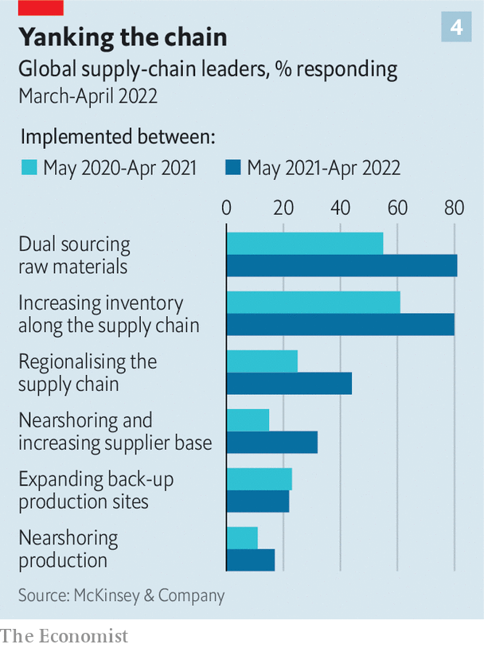

###### Chain reaction

# The structure of the world’s supply chains is changing 

##### The pandemic and war in Ukraine have speeded up the transformation 

 

> Jun 16th 2022 

Supply chains are the fibres out of which the past decades’ globalisation is woven. Time and again they have allowed intrepid outward-looking manufacturers to undercut their stay-at-home competitors and component-makers to find roles in new markets. 

Networks of aircraft, email and container ships, not to mention railways and pipelines, have tied together businesses in Guangdong and Oregon, Durban and Dubai, Rennes and Punta Arenas. Masters of their use, such as Airbus or Apple, can create technological marvels from components provided in dozens of different countries using raw materials brought in from yet farther afield. 

Over the past five years the tensions pulling at this fabric have been growing stronger. First came America’s tariffs on Chinese exports. Then the covid-19 pandemic boosted demand for a particular constellation of goods while constraining their production and transport. Most recently Russia’s war in Ukraine sent commodity prices soaring and reminded firms how quickly a political shock can close one market and wreak havoc in others. 

 


Governments and companies have a history of wringing their hands over such things but not, in the end, doing much to change them. This time things are different. As James Zhan of the United Nations Conference on Trade and Development wrote in a recent article, “The decade to 2030 is likely to prove a period of transformation for global value chains.” That transformation is already under way. 

The direction of change is clearly visible in data on inventories, investment and hiring; its effects are in the news around the world. Apple’s shift of some production from China to Vietnam has whipped up a war for talent in the country. Chinese firms have filled up a giant industrial park in Monterrey, Mexico, in hope of meeting American customers’ demand from closer to home. In May alone, Samsung, Stellantis and Hyundai announced $8bn of investment in American electric-car factories. 

Decision-makers are increasingly concerned that supply chains should be robust, not just efficient. As a result they are choosing to depend less on jurisdictions where they are exposed to risk. And countries are experimenting with industrial policies aimed at self-reliance or international pre-eminence in at least some “strategic” technologies and businesses. This means supporting investment in such sectors within their borders and sometimes restricting the export of the fruits of those sectors. Companies, for their part, are buying up suppliers at home and abroad in the name of vertical integration. 

 


The market-based and Sino-centric system that started to emerge towards the end of the past century is being transformed into something which, though still global, is less unitary and more costly. This should ultimately turn out to be less fragile. But the transition will be messy enough to create shocks of its own. 

“There are centrifugal and centripetal forces that pull the world together or apart,” notes Douglas Irwin, a trade historian at Dartmouth University. Today’s shift is not a swing from one extreme to the other; it is a strengthening of the centrifugal coupled with a weakening of the centripetal, which had, until recently, been at an historic high. 

Beginning in the 1990s, technology, geopolitical stability and the search for efficiency and comparative advantage were powerful pullers-together. Unshackled from geography by better communications and more efficient containerised shipping, companies skipped from continent to continent in search of cheap inputs and thicker profit margins. 

Global flows of foreign direct investment (fdi) had been worth 0.5% of global gdp in the 1970s and 1980s. By the mid-2000s they were worth 5% or more. This, in turn, created a global marketplace. In the two decades to 2008, trade as a share of global gdp jumped from 37% to 61%. 

I’m coming out

Even before the covid-19 pandemic there were ample signs that globalisation had become slowbalisation. The share of American firms’ revenues that came from abroad was mostly flat; profits earned abroad were falling. Flows of trade and fdi had stagnated. One reason was automation, which reduced the labour intensity of manufacturing and therefore the competitive advantage of lower-wage countries that had become offshoring hubs in the 1990s and 2000s. Another was that wages in those countries rose. 

In 2000 China’s average annual income per person expressed in dollars, a reasonable proxy for the wage costs facing a multinational firm, was 3% of America’s. That is one reason why the country’s accession to the World Trade Organisation the following year was so transformative. By 2019 that had risen to 16%. 

The fragility of the system had become more obvious, too. The Tohoku earthquake of 2011 shut down Japanese car suppliers and dented silicon-wafer production. Flooding in Thailand later that year submerged a hub of hard-drive manufacturing. But worries about such risks failed to prompt much action. 

A recent paper by researchers at the World Bank concluded that the disasters in Japan “did not lead to reshoring, nearshoring, or diversification”. The trade war with China which President Donald Trump started in 2018 saw corporate executives talk excitedly about supply-chain reshuffling. Yet there was little evidence for such a trend. In 2019 China still controlled more than one-quarter of the suppliers for big industries, including chemicals, electronics and textiles, according to the Conference Board, a research group. 

The covid-19 pandemic proved a dislocation large enough for concern to beget consequences. In its early days governments scrambled, often unsuccessfully, to secure protective clothing and hospital ventilators. Changes in patterns of consumption away from in-person services and towards manufactured goods brought new bottlenecks into being. More recently China’s vainglorious attempt to maintain zero covid, punctuated by on-and-off lockdowns, has led to further disruption. Hundreds of ships were left dawdling pointlessly off Shanghai—an image of dysfunction now stuck in people’s minds. 

The effects of Russia’s invasion of Ukraine have provided further, more profound shocks. It has disrupted markets in energy and, crucially, food in ways which highlight the need for more broadly based supplies. It has also made manifest the geopolitical risks of dependence on an autocracy with aggressive ambitions. That has further intensified concerns about China.

Thus economic dependency has become a cause for action, not just concern. This is most obvious in energy markets. Europe is working desperately to build up its gas inventories as well as its capacity to import liquefied natural gas (lng). In May NextDecade, an American energy company, announced a 15-year deal to sell lng to France’s Engie which will catalyse investment in a sprawling new export terminal along the Louisiana coast. Some senior Democrats are murmuring about easing their opposition to the Keystone xl pipeline from Canada. New infrastructure and long-term contracts are pushing a global, fluid system in the direction of one less efficient but more secure.

Dependency worries are also seen in manufacturing. The range of goods that governments deem critical has expanded well beyond the realms of defence and post-pandemic public health. “We cannot allow countries to use their market position in key raw materials, technologies, or products to have the power to disrupt our economy or exercise unwanted geopolitical leverage,” Janet Yellen, America’s treasury secretary, said in April. American export restrictions now include biotechnology software and the wherewithal for producing advanced semiconductors. 

Industrial policy is increasingly . More than 100 countries accounting for over 90% of the world’s gdp now have formal industrial strategies, according to a survey by the un, with a particular frenzy of activity in recent years. Policies run the gamut from investments in basic research to those that shield “strategic” industries from foreign competition. 

Many are informed by a growing appreciation of the size and scope of the industrial shift implicit in plans for net-zero emissions. The European Commission is dangling subsidies in front of makers of batteries and semiconductors. In America, where President Joe Biden began his term with a “Buy American” executive order, subsidies to help industry compete with China have attracted bipartisan support. 

Reach out and touch

There is little evidence of rich countries “reshoring” production from abroad. In America imports form an ever-larger share of domestic manufacturing output—a sign that manufacturers are becoming more reliant on foreign suppliers, not less. American spending on factories, warehouses and the like, relative to gdp, is only a tiny bit higher than it was in the early 2010s, and far lower than it was in the 1970s and 1980s. Across the oecd club of mostly rich countries manufacturing’s share of gdp is around 13%, an all-time low. 

But although reshoring is minimal, what happens off which shores is changing, as companies come to their own conclusions as to whether the risk of trying a new model exceeds the risk of sticking with the old. One fairly simple approach is to sign contracts with additional suppliers. Fully 81% of supply-chain leaders surveyed by McKinsey this year are now sourcing raw materials from two suppliers, rather than depending on merely one. Evidence from Goldman Sachs, a bank, suggests that America is broadening the number of countries on which it relies for supplies, a trend that is mirrored in other rich countries. This does not in itself deliver robustness—if capacity does not increase, then a shock will still cut supply in the aggregate. But big capital-expenditure plans suggest that companies are trying hard to forestall such an eventuality.

Companies are also building up inventories—half-finished or finished products, left in reserve, which can be sold if demand suddenly ramps up or if fresh supply fails. This has big costs in terms of tying up money. The world’s 3,000 biggest companies have increased their holding by the equivalent of 1% of global gdp since 2019, according to ’s analysis—and they want to do more. 

The fact that industries are bearing those costs shows that they fear supply problems more than they used to. They may be paying for time to weigh their options and see how others respond before taking hard-to-reverse decisions such as moving plant or people. Some may think that larger inventories are a necessary response to supply-chain risks in perpetuity. 

One family of hard-to-reverse decisions are those involved in vertical integration—either building the capacity to be your own supplier or buying up companies that already have that capacity. In some sectors this is a growing trend, driven both by supply-chain concerns and a desire to snatch back profit margins from suppliers. 

The American computer sector is about 50% more vertically integrated than in the mid-2000s, as measured by the share of the industry’s gross revenues accruing to companies in that industry (rather than outside suppliers). Vertical integration in the American car sector, meanwhile, jumped around 2019. Chinese firms have a dominant position in both the production of batteries and the processing of minerals required for them. So multinational carmakers elsewhere are building their own battery plants and even . 

 


Wariness of China is prompting broader changes, too. Official statistics regarding fdi into China show it going from strength to strength, but these numbers are hard to reconcile with other sources. Another measure is “greenfield” fdi—the sort of capital injection that builds new offices or factories. Since 2019 China has commanded less than 10% of global greenfield-fdi inflows, down from a peak of close to 20% in the mid-2000s (see chart 3). 

The number of oecd countries whose equity fdi into China was smaller than their disinvestment from it was zero in 2005. According to analysis by , that number had reached eight, or a fifth of the club, by 2019. 

Employment tells a similar story. The share of American multinationals’ staff based in China is drifting downwards. At the same time those companies are boosting recruitment in other parts of Asia. They employ nearly 400,000 people in the Philippines, a 10% rise since 2016. Nearly 1.4m people in India work for American companies, a 14% rise from 2016. 

Ain’t no mountain high enough

Other parts of Asia are the main beneficiaries of the not-China shift. In 2015 the total value of big democracies’ fdi in China exceeded their comparable investment elsewhere in East Asia by 20%. Now those positions are reversed. In 2021 oecd countries imported roughly $700bn-worth of Chinese-made “intermediate” goods (raw materials, components and the like), representing a modest increase from 2018. But imports of the same type of goods from Vietnam grew by 70% over the period. 

 


There is plenty of increased investment elsewhere, too. The largest greenfield fdi projects announced in the past year have been Intel’s $19bn chip factory in Magdeburg, Germany, and Samsung’s $17bn chip factory in Taylor, Texas. On an annual basis Taiwan is injecting more than twice as much fdi equity into oecd countries as it did in the early 2010s.

Inward fdi figures for Mexico—a country forever talked up by apostles of nearshoring—remain unremarkable, but leading indicators of change are discernible. Firms that help suppliers relocate production to Mexico are being inundated with requests from Chinese companies looking to set up shop, according to Patrick Van den Bossche of Kearney, a consultancy. In May a company called Zipfox, which helps American businesses search for suppliers in Mexico, saw the volume of new customers on its website increase by 20%. 

Mexico’s appeal is largely down to the access to markets elsewhere in North America provided by the us-Mexico-Canada Agreement. Similar trade deals could make the restructuring of supply chains easier and cheaper. Unfortunately, America’s leaders show no interest in persuading voters this would be worth doing. 

Redesigning supply chains takes time, and noticing an effect takes even longer. The boss of a giant American manufacturer which now produces 90% of its products in China says it plans to boost investment in American and European manufacturing dramatically over the next five years. That will still leave China producing about half its goods. But the shift is under way. 

The considerable costs of taking more than efficiency into account will fall on taxpayers, companies and consumers. The benefits should in principle be felt widely, too. But they may not be readily apparent. The world economy could become less vulnerable to shocks at a time when climate change and geopolitical tensions are increasing their frequency and intensity. Improving resilience could be a case of running to stand still. 

 


Indeed some of the underlying tensions may be exacerbated. Attempts to boost economic security can create shocks of their own. This year the spectre of new tariffs on imported solar panels brought American solar projects to a standstill. 

Increased economic integration did not bring about the greater global harmony that some had hoped it would. It is difficult to imagine that fragmentation will do much better, and it is all too easy to imagine it making things worse. That could be one of the reasons why, for a long time, changes to the fundamental shape of globalisation were much talked about but not much pursued. Now they are actually happening, they are contributing significantly to the new anxiety. ■


