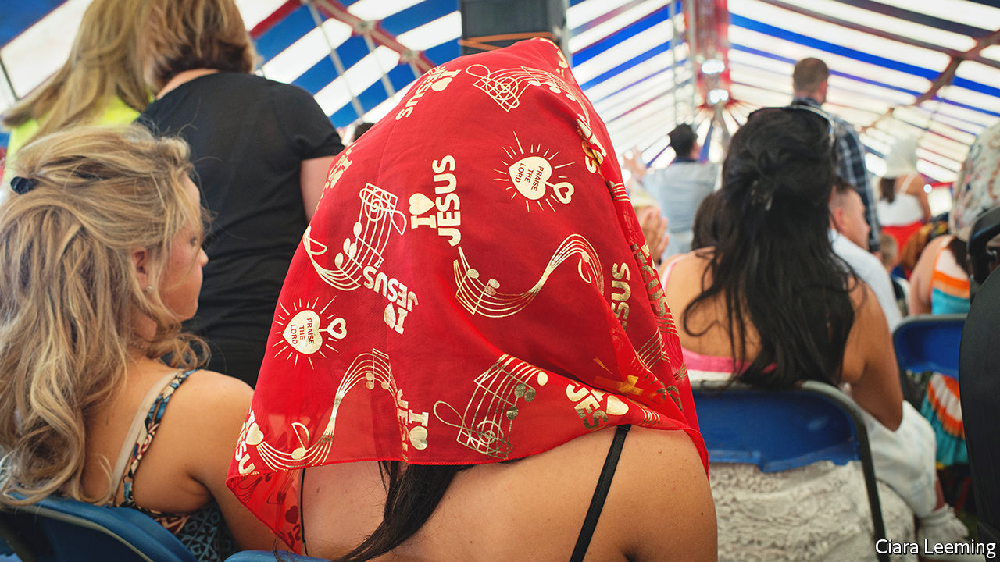
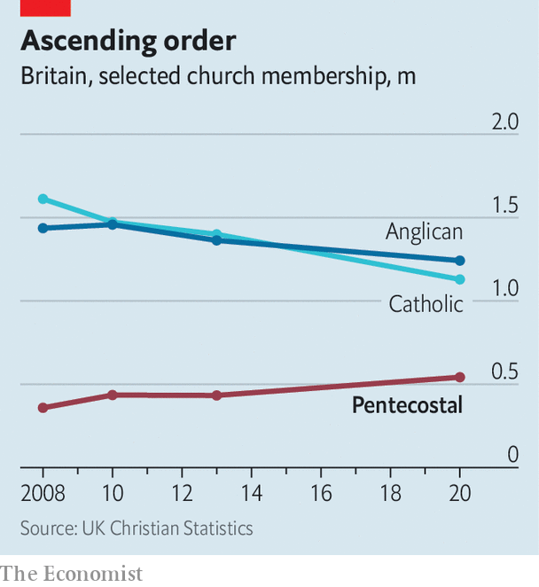

###### Conversion rates

# Britain’s gypsies have seen the light 

##### They are converting to Pentecostalism in large numbers 

 

> Jun 16th 2022 

God’s abundant gifts to his faithful rarely include natty dressing. The Lord might offer His followers salvation, redemption and whatnot but, at least in England, He isn’t famous for blessing them with an Instagram-ready aesthetic. 

Step into the Light and Life gypsy church in Buckinghamshire, and things are very different. When hands here are clasped to pray, they are manicured; the toes that tap in time to hymns are perfectly pedicured. When arms are raised unto the Lord, expensive watches glint on their wrists. Overall, the general aesthetic is less faded florals than tans and teeth. This is a deity with a liking for dentistry.

He has some fervent followers. This Sunday the Pentecostal church is merely half-full. Usually, says Caleb Jones, the preacher and himself a gypsy, it is “jampacked. Normally there are not enough seats.” Many are off on a mission (to nearby Bicester, which evidently needs saving). 

Britain’s gypsies—the term is one they use themselves—have joined up in droves. Data are shaky, but there are around 60,000 gypsies and Irish travellers in England and Wales. It is thought that a big proportion (about 40%, by one very rough estimate) of the population of British gypsies has converted, mostly from Catholicism and atheism, to Pentecostalism. In the 1940s there were more or less no Pentecostal gypsies in Britain; now the Light and Life church has over 30 congregations.

 


They are part of a wider national trend. As other Christian denominations in Britain wither—the number of Anglicans fell by 9% between 2013 and 2020, and of Catholics by 19%—Pentecostal Christians are thriving. In the same period their numbers rose by 25%, to over half a million. They fit an international pattern, too. Though most people pay it little attention, Pentecostalism is the fastest-growing religious movement on the planet. It began in America at the turn of the 20th century, and now Pentecostal and charismatic Christians make up over a quarter of Christians worldwide. 

One of the finest measures of the success of a Christian movement is how viciously their fellow Christians insult them. When measured this way, Pentecostalism is doing splendidly: it has been accused of lunacy, hysteria, delusion and of being “the last vomit of Satan”. Like holy hermit crabs, Pentecostals have started taking over the hollowed-out churches of less successful denominations. The Light and Life church in Buckinghamshire sits in a former Catholic church. As Mr Jones observes, “they had no use for it” any more. 

To say that Pentecostalism is growing is easy. To say precisely what it is that is growing is harder. This is a supremely protean movement, with no central authority. As Elle Hardy puts it in “Beyond Belief”, a new study of the movement, “there’s no Pentecostal pope.” There are some Pentecostal staples: speaking in tongues is common, as are faith healings; a conversion in which the person feels touched by the Holy Spirit is essential. 

But what you get depends on where you go. Enter a Pentecostal church in south London, for example, and you may find faith-healings and African music. Go into one in Oxford and you will find salvation earnestly being offered to students with a side helping of soft rock. Pentecostalism is all things to all men—and even more so to women (who like the free child care).

That flexibility might alarm traditionalists but, says Laurence Iannaccone, a professor of economics at Chapman University in California, it is the religious marketplace working perfectly. Religions can have an infrastructure—the presence of a Gothic cathedral, for example, “might be really cool”. But the fundamentals of religion—the promise of salvation; a dash of transcendence in a troublesome life—should come cheap. “Religious commodities can be produced with almost no physical inputs,” says Mr Iannaccone. “Anyone can enter the religion business.” 

In the past Christianity tended to ward off competition by allying with powerful states or burning customers who chose another service provider at the stake. This somewhat dampened consumer choice. The appearance of adaptable movements such as Pentecostalism is a sign of dynamism, says Mr Iannaccone. “That fragmentation is what we in economics call innovation…It’s generally associated with a really thriving market.”

The English gypsy church seems to specialise in helping its flock survive the slings and arrows of a hard life. One way it helps is by promoting literacy. In Buckinghamshire congregants arrive for the service with black Bibles in hand; at important moments, coloured pencils are retrieved from Louis Vuitton handbags and Biblical verses are highlighted. Mr Jones was largely illiterate until he converted because he “had no need for reading and writing”. After his conversion he wanted to read the Bible, so found a children’s one and worked his way through it. “I can read now. I can write, in a fashion.” 

Moreover, Mr Jones observes that converted gypsies don’t merely take on a religion but “a different life”. Teetotalism is encouraged; certain behaviour is discouraged. For one thing, he says, after gypsies convert they are “not swindling”. A lot of time is spent on church. Some of those there for the Sunday service have driven 50 miles or more; many will be back again that evening, and return on Tuesday, too. All this churchgoing takes time but, as Mr Jones points out, “We’re people that used to be in the pub seven nights a week.” ■

