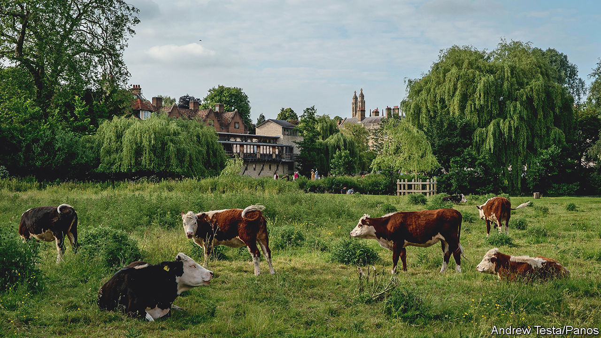
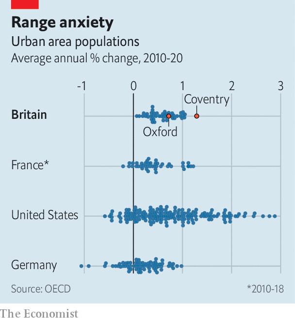

###### Britain’s growth crisis

# British cities all grow at roughly the same speed 

##### That makes them strange, and it’s not a good sign 

 

> Jun 15th 2022 

Few english cities are more successful than Oxford. Wages there are higher than the national average, and the proportion of adults with degree-level qualifications is far higher. Oxford University has a larger portfolio of patents than any other British university. 

But in one important way Oxford is no better than mediocre. Over the past five years the city has added just 1,440 net homes, swelling its housing stock by 0.5% a year. That is slower growth than the English average. The Office for National Statistics (ons) will soon update its population estimates to account for the 2021 census. For now, though, it calculates that Oxford’s population of about 150,000 is not growing at all. Even if you include surrounding districts containing lots of commuters—which is how the oecd, a club of mostly rich countries, defines urban areas—its growth is only average. 

 


When it comes to , British urban areas are all much of a muchness (see chart). Cambridge is just as successful as Oxford, yet the city and its hinterlands are growing slightly slower than its rival. Even London, whose success explains the government’s promise to “level up” the country, only grows by about 1% a year—again counting the commuter belt as part of the city. Not one metropolis is losing inhabitants. This pattern helps to explain why . 

Such homogeneity is unusual. Germany has several shrinking metropolises, many in the former East Germany but some, like Saarbrücken, in the industrial west. French cities are also more varied in their  than British ones. The range of population change in American metropolises, which stretches from -0.6% (Mahoning, Ohio) to 2.9% (Austin, Texas), is the widest of all.

Three things determine urban growth rates: domestic migration, international migration and the balance of births and deaths. British cities commonly gain more international migrants than they lose and have a surplus of births. But they tend to lose more people to the rest of Britain than they gain, as middle-aged residents seek quieter, more spacious digs in small towns and villages. That is true of Birmingham, Edinburgh, London, Manchester and Oxford, among many others. By contrast, says William Frey of the Brookings Institution, a think-tank, many cities in fast-growing American states such as Florida and Texas are positive on all three measures. 

The main reason successful British cities do not grow faster is the planning system, which allows local governments to block development. Oxford is surrounded by a 34,500-hectare (85,250-acre) “green belt”, a ring of land in which building is very difficult. Many green belts are much bigger: overall, 12% of England is so designated. “Green belts prevent cities from growing horizontally, height restrictions prevent them from growing vertically, and preservation rules prevent them from renewing themselves,” says Christian Hilber at the London School of Economics. Because most taxes are paid to central government, local authorities have little incentive to override planning restrictions. 

Large cities used to lose inhabitants: Liverpool, London and Manchester all did between the second world war and the 1990s. These days even struggling ones tend not to. They house the people who might move to successful cities if the latter were building more homes. Besides, says Paul Swinney of the Centre for Cities, a think-tank, people living in social housing are reluctant to move because they might have to join the queue in a new city. 

There is one exception to the rule, and it is a strange, revealing one. The ons, which generates the numbers used by the oecd, has for several years reported a high population growth rate for Coventry. Far from welcoming this as a sign of success, the people of Coventry have balked at it. Activists, local mps and the mayor of the West Midlands argue that the ons’s estimates are probably wrong. That is because the local authority is obliged to accommodate population growth. If Coventry is really growing quickly, it might have to build on the green belt.

Another effect of Britain’s stringent planning rules is that new housing is pushed into places with weaker restrictions. South of Oxford’s green belt and west of London’s one is Didcot, a small town that is growing at almost Texan speed. Two- and three-storey houses have sprouted along newly built streets with generic names like Greenwood Way and Orchid Mews. Thousands more are planned.

Locals complain that homes are being built faster than roads, leading to traffic jams, and that open space is being lost. “Many people feel like they’ve paved paradise,” says Debby Hallett, a Liberal Democrat member of the Vale of White Horse council. And although the new homes on the outskirts of Didcot are not far from lots of high-paying jobs, they are not close either: central Oxford is 13 miles (22km) away by car. Agglomeration effects, which raise people’s productivity by concentrating minds, are weakened as a result. 

In some ways the homogeneity of British cities is a boon. Although politicians complain about neglected, , Britain has few examples of true urban rot. The sign of a struggling British urban area is a high street with empty shops, not a street of boarded-up homes. Even poor post-industrial towns like Hartlepool and Merthyr Tydfil tick along, gaining a few hundred residents every year. Considering the many problems associated with depopulating urban areas, from a surfeit of infrastructure to vandalism, the lack of them is welcome. 

But the consistency of urban population change is worrying, too. It suggests that Britons cannot easily move to places of greater opportunity, where they might become more productive. One question often asked about Britain by politicians keen on “levelling up” the country is why big metropolises like Greater Manchester and the West Midlands conurbation are less dynamic than London. That is not the only problem, however. Another one is that the country’s most successful small cities cannot turn into big metropolises. ■

