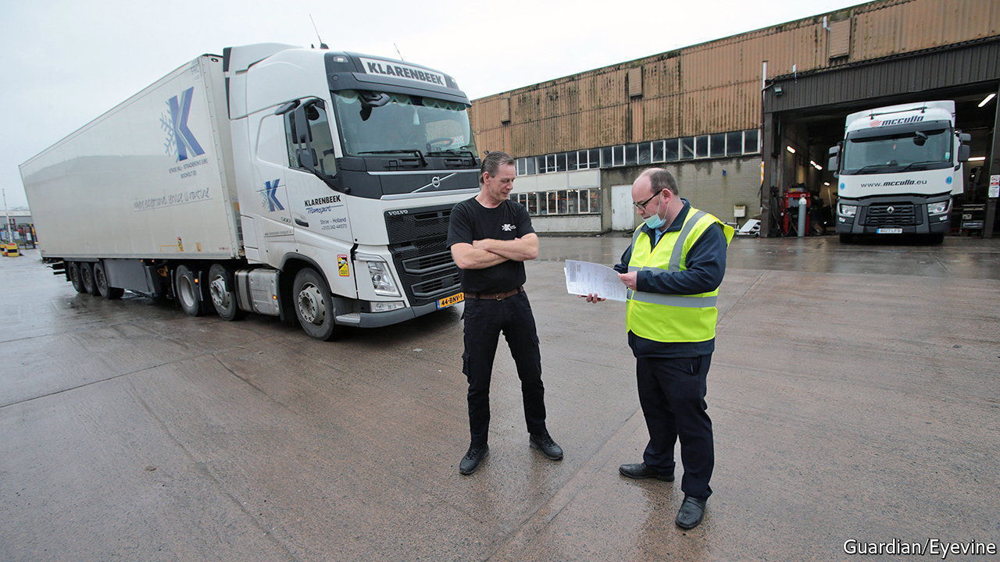

###### Forms, frustration and fans

# The Northern Ireland protocol enrages some businesses, pleases others 

##### Most firms in the province want it amended, not ditched 

 

> Jun 16th 2022 

When asked what he thinks of the British government’s new legislation to tear up much of the Northern Ireland protocol, Dermot Johnson struggles to think of printable words. “Unbelievable,” he eventually says. “Populist rubbish.” 

The protocol is the most contested part of the Brexit withdrawal agreement, which created a border between Great Britain and Northern Ireland in order to avoid hardening the land border on the island of Ireland. The legislation, which was introduced in Parliament on June 13th, would ditch large chunks of it unilaterally. Illegally, too, says the eu and very many lawyers. 

The government claims it has to act to resolve political instability in Northern Ireland, where unionists have demolished the devolved government over the protocol. It also cites the red tape that the arrangement imposes on firms as a reason for dismantling it. Talk to local businesses, however, and the picture is more complex. 

Mr Johnson is the archetypal small businessman who stands to benefit from the government’s new bill, which among other things would create different customs procedures for imports from the mainland that stay in Northern Ireland and those that head into the eu itself. His Lisburn-based firm, Johnson’s Coffee, recently wanted to buy 28 boxes of beef-flavoured crisps from England. The manufacturer refused to sell them because it would mean hiring a vet to complete an export health certificate demanded by the protocol (due to the presence of small quantities of an animal product in the flavouring). 

That cost would have come on top of the customs declarations that require British traders to choose the correct customs code from thousands of options when selling to Northern Ireland. Mr Johnson himself is deluged by paperwork. “It’s forms, forms, forms—I don’t think anyone even reads them.” But he nonetheless supports the protocol if it can become less cumbersome, and has little time for his namesake in 10 Downing Street. 

Four miles away, on the outskirts of south Belfast, Declan Gormley has a warmer view of the protocol. When the Irish Sea border came into force in January 2021, his company, Brookvent, took the opportunity to reach a big distribution agreement with one of the Irish Republic’s largest builders’ merchants. Mr Gormley, whose firm manufactures energy-saving ventilation systems, says that Brexit has hurt British rivals that must now navigate customs procedures to sell into the eu while he does so unimpeded. “Over time, this is going to benefit Northern Ireland enormously. Brookvent is now the only ventilation-manufacturing company in the British Isles with the same access to Great Britain and the eu. That’s a significant advantage.” 

He now fears the protocol will be ripped up, as do many other local companies which picked up contracts when it became harder for businesses on the mainland to export to the province. Almac, a pharmaceutical manufacturer, has been using the protocol as a marketing tool, referring to “the Almac advantage” of full access to the eu and to British markets. 

Others are opposed to the protocol. Peter Summerton, who runs McCulla Ireland, a haulier, believes the arrangement is disastrously unworkable, because it implements rules normally applied to containers or entire ships coming into the eu from places like Vietnam or Ecuador and applies them to tiny product movements within a small part of a domestic economy. “This was a plan to introduce the most complex sanitary and phytosanitary and customs controls anywhere in the world on one of the most fast-moving and integrated supply-chains anywhere in the world on one of most volatile border communities in the world. It was just a really bad plan.”

In February one of Mr Summerton’s lorries was stopped after coming off the ferry in Belfast. It was carrying Australian and New Zealand lamb to be made into ready meals in Northern Ireland, something which the industry had been told was legal. An unannounced change in the enforcement of the protocol meant that it was sent back to Britain after sitting in Belfast harbour for five days. And all this hassle is before the protocol has even been implemented in full. Most of the border procedures envisaged by the agreement have not yet been put into place; some which had been implemented were abandoned after a backlash last year. 

That the protocol needs improving is clear. It is bureaucratic, often disastrously so. It creates barriers to entry for firms outside the province, never good news for consumers. But most firms want the protocol to be altered, not ditched; many actively favour it. And what nobody wants is deeper uncertainty or the possibility of a trade war. On June 15th the eu announced that it was restarting legal action against Britain for delaying checks that should have been in place by now at the Irish Sea border. “Boris and the boys are on a kamikaze ride,” says the other Mr Johnson. “Europe’s their biggest market and they’re putting two fingers up to them.” ■


