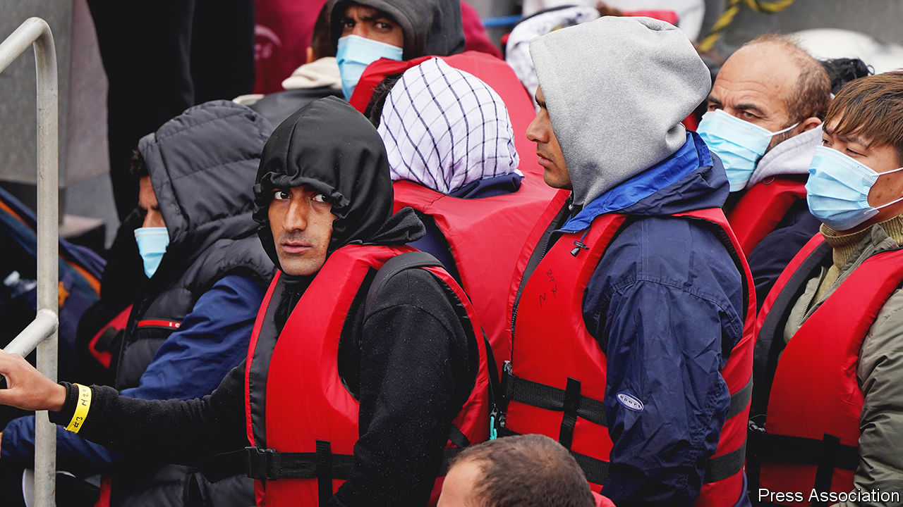

###### Asylum-seekers

# The real test of the government’s Rwanda policy 

##### People-smuggling across the English Channel is hard to police. But it exists because of policing 

 

> Jun 13th 2022 

Britain’s draconian attempt to crack down on illegal migration played out on many stages on June 14th. In Wiltshire a chartered plane stood ready to make the first flight deporting asylum-seekers to  since that controversial policy was announced in April. In Strasbourg a late ruling by the European Court of Human Rights found that an Iraqi man who was due to be on the flight should not be deported until the legality of the policy had been scrutinised at a High Court hearing in July. That decision allowed others to win appeals against removal, causing the flight to be cancelled. In London Tory mps fulminated against foreign judges and the government vowed to press ahead. 

If the courts do eventually allow the flights to Rwanda, attention will switch to another location—the French coastline. Last year 28,526 people came to Britain by crossing the English Channel in small boats. At least 45 people  on the journey. The goal of the Rwanda policy, says Priti Patel, Britain’s home secretary, is to break up the “evil trade in human cargo” by reducing demand for people-smugglers’ “repugnant activities”. If so, its success will depend on whether fewer people make the journey.

At a refugee camp near Dunkirk, volunteers say that the Rwanda policy is causing some people to have second thoughts about crossing. But it has not stopped the influx: 444 people crossed on June 14th alone. This continuing traffic reflects two inconvenient truths. 

The first is about supply, and helps explain why the government came up with its new policy in the first place: the cross-channel smuggling networks are very hard to break up. France has recently beefed up its police presence and installed thermal cameras near beaches, partly funded by . But smugglers have adopted new tactics to outwit the coastguard. They now co-ordinate mass launches of up to 40 vessels to overwhelm officers, and station people near beaches to figure out patrol times. Some have simply moved farther up or down the coast to avoid the guards: police must track a 130-mile (210km) stretch of coastline dotted with forests and wartime bunkers. 

Finding the right people to arrest is another problem. The smugglers often employ poor asylum-seekers to run on-the-ground operations for them. “It’s because of the empty pockets,” says Abdul (not his real name), who crossed on a small boat last summer, referring to people who run out of money on their way to Britain and do smugglers’ bidding for a period of time to finance the next stage of their journey. Asylum-seekers usually drive their own boats. 

Law-enforcement agencies are having some successes. But higher numbers of arrests have not curbed the trade, partly because of the way it is run. Unlike drug-smuggling gangs, where there is more rivalry between bigger, hierarchical groups, people-smugglers often work together. Smaller gangs and freelance smugglers, from Albanians to Kurds, frequently run different legs of someone’s journey. “There is no kingpin,” says Luigi Achilli of the Migration Policy Centre, a think-tank. “It’s not an organisation where you decapitate the head and bring down the whole group.” 

Collaboration between smugglers makes it difficult to prosecute them. People are responsible for different, legal parts of the operation. Some buy engines; others provide accommodation. “There’s nothing illegal in purchasing an inflatable boat,” says Martin Grace of the National Crime Agency. Drug-smuggling often involves the exchange of large wads of cash. People-smugglers are paid smaller amounts, and rarely in cash. People who cross on small boats are also reluctant to give information about smugglers. Some are scared. But others see smugglers as saviours. 

That leads to the second inconvenient truth: demand is likely to remain high. Most people who cross the channel in small boats are genuinely fleeing war, violence or persecution. In the year to March 2022 three-quarters of people seeking asylum in Britain were granted it. Abdul was fleeing the Taliban; they accused him of being a spy because he worked with Americans. Others are equally determined. “It’s no problem if they take me [to Rwanda]. I just don’t want them to take me back to Iraq,” says Hamat, who is in the camp at Dunkirk but has family in Britain. 

There are other ways to put the smugglers out of business: establishing legal routes for asylum-seekers to cross, such as a humanitarian visa scheme. Instead border security is being tightened and the British government has closed down avenues for claiming asylum. Such policies usually drive people towards smugglers, not away from them. Governments are “creating the very enemy that they are fighting. It’s like extinguishing a fire with oil,” says Mr Achilli. It will take an awful lot of deportations to Rwanda for that to change. ■

