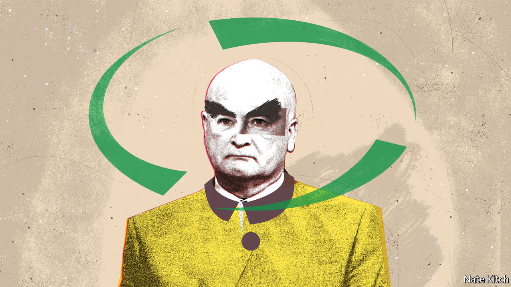

###### Bagehot

# The union planning Britain’s biggest rail strikes for three decades 

##### The RMT is the country’s most potent trade union as well as one of its weirdest 

 

> Jun 16th 2022 

Mick lynch has a distinctive face. Friends of the general secretary of the National Union of Rail, Maritime and Transport Workers (rmt) call him “The Hood”, after the glabrous villain in “Thunderbirds”. The , a right-wing newspaper, suggests the union leader likes the character’s reputation as the “world’s most dangerous man”. Mr Lynch has a prosaic explanation for the nickname: “[it’s] because I’m bald and I have massive eyebrows”. 

Britons should expect to see more of this visage. From June 21st Britain’s railways are in effect due to shut down, after the rmt launched the sector’s biggest bout of industrial action in three decades. The strikes will all-but close the network for a week. Cuts worth £2bn ($2.4bn) are coming to Britain’s railway budget, bringing probable job losses, service alterations and changes to working conditions. As well as haggling over that, the rmt has requested a pay rise to deal with inflation. 

The rmt is Britain’s most potent union and among its oddest, revealing both the problems and the potential power of Britain’s trade-union movement. Start with the flaws. The British left has a curious affection for authoritarian regimes, obsessing over the latest goings on in Venezuela or Cuba. (“Why do you have so many events and fringe meetings celebrating dictators at your congress?” asked one perplexed Norwegian trade unionist after visiting the annual meeting of the Trades Union Congress.) The rmt is no exception. A senior rmt official visited separatists in eastern Ukraine before the recent invasion; its store sells t-shirts pledging solidarity with Cuba.

All organisations are hypocritical. Charities are often horrific places to work; hard-charging financial firms can be perfectly pleasant. Likewise, the unions that protect workers’ rights can be an hr nightmare. In 2020 an external report into the gmb, the second-largest private-sector union, said: “Bullying, misogyny, cronyism and sexual harassment are endemic.” (A new general secretary has now taken over.) When acting general secretary, Mr Lynch briefly stepped down after accusing his executive committee of “bullying”. His predecessor quit citing stress. 

Where the rmt differs is in its ability to get things done. It is easy to paint the rmt as antiquated and, at times, insane. It is impossible to argue it is ineffective. Railway workers have kept benefits—such as final-salary pensions—that others have lost, even in industries with similar amounts of leverage. Only well-organised and motivated unions can prosper under strict anti-union laws, which demand a turnout of over 50% for a strike ballot to be valid. It takes around 4,000 signallers to run Britain’s railways. On the coming strike days only 400 or so will be working, according to industry estimates. Others mistook size for power. Unions such as Unite joined up with their peers, which gave them impressive numbers of members but reduced their ability to act quickly. 

Bigger unions were also preoccupied by their fractious relationship with the Labour Party. Jack Jones, a former trade unionist, once said of their relationship with Labour: “Murder, yes; divorce, never.” By contrast, the rmt disaffiliated years ago. Now other unions are beginning to pursue a more distant relationship. Unite’s new general secretary, Sharon Graham, promised less “Westminster politics” when running for office. Her predecessor, Len McCluskey, had been one of Jeremy Corbyn’s closest allies. The rmt’s politics may be crackers but they do not affect the day job. 

A summer of discontent, as some in the union movement have demanded, is risky. It would be welcomed by the government, which relishes the idea of a scrap with “union barons”. The Tories are sticking to trusty tactics, dubbing the action “Labour’s strikes”. Grant Shapps, the transport secretary, has threatened to change the law and allow agency staff to plug gaps during strikes. 

Changing commuting patterns also weaken the rail unions’ leverage. Leisure travel has recovered to pre-pandemic levels but commuters are moving around less. Inconveniencing people on the way to Glastonbury has less impact than ruining the week of City workers. Likewise, strike-breaking has never been so easy. In the 1980s Margaret Thatcher’s government spent years plotting how to counter miners, stockpiling coal and preparing for metaphorical and physical fights. Now advice to work from home may suffice (although this tactic is anathema to a government which has made reducing home-working a bizarre priority, despite its popularity among all age groups save the retired).

Rather Moderate Tankies

But compared with the wild demands of the 1970s the rmt’s wishlist is tame. The most militant union in Britain hints that it would accept a deal that kept wages flat after inflation. By comparison, in one dispute in 1972, when inflation was about 7%, miners demanded a 25% increase. They got it, too. Any summer of discontent would be a diluted version of its wintry 1970s cousin. 

And Britons may sympathise with demands to keep pay level with inflation. The Conservatives have swung from promising a high-wage economy to a much less popular position: warning against pay rises to ward off a potential wage-price spiral. Union barons are less unpopular than they were: a plurality of Britons think trade unions have a positive impact. Only the over-65s, who remember the 1970s and 1980s, have a negative view of them. Ahead of a summer of industrial action, a new generation of voters is approaching unions with an open mind. 

Get it wrong, however, and the results for workers and their industries may be dire. The history of Britain’s trade-union movement is one of formidable organisations brought low by hubris and misjudgment. Britain’s miners once seemed impregnable. An advert in 1975 for a career in the coal industry showed miners kayaking, shooting and skiing after work. It ended with the slogan: “People will always need coal.” Mr Lynch has bet people will always choose the train.■


