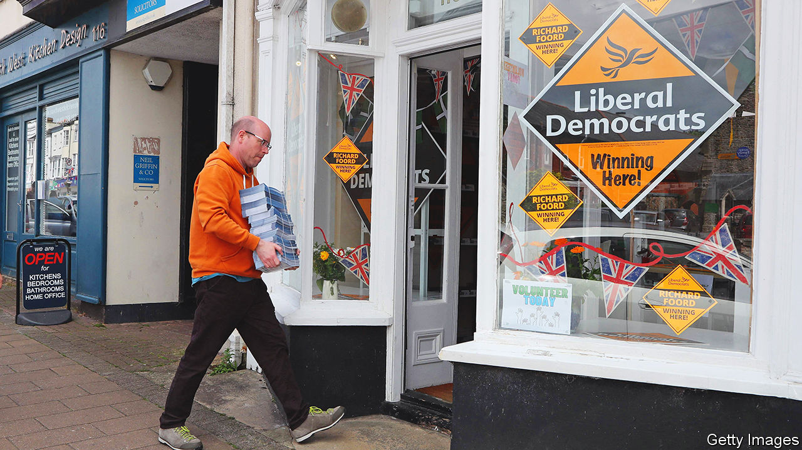
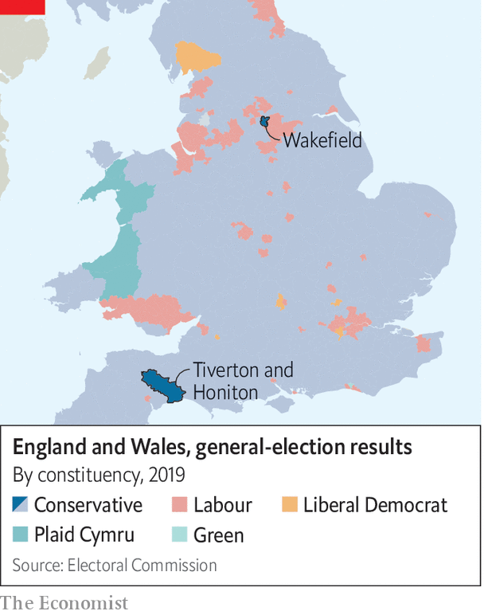
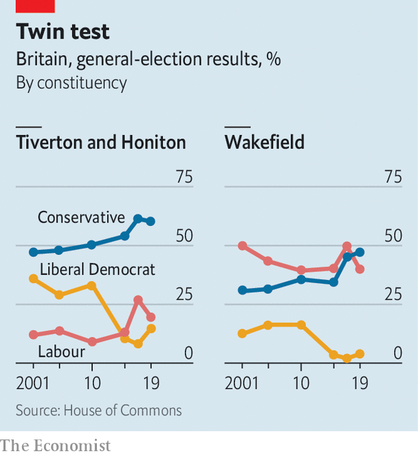

###### The progressive pincer

# Why the by-elections in Wakefield and in Tiverton and Honiton matter 

##### Two by-elections, at either end of the country, provide a dry run for the next British general election 

 

> Jun 16th 2022 

Psephologists used to lament the improved health of mps. In the past parliamentarians dropped dead regularly, providing a steady stream of by-elections to gauge a government’s mid-term popularity. Thankfully for pollsters, bad behaviour has replaced bad health. 

Scandals involving two Conservative mps have triggered by-elections on June 23rd that are perfectly placed to act as a dry run for the next general election. In Wakefield, a cathedral city in west Yorkshire, the Conservatives must demonstrate they can hang onto the traditionally Labour-voting areas which they won in 2019. In Tiverton and Honiton, in the south-west, they must stave off a resurgent Liberal Democrat party that has begun to take chunks out of the Conservative party’s rural base. Retain both and Conservative prospects are rosy. Lose either and the prognosis looks worse. Lose both and things become grim indeed. 

Start in Wakefield. All politics is local, but in Yorkshire it is parochial. The Conservative candidate, Nadeem Ahmed, is running as a born-and-bred-in-Wakefield candidate but in one interview he made a startling confession: “I did have a stint in Leeds, I’ll be honest with you.” 

 


Wakefield was once the administrative hub of the West Riding, a historic part of the county. Now Leeds is the undisputed centre of the region. That causes resentment across the once-rich, now-middling towns and small cities that dot the m62 corridor, places such as Halifax and Bradford. All struggle to accept that they are, in effect, suburbs of Leeds and Manchester. Most of them voted Leave in 2016, as Wakefield did by nearly two to one. 

Labour needs to regain seats such as Wakefield to win power. Polls suggest it is on track: one gives Labour a 20-point lead in the by-election. Short-term factors play a role. Boris Johnson presided over a jamboree of rule-breaking in Downing Street during lockdown; his wearied ethics adviser resigned on June 15th. The constituency’s former Tory mp was found guilty of molesting a child. There are not many Conservative signs. “Someone would just write ‘nonce’ on them,” noted one sage. (It would be apt: the slang term for paedophile originated in Wakefield’s prison.)

The Conservatives are also victims of past success. At the last election the pitch was one of “getting Brexit done” and keeping Jeremy Corbyn, Labour’s leftie leader, out of power. Now they have to offer something fresh to their new supporters. Labour has made its peace with Brexit; Sir Keir Starmer, the Labour leader, has in effect kicked his unpopular predecessor out of the party. In Wakefield, and many seats like it, that may be enough to lure voters back. 

The Conservative Party’s other vulnerable flank is in rural east Devon. Although the party easily won the Tiverton and Honiton seat in 2019, its mp, Neil Parish, resigned in May after twice watching pornography in the House of Commons chamber (he claimed that he had been searching for images of tractors the first time). The constituency is more varied than its cream-tea image might suggest. It contains wealthy villages but also unprepossessing small towns with deprived sections. 

The Liberal Democrats, who pride themselves on viciously effective by-election campaigns, are throwing everything they have at it. The Conservatives clearly regard them as the main threat. “Thinking of voting Liberal Democrat?” asks one of their leaflets, which goes on to claim that the Lib Dems want to rejoin the eu and raise the price of petrol. 

The insurgent party has an excellent local candidate in Richard Foord. He looks Devonian, with an authentically unfashionable haircut, and served in the army for a decade. That is a big advantage in south-west England, which contains more soldiers than any other region. He insists that the Conservative Party has neglected the area. Labourites in northern England say the government has not done enough to “level up” there, but Mr Foord disagrees. Levelling-up cash is being flung at marginal constituencies in the north and the Midlands rather than at Devon, he says. 

Partygate has turned many Britons off the Tories. But it offends especially in Devon, where an older-than-average population stringently obeyed lockdown rules. By the end of 2020, when vaccines were about to render the virus less lethal, the cumulative recorded infection rate in the county was less than half the national average. Many people still wear surgical masks in Tiverton and Honiton, even when outdoors. 

 


Still, the Lib Dem challenge to the Conservative Party’s dominance in south-west England is weaker than its frenetic campaigning in Tiverton and Honiton suggests. Although the south-west was once a Liberal heartland, the party was wiped out in the 2015 general election, losing all 15 of its seats to the Conservatives. It has struggled to recover, partly because its pro-eu stance offends people in a Leave-voting region and partly because its local machine is weak. In east Devon, independents are a more potent force in local elections. 

Progressive voters now outnumber Conservative voters in Britain by two to one, according to some polls. But marshalling this into an anti-Tory force is easier said than done. If there is an understanding that Labour ought to step back and allow the Lib Dems a free run against the Conservatives, nobody seems to have informed Liz Pole, the party’s candidate. She is running a shrewd campaign, arguing that the government’s policy of cutting agricultural subsidies should be suspended. The Lib Dems are behaving “like the lord of the manor expecting their tithing rights”, she says. The Tories are in trouble. But they are often lucky in their enemies. ■

