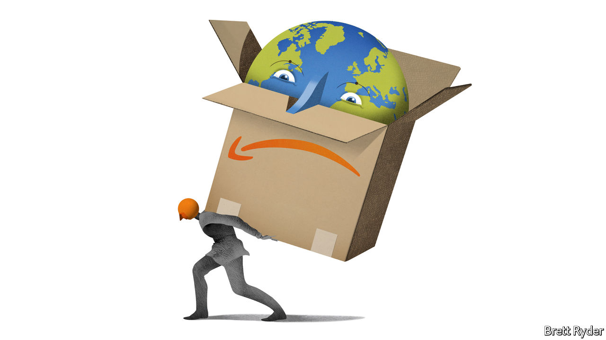

###### Schumpeter

# Amazon has a rest-of-the-world problem 

##### The Everything Store now has too much of everything 

 

> Jun 16th 2022 

As every wartime quartermaster knows, it is only when things go really wrong that you get noticed—or shot. The same is true in the logistics business. That is why it made news recently that Dave Clark, Amazon’s former logistician-in-chief, left the Seattle-based online giant to become ceo of Flexport, a shipping-software company. His departure comes just as Amazon is deluged with overcapacity in its vast warehousing and distribution business, which he captained during most of his 23 years at the firm. Some wondered whether he had faced the firing squad. 

In fact Mr Clark’s move looks to have been a voluntary one—with a hint of masochism. After doing a job that would have finished off most people, namely blitzkrieging through the retail landscape to bombard the world with Amazon packages, he now wants to prop up firms battling to get to grips with global supply chains. In doing so, Mr Clark leaves behind him a severe headache for Andy Jassy, Amazon’s boss. The titan of e-commerce is not just overbuilt and overstaffed. For the first time in its 28-year history it is in the midst of an inflationary whirlwind, which is playing havoc with its ability to predict the future. The situation is bad enough in Amazon’s American heartland. It is worse in its operations elsewhere. That makes it harder to fix.

When looking at Amazon, most attention is paid to its North American retail business—mainly the United States, but also Canada and Mexico. It accounts for the vast bulk of sales, almost 60% in the first quarter. The hinterland, which is to say its international business, includes dozens of countries, from Japan to India, parts of western Europe and elsewhere, that punch well below their weight. Strange as it sounds to non-Americans tied to the tyranny of the doorbell, collectively they contribute just 25% of Amazon’s overall sales. Amazon Web Services, the fast-growing cloud business, makes up the rest. 

Unsurprisingly, then, Amazon’s frenetic logistics drive in the past two years began at home. Since the early days of the covid-19 pandemic, the firm realised that lockdowns would fuel demand for online shopping. It threw caution to the wind and went on a domestic warehouse-building and hiring binge. In two years, as Marc Wulfraat of mwpvl, a logistics consultancy, puts it, Amazon created as much fulfilment square footage as Walmart, America’s ubiquitous supermarket giant, has built in half a century. Its logistics business, started only in 2014, has leapfrogged FedEx and is catching up with ups. Amazon’s total workforce almost doubled after 2019, to 1.6m. The feat was a Herculean one—with Hydra-headed consequences when inflation and covid-19’s contagious Omicron variant hit. In round numbers, overbuilding, overstaffing and inflation each added $2bn to Amazon’s costs in the first quarter, year on year, driving it into the red. The next epic task is to squeeze those costs out. 

This is where the rest of the world becomes a big problem. For cost control may prove harder abroad than at home. Although Amazon says it will keep building American fulfilment centres, it plans to sublease some of the space until demand recovers. It also hopes to reduce staffing through attrition and allow third-party sellers to use some of the spare capacity. It assumes that domestic retail growth will pick up later this year. Prologis, the world’s largest warehouse operator (and a big supplier to Amazon), showed similar faith in the future on June 13th when it agreed to buy Duke Realty, an American rival, for $26bn.

Look outside the United States and such optimism becomes harder to sustain. Amazon’s international business is, as in America, awash with overcapacity. But whereas North American sales grew by 8% year on year in the first quarter, in the rest of the world they shrank by 6%. Worse, in some big foreign markets, such as Britain and Germany, conditions may be deteriorating. Mark Shmulik of Bernstein, a broker, notes that overall e-commerce penetration is shrinking in Britain and mainland Europe for the first time in years. Consumer confidence is plummeting. Europe’s woes may be exacerbated by its proximity to the war in Ukraine. They may also be a harbinger of trouble in America.

Some of the deep-seated problems in these non-American markets were easy to make light of when business was booming, but loom larger now. The biggest is profitability. Amazon’s international operations are almost perennially loss-making, mainly because of the huge amounts of cash it is ploughing into expansion; the losses were particularly severe in the first three months of this year. Another is spending power. Mr Wulfraat calculates that Amazon sells $881-worth of stuff and services a year for every American. No other country comes close; the figure is $436 in Britain, $97 in Italy and $13 in Mexico. Third, in the poorer regions where the company operates, such as India and Latin America, the infrastructure is shoddy and local competition intense. That makes it look like it is throwing good money after bad. 

Amazon says it intends to continue its international expansion. It believes the slowdown in e-commerce penetration in Europe is partly a reaction to excessive dependence on online shopping during lockdowns. And whatever happens to the world economy, Amazon is confident that the structural shift from offline to online commerce is real and permanent. 

Cutting down the Amazon 

When Jeff Bezos was running the company he founded, few would have second-guessed such assumptions. But this is new leadership in turbulent times. Mr Jassy, who took the helm less than a year ago, is still on probation. If Amazon’s forecasts are correct, pretty soon the successor to Mr Clark will be building yet more warehouses and Amazon will be back to the races. If they are wrong, the newish ceo may have little choice but to consider reducing Amazon’s exposure to some of the more peripheral parts of its hinterland. Would he have the guts? ■


