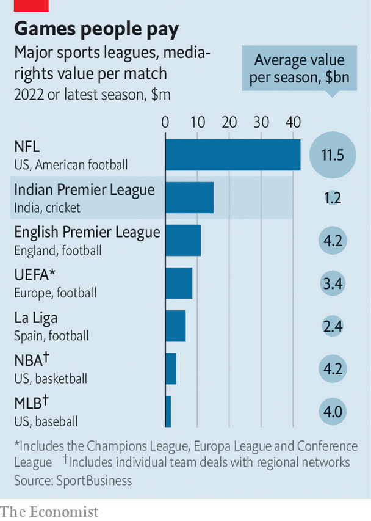

###### A near miss

# Disney loses its Indian Premier League streaming rights 

##### Phew 

 

> Jun 16th 2022 

The indian premier league (ipl) is awash with cash. cvc Capital, a European buy-out firm, paid $750m for the Gujarat Titans, one of the cricket extravaganza’s newest teams. In an auction ahead of this year’s competition, which concluded last month (with the Titans’ victory), the ipl’s ten sides splurged $71m on 204 players, five times the amount spent five years ago (when there were eight of them). 

Another auction, held between June 12th and 14th, attracted even more serious dosh. Media heavyweights fought for the right to show ipl matches to cricket-mad Indians for the next five years. Disney, which owns the current package, managed to hold on to the tv rights by agreeing to part with $3bn. It lost the online-streaming rights to Viacom18, a joint venture between Paramount Global, a fellow American media firm, and the media unit of Reliance, an Indian conglomerate, which will pay $2.6bn for the privilege. For another $500m or so, Viacom18 also scooped up the international rights for Australia and New Zealand, Britain and South Africa, the other big cricket markets, and a smaller domestic package for high-profile games. 

 


In all, the auction has netted the ipl $1.2bn per season—less eye-watering than, say, the English Premier League’s reported $4.2bn-a-year media haul in football. But if you adjust for the ipl’s leaner season—74 matches, against 380 in the English Premier League—that makes it the second-most-lucrative sports series per game. Only the gladiatorial contests of America’s National Football League score higher (see chart). 

The bidders believe it is money well spent, for two main reasons. The first is the promise of advertising riches. Perhaps half a billion Indians watch at least some ipl, and millions tune in religiously. The tournament’s format, with play stopping every few minutes, is an adman’s dream. Last season’s broadcasts featured more than 110 different advertisers, from sellers of , an Indian digestive, to Unacademy, an education-technology firm (when a batsman whacks the ball for the maximum score, commentators describe it as an “Unacademy Let’s Crack it Six”). 

The ipl’s second big attraction is as a gateway to the Indian consumer. For a company like Paramount, which plans to launch its own streaming service in India in 2023, the ipl serves as a beachhead. For Reliance, India’s dominant digital platform, it is a way to engage the 400m Indians that already subscribe to its mobile network, Jio—and to get them to spend more on Reliance’s multiplying offerings.

Disney’s failure to capture the streaming rights will make it more difficult for the Hollywood giant to reach its target of 260m global subscribers across its online services by 2024. In the first quarter of 2022, when the ipl season got going, Disney added nearly 8m new subscribers, more than half of them in India. It may now lose 20m subscribers, according to Media Partners Asia, a consultancy. 

Disney insists that its local content, along with other sports broadcasts (including the national cricket team’s matches), will keep viewers hooked. More than four-fifths of the estimated $500m in ad revenues from the ipl last year came through tv, which Disney has held on to. Attention may anyway be waning: this season saw a decline in viewers, though the ipl insists it was a one-off. 

Most important, investments in Indian streaming offer meagre returns. Indian subscribers pay Disney just 76 cents a month on average, compared with $6.30 in America. That may explain why Alphabet, Amazon and Meta, three American tech giants with big ambitions in India, did not take part in the auction despite earlier interest. Nor did Apple, which is said to have just signed a $2.5bn ten-year deal to stream America’s football league (the proper kind). Paying billions for access to the Indian consumer is one thing for Reliance, with its aim to dominate all things digital in its home market. For Disney, the loss looks like a sticky wicket avoided. ■


