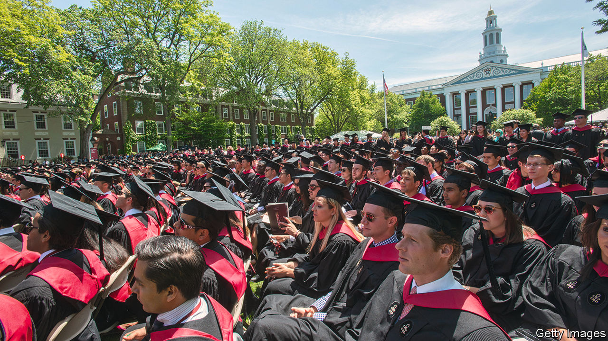

###### Human capital in the 21st century

# How modern executives are different from their forebears 

##### They need to work harder at more tasks, and to deploy softer skills 

 

> Jun 16th 2022 

Spiritual growth is an odd mandate for business schools preparing graduates to make manna in a secular world. One such institution, hec Paris, has nevertheless decided to send students on a trek through the French countryside to a remote village, where a Benedictine monk (a former lawyer) guides them through ethical dilemmas. Whether or not the three-day seminar represents a shift away from the profit-driven logic of business and towards a kinder, gentler form of capitalism is up for debate. But it shows that expectations for what makes a great mba programme—and, by extension, a great executive—are in flux.

mba courses (our ranking of which you can find at economist.com/whichmba) used to focus on number-crunching and business strategy. Executives must still master these skills. Yet the corporate world has changed since the mba first became a rite of passage for high-powered executives. Management teams answer to a growing number of “stakeholders”, from employees to social activists, and face public scrutiny on their companies’ environmental, social and governance (esg) record. Simply creating shareholder value no longer cuts the mustard.

One consequence of this trend is that running a modern business requires an ever-expanding list of credentials and competences. In addition to financial and digital literacy, strategic acumen and communication skills, executives are expected to be clued in on supply chains, climate science and much else besides. They must ensure that their workforces are diverse and inclusive. And as work life goes hybrid, mixing time in the office with home working, they are also asked to spend more time checking in on subordinates. 

Some of these new duties are delegated to new corporate roles. Prince Harry is the “chief impact officer” of a Silicon Valley firm. Clifford Chance, a law firm, has appointed a global “wellbeing and employee experience” chief. Nearly 5,000 people on LinkedIn, a social network, describe themselves as “chief happiness officers”. Still, most high-ranking managers will almost certainly need to perform each of these novel tasks to a greater or lesser extent. 

Since a day has 24 hours—and even hard-charging executives need sleep—their workload is changing. Devoting more time to employees and other stakeholders leaves corporate leaders less for other things, including mission-critical ones like coming up with a strategy for their firm. Since 2006 Michael Porter and Nitin Nohria of Harvard Business School have tracked what ceos do all day. They find that bosses spend 25% of their working lives on fostering relationships with insiders and outsiders, more than they devote to strategy (21%), corporate culture (16%), routine tasks (11%) and dealmaking (4%).

Although Messrs Porter and Nohria do not yet have the relevant data, anecdotal evidence suggests that hybrid work may be skewing executives’ workday even more towards people management. Human-resources chiefs report that managers spend more time hand-holding staff, for example. Bosses were hybrid workers before covid-19. The pre-pandemic ceo spent around half their time in the office and the rest in external meetings, travelling or otherwise working remotely. More than a third of their communications was via video chat, email or the phone. The difference now is that everyone else spends just as little time in the office—if not less. This further reduces opportunities for face-to-face contact, which makes building relationships with employees more difficult, and almost certainly more time-consuming. 

As the 21st-century executive’s workload is changing, so too are mba curriculums. Many institutions are busily incorporating new, cuddlier modules. Harvard Business School now has one entitled “Reimagining capitalism”. insead, a French organisation, teaches students about “Business and society”. Plenty of mba programmes offer courses on interpersonal skills. Some are tailoring classes for the Zoom age, for example pointing out the common traps of virtual negotiations. That necessarily leaves less time for other, more traditional instruction. 

A few schools are even fundamentally rethinking their recruitment policies to reflect the evolving character of modern management. That may involve conducting group interviews to assess candidates’ soft skills rather than their intellect alone, or screening candidates for emotional traits such as empathy, motivation and resilience through questionnaires, letters or essays. Changes to whom business schools recruit, as well as to what they teach, may in turn affect who applies. Given that a business-school degree is designed in part to send a powerful signal of executive competence, that may determine what type of person rises up the corporate pecking order. It might not be your parents’ mba. ■


