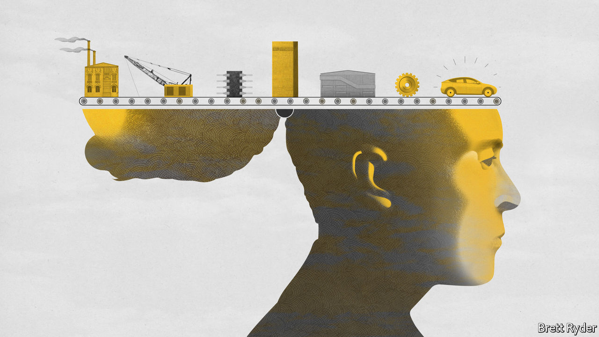
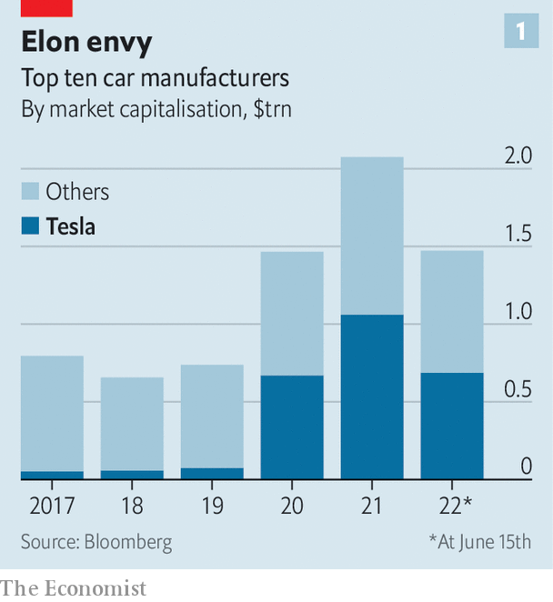
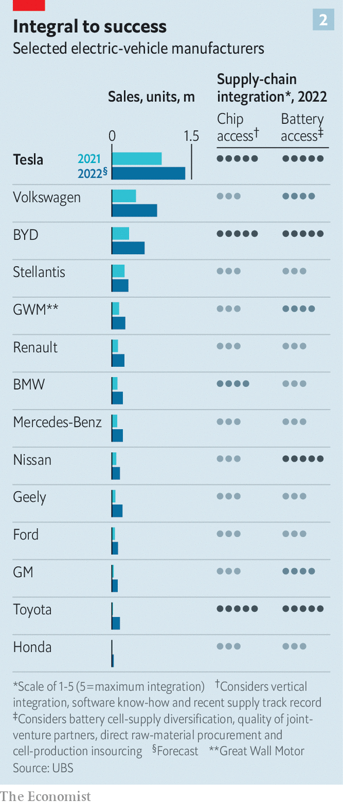
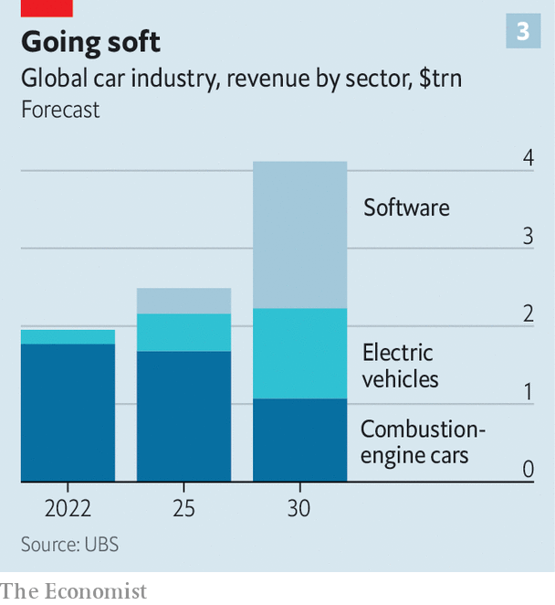

###### The great Teslafication

# How supply-chain turmoil is remaking the car industry 

##### Learning from Elon Musk 

 

> Jun 12th 2022 

If you want to see how technology and deglobalisation are changing the global economy, there are few better places to look than the car industry. Not only is it going through an epochal shift: away from the internal-combustion engine (ice) and towards  (evs). Automobiles are also becoming, in effect, computers on wheels, running as much on processing power as the horse variety. And the pandemic has wreaked havoc on car companies’ complex global supply chains, most prominently of . As carmakers electrify, computerise and refashion their supply chains for the new reality, the giant sector is undergoing the greatest transformation in decades.

Having outsourced much of the manufacturing process in the past half-century to focus on design, supplier management and parts assembly, car firms want greater control over their value chain—from the metals that go into ev batteries to the software those evs run on and the shops in which they are sold. And they want to turn their ev arms into tech startups. 

In both respects, control and startupiness, Big Auto wants to be more like Tesla, the world’s undisputed ev champion. As with earlier examples of tailgating a rival that tries something that works, from Ford’s moving assembly line or Toyota’s just-in-time manufacturing, Teslafication of the car business will prove disruptive.

Doing everything under one roof is an idea both old and new. Tesla’s industrial system is at first glance an embrace of Silicon Valley’s “full stack”—internalising all aspects of production, and therefore all the profits. Elon Musk, Tesla’s opinionated boss, once claimed that his company was “absurdly vertically integrated” by any standard, not just the car industry’s. In fact, Mr Musk borrows heavily from carmaking’s past. Henry Ford often sourced raw materials, like rubber for tyres and steel for chassis, from plantations and blast furnaces owned by his firm. His River Rouge factory in Detroit was powered by coal from Ford mines. 

In an echo of Fordism, Tesla has struck recent deals with  and graphite suppliers, and last month confirmed a deal with Vale, a Brazilian mining giant, to purchase nickel. The plan is to acquire most of its lithium, over half its cobalt and around one-third of its nickel directly from nine mining companies. It will use those minerals in its “”, the first of which started making batteries in 2017 in Nevada in partnership with Panasonic of Japan. It plans to make more cells on its own at its three other gigafactories around the world. 

Tesla has also pulled other bits of the powertrain in-house. It makes its own motors and a lot of its own electronics, giving it more control over costs as well as over the technology, says Dan Levy of Credit Suisse, a bank. Although rumours swirling last year that Mr Musk might buy his own chip factory have faded, Tesla designs its own semiconductors and has closer links than other carmakers with those who manufacture them. That has helped it weather the global chip shortage better than rivals. Tesla’s software engineers have created a centralised computing architecture to run on those chips, ensuring smooth integration with the four-wheeled hardware. Mr Musk has even ditched the dealership-based sales model, instead opening his own swanky Tesla stores. 

 


Jealously eyeing Tesla’s market value of $724bn, which is roughly as much as the next nine biggest carmakers combined (see chart 1), other car bosses are desperate to emulate Mr Musk’s digger-to-dealership control. According to ubs, another bank, “integration represents a strong competitive edge in an environment of structurally tight supply chains.” As Jim Farley, Ford’s current boss, recently declared, “The most important thing is we vertically integrate. Henry Ford…was right.”

This reverses decades of outsourcing to big suppliers such as Bosch, Continental and Denso in order to concentrate on managing supply chains, integrating separate parts, design and marketing. Suppliers sold similar components to many customers using scale to keep prices low. This freed up capital for carmakers but put technological innovation at one step removed. Carlos Tavares, chief executive of Stellantis, an Italian-American giant (whose big shareholder, Exor, also owns a stake in ’s parent company), has said that his cars are 85% “bolt-on parts”. Mercedes-Benz estimates its value-added split at 70-30 in favour of suppliers. 

Established car firms now want their ratios to more closely resemble Tesla’s, which Philippe Houchois of Jefferies, an investment bank, puts at 50-50 and rising in favour of in-house. This starts with raw materials. As demand for battery minerals, notably cobalt, lithium and nickel, and processing capacity continues to outstrip supply, car firms are striking deals which would have Henry Ford nodding with approval. Getting their hands dirty by short-circuiting supply chains is, in the words of one former mining titan, “extraordinary”. 

bmw said in 2021 that it had put $334m into an Argentine lithium project. Last year Stellantis and Renault each signed deals with Vulcan Energy Resources, and gm revealed a “multimillion-dollar investment” in Controlled Thermal Resources, in each case for lithium. In April Ford inked a deal with Lake Resources for the same mineral, while Stellantis and Mercedes entered an arrangement with Umicore, a Belgian chemicals giant, to supply cathode materials for acc, the two carmakers’ battery joint venture. A month earlier byd, a more Tesla-like Chinese firm that started out making phone batteries before turning into one of the world’s biggest ev-makers, announced a nearly $500m investment in a Chinese lithium miner. It is said to have bought six mines in Africa. The terms of such deals are as opaque as the sums involved are eye-catching. Car bosses agree that they will become commonplace. 

Efforts to emulate Tesla’s battery gigafactories are also getting into gear. Carmakers are hoping to break the stranglehold of China and South Korea on battery-making, bringing production closer to home to keep costs in check and supplies reliable. Volkswagen (vw) is creating some in-house battery-making capacity. It has earmarked €2bn ($2.1bn) for its German factory, and says it will build six battery factories in Europe by 2030.

 


Plans for such fully fledged in-house battery units remain rare (see chart 2). Most companies still prefer to team up with specialist producers. Ford and sk Innovations of South Korea will stump up $7bn and $4.4bn, respectively, for three joint gigafactories in America. Last year gm unveiled an investment of $2.3bn for a battery plant in Tennessee built with lg, another South Korean firm. Sometimes, as with acc, rival car companies band together to share the cost of battery production. Stellantis and Mercedes (along with TotalEnergies, a French oil giant) will invest $7bn in acc factories in France and Germany. vw has a 20% stake, worth €1.4bn, in Northvolt, a Swedish firm that also counts Volvo as an investor. 

Buying off-the-shelf electric motors is also falling out of favour. Hyundai and the Renault-Nissan-Mitsubishi carmaking alliance are mostly going it alone. bmw, Ford, gm, Mercedes and vw are planning to make more motors in their own factories. 

Although no car boss is about to outdo Mr Musk and make the leap into chipmaking, the 7.7m cars in lost production last year as a result of the global semiconductor shortage has made the industry forge closer links with chip designers such as Qualcomm and Nvidia, which would once have sold chips to firms far down the carmakers’ supply chain. The car companies are also employing chip specialists to help them semi-tailor specifications and turn them into, as one car boss puts it, “smarter buyers”. vw is hatching plans to design its own custom silicon, as Tesla does. 

 


Something similar is happening in software development. Last month vw’s boss, Herbert Diess, told a meeting of his employees that developing its “own software expertise is the biggest switch the automotive industry has to make”. Mr Diess’s fellow industry leaders share his analysis. In the next few years software is expected to become the biggest source of revenue for the industry. ubs reckons that worldwide car-software sales will bring in around $1.9trn annually by 2030 (see chart 3). 

Small wonder that car companies want to appear more techie. In September Ford poached Doug Field, who had been in charge of special projects at Apple, a tech giant with its own long-rumoured automotive ambitions. Jim Rowan, who took charge of Volvo in March, is a former boss of Dyson, an electronics firm. Even Ferrari, an Italian sports-car brand defined by the roar of its petrol engines (which is also part-owned by Exor), has been run since September by Benedetto Vigna, recruited from stMicroelectronics, a Swiss semiconductor company. 

In 2020 vw created a separate software arm, cariad, to sidestep its slow decision-making bureaucracy. Despite teething troubles with the programs for its id.3 hatchback that surfaced at the end of 2019, the firm has recently said that it aims to develop most of its own software in 15 years’ time, up from about 10% now. That includes plans for a proprietary operating system, something that Mercedes and Toyota are also contemplating. (Ford and gm are instead adopting Google’s Android operating system.) To that end, vw plans to invest around €30bn over the next five years. Stellantis wants to hire 4,500 software engineers by 2024. Several carmakers are setting up research-and-development centres in tech hubs, from Silicon Valley to Shanghai, in order to tap those places’ existing talent pools.

As for sales, the established giants have no intention of dismantling the time-honoured dealership system. It serves useful functions in servicing, for example—as Tesla’s long-running struggles in this area illustrate. Still, more car companies are shifting to an “agency model”, selling vehicles directly to motorists, as Tesla does, rather than through a third party. Charging fixed prices could boost margins. Direct sales also forge a closer bond with buyers who might go on to purchase additional services and upgrades. 

If they really want to catch up with Tesla, let alone overtake it, car companies will have to “move at Silicon Valley speed”, as Barclays, a bank, puts it. That means simplifying not just their supplier networks but their corporate structures, which have become Byzantine and siloed. As long ago as 2019 Volvo and Geely, its Chinese parent company, merged their ice operation as a stand-alone business. That has allowed the Swedish marque to go full speed to becoming electric-only by 2030. In March Ford said that it would create an ev unit, Ford Model e, and separate it from the ice operations. Renault is considering doing something similar, also with a view to accelerating innovation. 

All this amounts to a once-in-a-century upheaval for a globe-spanning industry encompassing thousands of companies, millions of workers and billions in sunk ice-age costs. Refashioning value chains will require spending lots of time and money, and comes with the risk of failure. For suppliers, it potentially means less business, as vertical integration makes them less central to carmaking—a prospect reflected in the sliding share prices of some, including large ones like Continental, in the past few years. 

For car bosses, that means more headaches, as they consider how best to deploy their firms’ resources and skills, without provoking a backlash from governments and unions fearful of the loss of well-paying manufacturing jobs. As a result, the sector’s Teslafication drive will be uneven and fitful. But the direction of travel is unmistakably Muskian. ■


