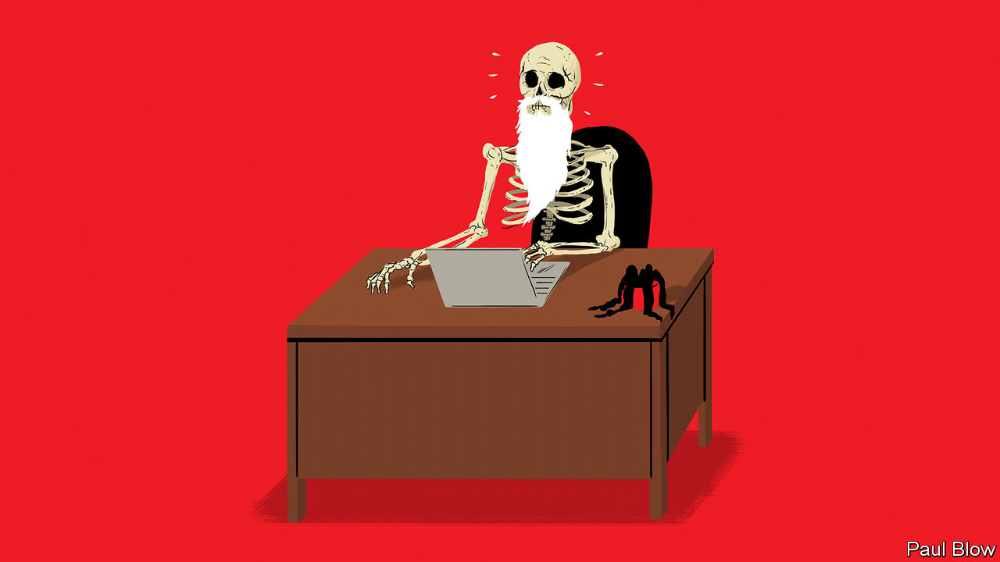

###### Bartleby

# Work, the wasted years 

##### Logging in, deleting emails, mistyping things. It all adds up 

 

> Jun 16th 2022 

Few things are more depressing than estimates of how much time people spend on a specific activity over the course of their lives. You know the sort of thing: you will spend one-third of your life asleep, almost a decade looking at your phone and four months deciding what to watch on streaming services. 

A new study, by academics from the Maryland and Delaware Enterprise University Partnership (madeup), applies this approach to the workplace. By conducting a time-use survey of 5,000 office workers in America and Britain, the researchers identify the number of minutes that people waste on pointless activities each working day. (Meetings are excluded: they often turn out to be useless but not always and not for everyone.) The authors then extrapolate these figures to come up with a “weighted total futility” (wtf) lifetime estimate of time that could have been better spent. The results are literally unbelievable.

Correcting typos takes up an average of 20 minutes in every white-collar worker’s day, the equivalent of 180 days, or half a year, over a 45-year career. Some words are mistyped so frequently that on their own they can waste days of the average employee’s existence. “Thnaks” is the worst offender in the English-speaking world, followed by “teh”, “yuo” and “remeber”. The amount of time the average worker spends writing “Bets wishes” is also counted in days.

The gestation period of a goat is around 145 days. Which is also how long the average worker spends logging into things during his or her working life. Security concerns mean that some time is bound to be absorbed in this way. But months are wasted trying to remember passwords, entering them wrongly or updating them. Just as much time is spent waiting for something to happen, a great economy-wide period of vacant staring at a screen. 

If getting into things wastes lots of time, so does closing them down. Eliminating help windows and tool-tip boxes takes up days over a career. Rejecting repeated requests to schedule updates to your operating system is another chunk of existence that you will never get back. Zapping pop-up ads and trying to pause auto-playing video absorbs time that could have been spent learning to knit or visiting Machu Picchu.

A bundle of “tidying up” activities absorbs over four months of the average worker’s life. Deleting emails takes up about six weeks of your life. Clicking on Slack channels to read through messages that are not meant for you, or clearing notifications on your phone screen for articles that you will never look at: tasks like these each eat up several days. 

Various types of formatting tasks constitute another huge time-suck. Think of those attempts to change the margins on Word or Google documents, or the hours spent trying to work out where exactly you need to put the missing bracket in that broken spreadsheet formula. Shakespeare wrote “King Lear” in the time an average office worker spends changing font sizes during their career. 

Redoing work that you have failed to save is in a category all of its own, because of the psychological trauma involved. This problem has been mitigated now that revisions are saved automatically on many programs, but it has not been solved. Batteries still run out at crucial moments, internet connections still fail. Making a series of deeply insightful comments in a Google doc, failing to save them and then closing everything down causes a special kind of despair. So does creating an org chart with hundreds of arrows and text boxes, and realising you missed someone out.

These are only some of the many ways in which time is routinely wasted. Co-ordinating diaries for meetings that will later be cancelled: another month. Waiting for people to repeat themselves because they were on mute by mistake: a fortnight. Spending hours crafting an email and then leaving it in the drafts folder: two days. Desperately opening and shutting various flaps on a recalcitrant printer: a day. 

The madeup study shows that technology lies at the heart of this squandered time. Technology can also help. Services that sync up diaries and autocorrect options already do; passwords will doubtless end up being replaced by facial recognition and fingerprint logins. Whether the time thereby saved would be put to more productive use, like reading this column, is a reasonable question. But years of workers’ lives are wasted on utterly pointless activities. All improvements warrant heartfelt thnaks.


