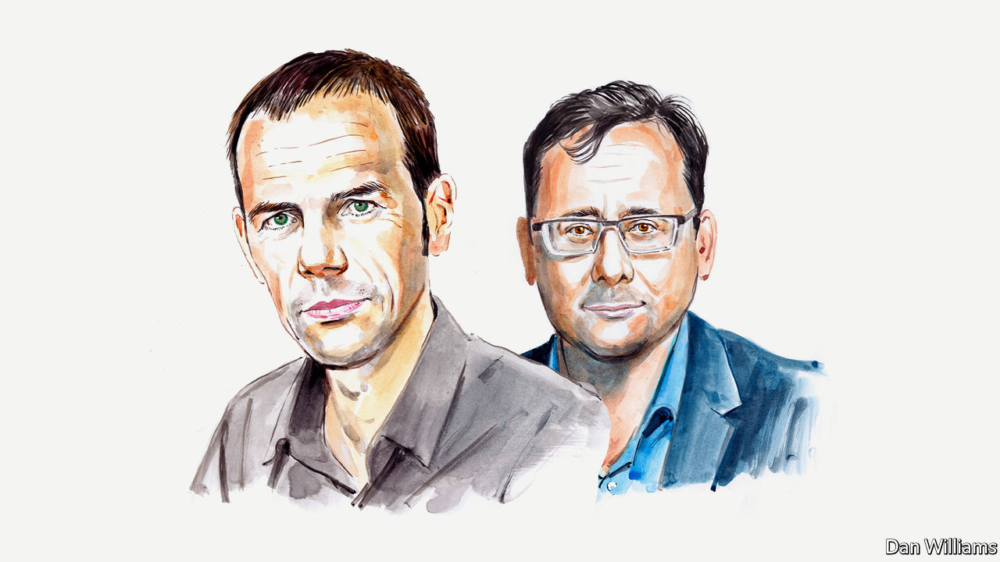

###### Ukraine and the EU

# Allowing Ukraine into the EU is not the right move for now, say Luuk van Middelaar and Hans Kribbe 

##### Instead, a new security league should forge closer links between Europe’s countries, argue two former Brussels insiders 

 

> Jun 10th 2022 

SHOULD UKRAINE join the European Union? It is a big question, not just for Ukraine but for the EU too. Volodymyr Zelensky, Ukraine’s president, has made a strong case for his country, and several EU governments are convinced. We are part of the family, he argues: fighting and dying for Europe and its values. 

Mr Zelensky’s plea is hard to ignore. Pouring cold water over the European aspirations of a country under attack in a vicious war seems callous and myopic. And he is right to remind Europeans that enlarging their club carries geopolitical significance. Concerns about stability in Europe drove the post-cold-war accessions of Poland, Hungary and others to the EU almost two decades ago.

Yet many European leaders prefer to play the procedural card, hiding behind time and process. Olaf Scholz, Germany’s chancellor, says fast-tracking Ukraine would be unfair to aspirant members in the Balkans who have been stuck in the queue for years. Mark Rutte, the Dutch prime minister, insists there can be “no short-cut” to membership. Emmanuel Macron, France’s president, says accession will take “years, and in truth, no doubt decades”.

Such “rules are rules” arguments may be cogent in peacetime. But during a war they risk looking clueless and cynical. At stake is Ukraine’s survival as a state, not its adoption of EU food-safety standards. There is a risk of losing sight of the strategic choices at stake. At their summit on June 23rd and 24th EU leaders may be tempted to fudge the issue, hinting at accession prospects without giving a clear date or firm commitment. By creating expectations that cannot be met, this risks breeding resentment. Just ask Turkey, which has been on a phantom road towards EU membership for almost 20 years.

Still, Ukraine deserves straight answers, not false promises. And the truth that EU leaders leave unspoken is that, although anchoring Ukraine in European structures is strategically important, there are equally strategic reasons why the EU should not be one of them. 

It does not make sense for Ukraine to join the union before it secures NATO membership, which even Mr Zelensky agrees is unattainable today. Security comes first, and the EU cannot provide it against Russia. EU member governments have a treaty obligation to assist each other in the case of armed aggression “with all means in their power”, but this form of solidarity, designed with terrorism or cyber-warfare in mind, does not deter a nuclear power. It is why Poland and other ex-Warsaw Pact members entered NATO before joining the EU. It is also why Finland and Sweden are now seeking protection under NATO’s Article 5, its mutual-defence clause. If Ukraine were to join the EU without this NATO deterrent in place, the risk of a future war between Russia and the EU as a whole would grow significantly. 

There are further trade-offs to consider when weighing Ukraine’s EU bid. Europe needs to grow into a geopolitical force, capable of working with America to stabilise the European region. But the accession of Ukraine, as well as states such as Russia-friendly Serbia, would risk leaving the club even more divided and hamstrung than it is today. (The experience of Hungary, which has tilted towards authoritarianism over the past decade and recently diluted the EU’s sanctions on Russia, provides a cautionary tale.) Centralising EU decision-making on foreign policy and the rule of law, which currently require unanimity among 27 governments, would undermine the ability of new members to throw grit into the oyster. But few existing members are ready to contemplate handing such powers to Brussels.

None of this means Mr Zelensky should be given the brush-off. There is an evident need to anchor Ukraine, and several other Balkan and Black Sea states, more firmly in Europe. But neither NATO nor the EU can be that anchor. It is this that makes Mr Macron’s recent proposal for a pan-European political community a more realistic proposition than some of his critics suggest—as long as it is conceived in the right way.

Above all, such a league of European states—call it the E40, after the long motorway that connects Calais to Ukraine—should exist outside EU structures and be intergovernmental, a bit like the G20. What Europe does not need is another waiting room for aspiring EU members, or a revived version of the old “two-speed Europe” idea (in which one group of states moved towards greater integration with more speed than others less keen to do so). Nor should such a concert of states be imagined as an outer circle orbiting a Brussels core, as the European Commission is likely to conceive of it. The EU already has countless partnerships and association agreements with European non-member governments, including Ukraine. And any hint of an “EU-lite” would instantly deter Britain, which must also be involved.

Instead, the E40 should offer a security assurance to its members; not with the full force of NATO membership but with something beyond mere declarations. It could identify threats to common interests and values and formulate joint strategies in response, for example in the area of energy security (interconnecting electricity grids), border disputes and cyber-attacks. Taking up an idea that has been floating around in European circles since 2018, the E40 could set up a “European Security Council” with rotating and permanent members (France, Germany, Britain, as well as possibly Poland, Italy or Spain). 

No existing grouping of states can currently fulfil this role. For the foreseeable future there is no place for Russia in such a pan-European club, which is why the OSCE, to which Russia and numerous non-European countries belong, cannot perform the task. The Council of Europe, with its narrow human-rights mandate, is equally unsuitable. Although the EU would not be an E40 member as such, its presidents could attend leader summits, as they do in the G7 and G20. The same goes for the secretary-general of NATO, who would provide a critical link with America and its hard power. 

The E40 will certainly not be a panacea, but it does provide a more immediate and less cynical way forward for Ukraine than phantom promises of accession. Above all, it would give Ukrainians the political signal that, as citizens of an independent and sovereign state, they belong to the European world, to its civilisation, values and civic aspirations. That may not be exactly the message Mr Zelensky wishes to hear. And yet it has the virtue of being honest and truthful. Isn’t that what we expect from family?■

_______________


