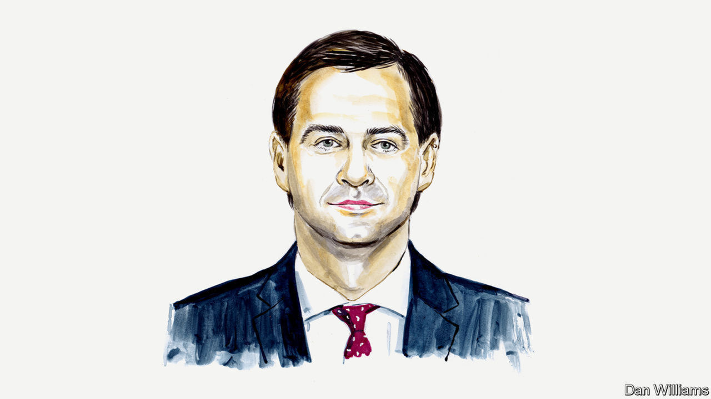

###### Russia and Ukraine

# Moldova’s deputy prime minister urges the EU to expand its membership 

##### Nicu Popescu says his country is eager to join 

 

> Jun 14th 2022 

AFTER THE great destruction of the second world war, there was a singular purpose behind the creation of what is now the European Union: lasting peace. The EU must renew its commitment to this mission in light of Russia’s invasion of Ukraine. And enlargement is the most effective instrument that it can use to foster peace and bring stability to fragile eastern Europe. 

Article 49 of the founding treaty of the EU establishes that any European state which respects human dignity, freedom, democracy, equality, the rule of law and human rights, and which is committed to promoting them, may apply to become a member of the union. Moldova is committed to these values. We have demonstrated it the hard way. 

When the first Russian bombs exploded on Ukrainian soil, Moldova condemned the Russian invasion of our neighbour. Our country respects the international financial sanctions on Russia, and we voted to cast it out of several international forums. We also welcomed almost half a million refugees crossing our border as they fled the war. Some 78,000 chose to stay here and most are hosted in private homes, not in government facilities. 

In favour of democracy and against authoritarianism, Moldova applied to join the EU on March 3rd. We seek formal candidate status for membership. Our EU bid is hardly news. For over 20 years, the EU has been an anchor for the peaceful, prosperous, and democratic development of Moldova. 

We have never abandoned our goal of European integration. Throughout Russian trade embargoes, oligarchic rule, political arm-twisting and gas crises, we remained steadfast. When our politicians failed to draw us closer to the EU, our citizens acted. Last year a Russia-leaning administration was voted out of office. 

For the first time since Moldova’s independence more than three decades ago, the president, the parliament and the government are guided by the same objective of achieving a breakthrough on the European path. This unique political conjuncture must not be wasted.

It is time for the EU to embrace Moldova. Member states know that stability and prosperity among the EU’s neighbours means stability and prosperity for all. Enlargement of the union is the best way forward for all and Moldova deserves inclusion. Our democratic institutions are functional, we are committed to the rule of law and we are aligned with EU foreign policy. In addition, we are prepared to enact further reforms and other measures necessary to join. And we have already implemented significant parts of the —the body of legal rights and obligations that bind all EU countries—since the signing of the Association Agreement in 2014.

There are relevant precedents that support our application to join. Emerging from dictatorship, in the 1980s Greece, Portugal and Spain joined what was then the European Community as a means of boosting their new democracies and modernising their economies. The Thessaloniki Summit in 2003 opened the door to a European future for the western Balkans after the tragic Yugoslav wars in the 1990s. Their accession process might have been slow and imperfect, but it has stabilised the region politically and provided motivation for reforms.

Moldova needs an economic boost, too. With a dramatic increase in the country’s population—a 4% rise at the peak of the influx of refugees from Ukraine—Moldova’s resources are overstretched. Inflation has hit 27%, mainly because of a four-fold increase in energy prices. Investments, trade and supply chains are all affected. Covering the shortfall in revenue is no simple task.

Closer economic integration with the EU will help us tackle these challenges. The union is already our largest trading partner and accounts for 67% of Moldova’s total exports. The EU is also a significant source of job-generating foreign direct investment.

Along with Ukraine’s own electricity system, we are connected to the European Network of Transmission System Operators and taking steps to open electricity trading on the EU market. In addition, electricity interconnections with Romania are being built and the Iasi-Ungheni-Chisinau gas pipeline is operational. Most recently, Moldova has been included in the joint energy purchases under the REPowerEU plan, which aims to strengthen the continent’s energy security. The accession process would help consolidate these ties, diversify away from dependency on Russian gas and modernise our economy.

Economic growth may also make a long-lasting settlement with the breakaway Transnistrian region more likely. Growing prosperity would make Moldova more attractive to its residents and the pitch of the separatist authorities less attractive. 

I am aware of the huge responsibility that lies on the political leadership of the EU and its member states. The challenges we are facing require statesmanship, courage and strategic vision beyond short-term calculations. Historic moments call for historic decisions. They will involve costs, but inaction and negligence will cost Europe more. Moldova is a small country of 3m people. We will be either part of the EU or left in a dangerous limbo. The window of opportunity is small. There is no time for hesitation. ■


