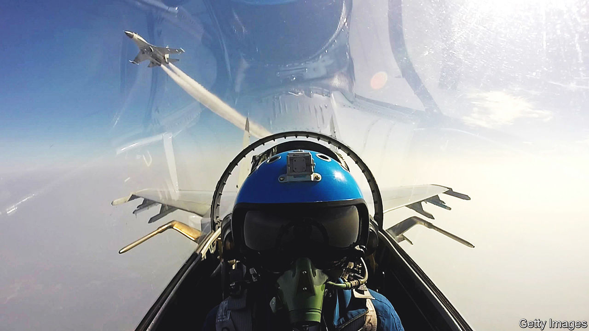

###### Guardrails needed

# America and China try to prevent military mishaps and miscalculations 

##### The original cold war holds some lessons 

 

> Jun 16th 2022 

On may 25th 1968, a Soviet Tu-16 bomber made several low fly-bys perilously close to the , an American warship in the Norwegian Sea. On its final pass, the Soviet plane clipped a wave and crashed into the sea, killing the entire crew. It was one of the deadliest in a string of close encounters between American and Soviet forces that led in 1972 to the Incidents at Sea (incsea) Agreement, establishing protocols for the two sides’ ships and planes to interact safely in peacetime.

Half a century on, America and China are wrestling with how to prevent their own mishaps and miscalculations from flaring into conflict as tensions mount over Taiwan and alliance-building in Asia. After years of rejecting cold-war-style agreements, both sides now talk of creating new mechanisms to mitigate risks and communicate in crises, potentially including efforts to replicate the incsea pact.

At a security conference in Singapore from June 10th to 12th, American officials emphasised the need for “guardrails” in relations with China. “That includes fully open lines of communication with China’s defence leaders,” said Lloyd Austin, America’s defence secretary. The day before, in his first meeting with General Wei Fenghe, China’s defence minister, Mr Austin urged the People’s Liberation Army to participate more actively in risk-management mechanisms, according to American officials. They say General Wei was “responsive”. 

A Chinese defence-ministry spokesman echoed that, telling reporters that the two sides had agreed to maintain regular communication and “properly manage risk and crisis”. The more the two sides spoke, however, the clearer it became that they have very different goals in mind. 

China has long been wary of risk-management agreements with America, fearing they will limit its options to respond to American surveillance flights and naval patrols near its shores. Two members of China’s delegation suggested it was now open to such agreements, drawing on cold-war deals like incsea. But they made clear that China’s aim was to curb American and allied activities, not its own. 

Senior Colonel Zhang Chi of China’s National Defence University said China should also negotiate similar deals with other countries in the region, requiring them to declare their “strategic intent” before conducting operations. That might have helped avert recent encounters in which Canada and Australia say their military aircraft were hounded by Chinese fighters, he said. Other Chinese delegates advocated more regular military exchanges to clarify “red lines” and build trust. “If we’re on the wrong track, what’s the use of guardrails?” asked Cui Tiankai, a former Chinese ambassador to America. 

America, meanwhile, wants more direct communication lines with China’s military leaders, including regional commanders, so it can contact them quickly in a crisis. America does not appear to be seeking a separate incsea-type agreement with China. It wants, instead, to strengthen existing mechanisms to replicate the cold-war pact’s effects. Those mechanisms include the Code for Unplanned Encounters at Sea, or cues, signed by 21 countries in 2014. That only covers international waters, so China does not observe it in parts of the South and East China Seas that it claims. cues also does not apply to coast-guard and fishing fleets, which China uses to enforce those claims. 

China has resisted expanding cues, so some American and allied officials still advocate an incsea-type deal. Others worry that would take years and end up equally flawed. “If partner nations believe we need another document, then we always listen to our partners, and we’ll work through what that might need to look like,” said Admiral John Aquilino, head of America’s Indo-Pacific Command. But he warned: “The only thing worse than having no strategy is having too much strategy.” 

The good news is that us-China tensions are still a far cry from those between America and the Soviet Union, which narrowly escaped nuclear war in 1962 and harassed each other’s ships and planes repeatedly throughout the 1960s. The more troubling notion is that things could get a lot worse before China and America find an effective way to manage risks. ■

