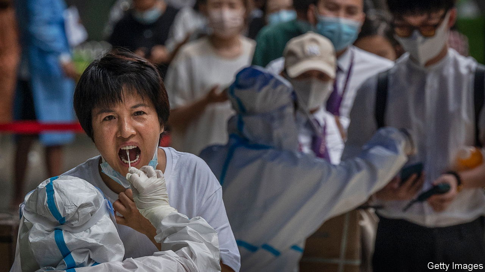

###### The new normal

# Beijing and Shanghai are still trying to get a grip on covid-19 

##### Will mass testing and “micro-lockdowns” be enough? 

 

> Jun 14th 2022 

Since june 1st, when the authorities in Shanghai lifted a , many aspects of life in the city have returned to normal. The once-deserted freeways around China’s financial hub are again full of traffic. The workers who moved into their offices during April and May have at last returned home. The number of cases of covid-19 found outside quarantine has dropped to single digits.

But Shanghai’s officials are still on edge. Many residential communities reopened only to be locked down again when a positive case, or merely a close contact of one, was found in their vicinity. Residents continue to be taken away to quarantine centres if they live in the same building as someone infected. A case linked to a hair salon resulted in hundreds of people being whisked into isolation and several housing compounds being locked down. The city ordered most of its 25m residents into mass testing on June 11th and 12th.

This is what the new version of China’s “dynamic zero-covid” campaign looks like. “Micro-lockdowns” and mass testing are meant to replace economically destructive citywide closures. The strategy is supposed to be more targeted, finding and quarantining cases and their close contacts quickly. But calibration is proving difficult.

In Beijing hundreds of cases were recently traced to Heaven Supermarket, a bar. Local officials had only just declared the latest outbreak over and allowed such establishments to reopen. Now they have cancelled plans to reopen many schools, calling the situation “severe”. Thousands of residents were put into quarantine and neighbourhoods sealed off. Sun Chunlan, a deputy prime minister in charge of fighting covid, even went to inspect Heaven Supermarket herself (probably the bar’s first visit from a Politburo member).

Despite calls by some experts to rethink the , the government is doubling down. Hundreds of thousands of testing facilities are being built. Cities are required to be able to screen all residents within 24 hours. In Beijing and Shanghai residents must take a test every few days in order to enter public spaces. There are often long queues to get swabbed. People joke that the common Chinese greeting of “Have you eaten yet?” is giving way to a new one: “Have you got tested yet?”

Humour, though, is in short supply. In Beijing, Shanghai and elsewhere the movement of residents is tracked and restricted using a mobile-phone app, which produces a coloured qr code. Green means you are allowed to move about; red means quarantine. People are anxious to avoid being ensnared by such controls. The authorities in Henan province are suspected of using the app to block the movement of people who demonstrated outside the local banking regulator last month.

Small businesses in Beijing and Shanghai have received little guidance from officials. Many are preparing for disruptions that could last months. They were already suffering. Tensions boiled over in Shanghai on June 13th, when hundreds of people protested. Most of them ran stalls at the city’s biggest wholesale market for clothes. After months of lost business, they chanted: “Return our rents!” The government has done little to help. 

Some hope that the government will ease restrictions after an all-important Communist Party congress later this year. For that to happen without many deaths, the  among the elderly must rise. To win over holdouts a number of cities are offering to insure people 60 and over against jab-related side-effects. 

But in other ways, the government has signalled its intent to stay the course. China has already pulled out of hosting next year’s Asian Cup football competition. “Victory comes from perseverance,” says President Xi Jinping of his covid policy. Frequent testing, invasive tracking and targeted lockdowns: this is the new normal. Few expect it to end soon.■


