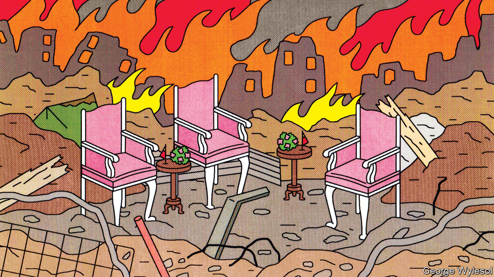

###### Non-interfering mediation

# China’s diplomats are trying to broker peace in foreign conflicts 

##### Just don’t expect them to propose solutions 

 

> Jun 16th 2022 

Soon after Russia began its latest invasion of Ukraine, the European Union’s foreign-policy chief, Josep Borrell, told a Spanish newspaper that there was “no alternative”. The eu and America could not act as mediators, said Mr Borrell. “Who else? It has to be China.”

So far that has proved wishful thinking. Russia appears determined to keep fighting. China, its close friend, has made only vague suggestions that it would be willing to mediate, “when needed”. Since the war began China’s leader, Xi Jinping, has not even spoken to his Ukrainian counterpart, Volodymyr Zelensky. But on June 15th Mr Xi and Vladimir Putin, Russia’s president, had their second conversation by phone since the war started. Mr Xi expressed support for Russia’s security worries. 

Most Western officials, therefore, are uneasy about the idea of China doing more. Mr Xi is as anti-Western as Mr Putin; China would oppose any deal that makes Russia appear the loser. But before Mr Xi took power in 2012, it would have been difficult even to imagine China as a mediator in a European war. It is a measure of how much Chinese diplomacy has changed during his rule that such thoughts are now entertained, at least by some.

Evidence of this evolution can be seen in the Horn of Africa. On June 20th a two-day “peace conference” is due to begin in Addis Ababa, the capital of Ethiopia. It will be joined by foreign ministers from across a region racked by numerous ethnic, territorial and resource-driven conflicts. These include war between Ethiopia’s federal authorities and the rebellious region of Tigray, and in Somalia between Islamist militants and the country’s Western-backed government. It was China’s proposal to hold the talks. They follow its appointment in February of a special envoy to the Horn of Africa—a signal of its intent to step up diplomacy in the region. 

China was once reluctant to insert itself between foreign antagonists. It still insists that its foreign policy is based on “non-interference” in others’ affairs. In 2003, however, it took an unusually bold step into international crisis management by hosting “six-party talks” on North Korea's nuclear programme with the two Koreas, America, Japan and Russia. These on-and-off negotiations gained China some kudos in the West, even though they failed to stop North Korea developing nuclear weapons: it conducted a nuclear test in 2006 and another in 2009 that scuppered the process. 

That decade saw a few other attempts by China to reduce tensions abroad, including in Africa. But since Mr Xi took over, the pace has picked up, spurred by his push for China to “get more actively involved in international affairs” and “play its due role as a major responsible country”. In the past decade Chinese diplomats have been active as facilitators of peace talks in numerous places from Afghanistan to South Sudan. They have mainly focused on areas where China has substantial economic interests that could be threatened by local conflict. Often these are also places with large numbers of Chinese citizens who might be in harm’s way. 

Many analysts wonder whether these efforts count as mediation. China rarely proposes ways of resolving conflicts that go beyond vague statements of principle (“win-win solutions”) or ideas that are already broadly accepted by the parties involved. The usual aim of China’s diplomats is to preserve the status quo or restore it, says Helena Legarda of the Mercator Institute for China Studies, a research group based in Berlin. “They are quite risk-averse,” she says. 

That is likely to be evident at the Horn of Africa talks, which involve Djibouti, Ethiopia, Kenya, Somalia, South Sudan, Sudan and Uganda (it is unclear whether Eritrea, a big source of the region’s instability, will attend: diplomats say it has not yet replied to its invitation). By not inviting rebel groups China has avoided ruffling feathers. It has said very little about what it aims to achieve, other than to tackle the challenges of “security, development and governance”. By governance it means maintaining social order, not encouraging free and fair elections. 

China is unlikely to attempt to mediate in Ethiopia’s civil war. The African Union is already leading such efforts. “It’s all about getting a photo-op of the special envoy with the foreign ministers,” says a Western ambassador. “It’s information warfare rather than serious diplomacy.” 

Peace dividends

China's aims are not altruistic. It worries about the impact of war and political instability on the region’s economies. One reason it needs them to thrive is so they can pay back debts incurred by a splurge on infrastructure under China’s Belt and Road Initiative. The war in Ethiopia has disrupted use of a $3.4bn Chinese-built railway line, opened in 2018, that connects Addis Ababa with the port of neighbouring Djibouti. Resurgent jihadists in Somalia have spread across the border into Kenya, carrying out attacks as far south as a port refurbished by Chinese firms in Lamu county. 

China also wants to score points off America, which appointed its first special envoy to the Horn of Africa last year. The Chinese envoy, Xue Bing, said some countries in the region were “fed up with the preachings” of the West. China has not joined America in imposing sanctions on Eritrea’s ruling party and army for their involvement in Ethiopia’s civil war. During a tour of the region in January China’s foreign minister, Wang Yi, appeared to needle America by visiting Eritrea and offering to help it develop its Red Sea coastline. 

Were China to make any serious attempt to mediate in Ukraine, the stakes would be far higher. Any action construed as favouring Russia would enrage the West. “China is not interested in stepping into this tricky territory,” says Miwa Hirono of Ritsumeikan University in Japan. President Xi talks of moving China to the “centre stage” of international affairs. Although China may at times still appear reluctant to step into the spotlight, it knows how to pick its roles. ■

