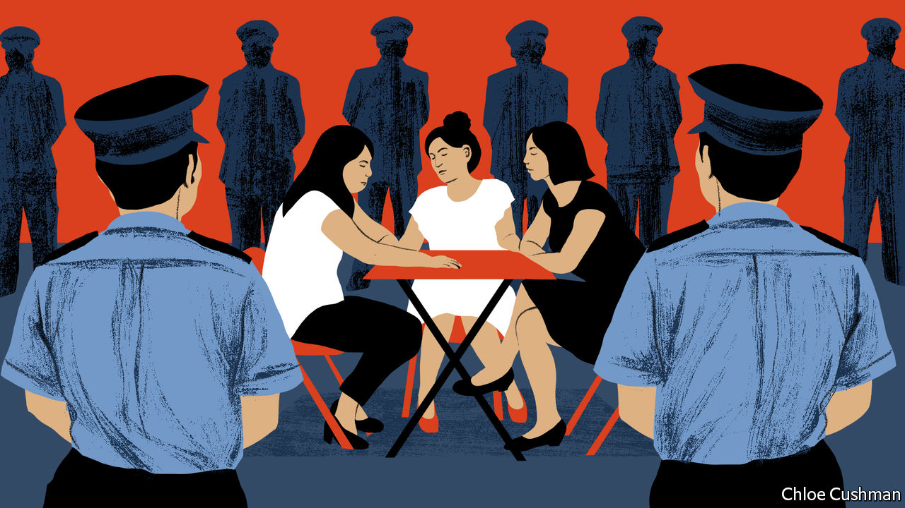

###### Chaguan

# China’s elites think feminism is a foreign plot 

##### Party bosses blame a brutal assault on gangsters, rather than endemic sexism 

 

> Jun 16th 2022 

An unprovoked attack on several women by drunken thugs has revealed something striking: Chinese leaders are more threatened by feminists than by violent gangsters. Communist Party bosses could hardly avoid addressing widespread public horror after the assault was captured by security cameras at a late-night barbecue joint in the northern city of Tangshan, earning billions of views online. Faced with this challenge to China’s self-image as a harmonious, low-crime society, officials, state media, China’s largest social-media platform and even a university dean have lined up to denounce the notion that China has a problem with gender-based violence. Instead, the ruling establishment has played up the problem of organised crime.

At least initially, several news outlets declined to report the assault as an example of the harassment that Chinese women endure all too often, whether from strangers, colleagues or lecherous bosses. , a news outlet with 27m followers, called the attack a “scuffle” after men failed to “strike up a conversation” with women diners in the early hours of June 10th. Those bland words did not match images of women being clubbed with bottles and chairs, dragged outside and kicked in the head by several men, sending two of the victims to an intensive-care unit. 

Rather than talk about endemic violence against women, officials and police commanders in Tangshan, a steelmaking city of 7.7m people, portrayed the attack as a glimpse of an underworld that—despite repeated anti-mafia campaigns—lurks in a few corners of their home town. Police said that five of the men arrested and accused of beating women who refused their drunken advances or who tried to stop the violence had been charged previously with crimes including assault and unlawfully detaining others. The city’s leaders announced a two-week “thunderstorm” anti-crime campaign, involving intensive patrols and a gang-reporting hotline, which has been swamped with tip-offs. They pledged that this would “comprehensively rectify outstanding problems in the field of public safety”. The public has heard such promises before, notably in 2018 when national leaders ordered a three-year campaign against organised crime, dubbed “Resolutely Root Out Black and Evil Forces”. Shrugging off questions from netizens and even some newspapers about the value of short-term campaigns against crime, police in several other cities staged shows of force, sending officers to guard pavement barbecue stalls or bark public-safety messages at diners through megaphones.

The readiness of officials to talk about violent gangs is all the more striking because China’s relatively low crime rates are a mainstay of propaganda about the superiority of one-party rule. In 2018 the recorded murder rate per 100,000 people in China was almost a sixth of that reported in India, and a ninth of America’s murder rate. Reports of mass shootings or racist attacks in America are a staple of Chinese television’s main evening news broadcast. Some netizens have thrown such boasts back at the authorities after the Tangshan assault. Particular sarcasm was directed at reposts of a blog about the perils of overseas study, originally published by the Communist Youth League in 2017, which advised its young members, “Going out late at night for barbecue skewers? I’m sorry, America can’t give you that safe feeling.”

There are several explanations for this eagerness to blame thugs rather than sexism. One is that China, a control-obsessed state, often treats societal ills as problems of national security and politics. The oath of office for Chinese police opens with a vow to defend “the absolute leadership of the Communist Party” before it mentions enforcing the law, and emphasises “political security and social stability”. This emphasis on politics cuts both ways. A gripping research paper published in 2021 by Liu Yuchen, a political scientist now at Peking University, draws on interviews with dozens of police officers to explore how “Root Out Black and Evil” campaigns are undermined by tensions between top-down orders from party chiefs to arrest gangsters and the incentives of individual police, who know that local crime bosses may have powerful political patrons. The paper, “The Art of Criminal Investigation in China, a Typology of Policing Crimes”, describes police tipping off gang leaders and targeting lower-level thugs instead. Petty crimes such as street fights that do not lead to deaths are ubiquitous but rarely reported, Mr Liu writes. To keep local crime statistics low, officers may lean on victims to drop charges. Assaults may end up as , or drawer cases, languishing under desks for ever.

The People’s Republic is a patriarchy

Ordering yet another gang crackdown keeps the party in familiar, safe territory. It helps that street violence has been declining for some years, not least as fewer Chinese live by muscle-power alone and increasingly work in service jobs that impose certain standards of behaviour, says Xu Jianhua, a former Chinese policeman who is a sociologist at the University of Macau. In contrast, feminism is “more politically sensitive”, says Mr Xu, because it draws energy from social movements not under the party’s control.

Party leaders see China as a socially conservative country, and rarely seek to challenge that chauvinism. Just one member of the 25-strong Politburo is a woman. President Xi Jinping lauds China’s “excellent traditional culture”. Women such as Peng Shuai, a tennis champion, who accuse powerful men of abusive behaviour are scrubbed from public life by censors. Judges routinely deny divorces to women assaulted by their husbands, even when shown medical records of injuries. Above all, feminism is called a foreign threat. A note sent on June 12th by the dean of the school of sociology at Wuhan University went viral after he told students concerned about the Tangshan assault to beware the “American ideology” of “fist-waving women”, a crude pun on the Chinese word for feminism. China’s elites would rather blame social ills on wrongdoing by criminals than admit that individuals have rights. ■


