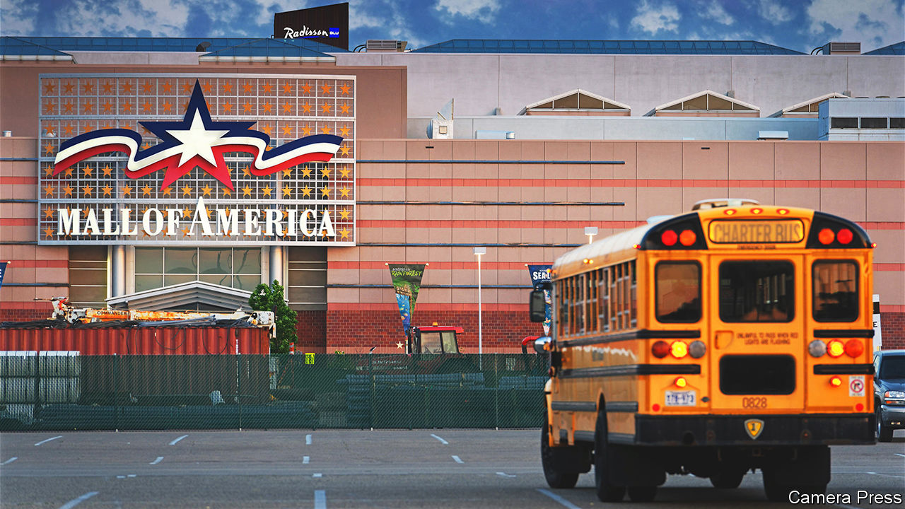

###### Walking the floors

# Alexandra Lange explores the history of American malls 

##### They need not be doomed, she argues in “Meet Me by the Fountain” 

 

> Jun 16th 2022 

 By Alexandra Lange. 

Near the start of “Meet Me by the Fountain”, Alexandra Lange encourages readers to picture their shopping mall. Maybe it is the place they frequented in their youth, had their first job or took their children for back-to-school buying sprees. This reviewer’s memories are of suburban Chicago in the 2000s—of dimly lit shops selling skimpy clothes, and afternoons spent gossiping at the food court and wondering if your latest crush would show up.

Writing a history of shopping malls is a multifaceted task. They seem utilitarian, and were originally envisioned as venues for supermarkets, dentists and post offices. But the mall is also a social hub and an architectural challenge. Ms Lange examines the enduring influence of architects such as Victor Gruen and Jon Jerde as shopping centres developed into places of entertainment. In the 1940s Gruen used department stores to anchor his malls and help enchant suburban housewives; Jerde put an amusement park at the heart of the colossal Mall of America near Minneapolis, which opened in 1992.

True to her roots as a design critic, Ms Lange whisks readers through decades of this architectural evolution. But her book shines in its study of malls as symbols, and drivers, of American consumerism and urban sprawl. Their rise in the mid-20th century coincided with white flight from city centres to suburbs, and their form pointed to the intended patrons. “In proposing a downtown outside downtown, protected from the elements, ringed by parking lots”, contends Ms Lange, Gruen “created a mechanism to protect white, upwardly mobile homeowners from those unlike themselves”.

As the tendrils of suburbia and exurbia extended across America, malls became a feature of the landscape. They sprouted food courts, arcades and central atriums in which to see and be seen. This is the mall of teen movies such as “Fast Times at Ridgemont High” and “Mean Girls”. Developers aimed to recreate the conviviality of city streets and shopping plazas on a private, controlled site. But only up to a point: mall police were used to restrict loitering and protests. The evolution of malls into de facto public squares prompts questions about what private spaces owe to those who use them as a commons.

Though Ms Lange pays rapt attention to malls’ shortcomings, her book is refreshingly optimistic. With their air-conditioning, level floors and abundant benches, malls are a lesson in accessibility. The author devotes many pages to mall-walkers: elderly Americans who power-walk around shopping centres for exercise in the mornings. For them, malls are a safe alternative to streets or parks.

The rise of e-commerce has prompted obituaries for the mall. Many have failed because they offer nothing distinctive. Joan Didion, an American writer whom Ms Lange considers one of two great cultural critics of the mall (Ray Bradbury was the other), skewered their sameness long ago. “Valley Fair, Mayfair, Northgate, Southgate, Eastgate, Westgate, Gulfgate”, Didion wrote: “They are toy garden cities in which no one lives but everyone consumes.”

Yet Ms Lange thinks they can be reinvented. Already, as the suburbs have diversified, malls have begun to reflect their new clientele. Food is key. La Gran Plaza in Fort Worth, Texas, has become a destination for Mexican cuisine and culture (wrestlers and mariachi bands entertain shoppers). Mission Square Shopping Centre in Fremont, California, caters to the Bay Area’s Asian-American population. These malls “are destinations unto themselves”, says Ms Lange. “They don’t try to represent all of America, but  America.” ■

