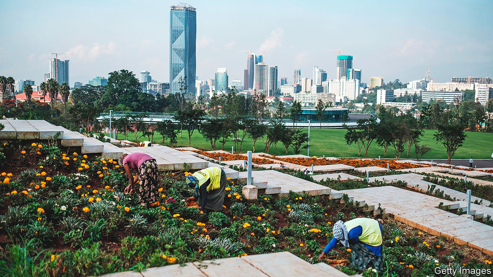

###### Make me a city

# Ethiopia’s capital is a showcase for its leader’s ambition 

##### Despite the ongoing civil war, Abiy Ahmed is remaking Addis Ababa 

 

> Jun 16th 2022 

To walk among the happy throngs in Sheger Park, Addis Ababa’s newest and glitziest public space, is to encounter an idealised vision of Ethiopia’s future. Gentle piano music wafts through the air. Beaming newly-weds pose for photographs beside a glittering artificial lake. Young professionals clink wine glasses as families donning traditional white shawls wander through a botanical garden. When the sun sets a spectacular display of water fountains erupts to rapturous applause.

All Ethiopia’s modern history is on display, too. Looming above you is the palace of Emperor Menelik II, who founded the Ethiopian capital in the late 19th century. To the north, beneath eucalyptus-covered hills, are districts built by Italian colonists in the 1930s that were once racially segregated. To the east stands a grand circular building, in the style of an Ethiopian monastery, made for the national bank in the 1960s during the modernising phase of Emperor Haile Selassie’s reign. A soaring bronze monument nearby commemorates the socialist revolution of 1974. Squint a little, and in the distance you spy rows of hulking tower blocks, built during the era of the Ethiopian People’s Revolutionary Democratic Front (eprdf), a leftist rebel movement which seized power in 1991.

Addis Ababa is a fabled capital. Successive rulers have treated it as a “modernist monument for the rest of Ethiopia”, writes Elleni Centime Zeleke, author of “Ethiopia in Theory”. Its buildings, streets and public spaces are etched with the legacies of empire, war and revolution. From the racist master-plans of the Italian occupation, to the Haussmannian demolition schemes of the eprdf years, each government has sought to recast the city in its own image. Now Abiy Ahmed, prime minister since 2018, is setting out to do so again—even as an atrocity-filled war with Tigrayan rebels has disgraced his regime and called the country’s future into question. 

The new park is one of a dizzying array of  in the pipeline. Menelik II’s nearby palace has already been converted into the first of several new exhibition centres. Earlier this year a massive public library opened. Next door a science museum and an amphitheatre are going up. Several more parks and green spaces are germinating. The swishest of these, set on nearby Mount Entoto, boasts hiking trails, adventure sports, boutique restaurants and a luxury resort. “These days you see new changes every week,” gushes Gebre Sifer, a retired pastor visiting the library. 

The city’s existing infrastructure is also getting a facelift. Government offices have been spruced up. Public thoroughfares have been splashed with colour and adorned with flowers and murals. Last year Meskel Square, the historic central plaza, was lavishly refurbished at a cost of more than $73m—a striking sum in a country in the midst of a civil war. 

For Abiy, who has cracked down on dissent and imprisoned opponents, refashioning the capital is a political project as well as an aesthetic one. “If you can change Addis, definitely you can change Ethiopia,” he remarked in an early interview. Glossy promotional videos depict the renovation scheme as a symbol of national unity. In the run-up to elections last year, in which the ruling party won over 90% of the seats contested, state media broadcast drone footage of the revamped city at the top of the evening news. “Abiy believes that public spaces and monuments create the image of the Ethiopian state which he wants to project to his citizens and to the world,” says a former adviser.

To grasp the kind of image he has in mind, compare it with the style of the eprdf, Abiy’s Marxist-inspired predecessors. They viewed the city in essentially functional terms; their flagship urban projects were mostly large-scale bits of infrastructure such as housing estates and a light-rail system. Aesthetic concerns were secondary. Alula Tesfay Asfha of the University of Tsukuba notes the constructivist style of the period, in which buildings were designed to a minimum standard and aimed to cater to as many people as possible. In practice this often meant drab high-rises built with cheap aluminium frames.

Abiy’s priorities are very different. His ruling Prosperity Party has ditched the state-led economics of the eprdf for a more liberal, consumerist kind of capitalism. In this new orientation, outward appearances matter. Asked about the flowers placed along the road to the airport, Abiy once said that “A mind that doesn’t see a good thing will not create a good thing.” In a recent televised meeting he berated officials for neglecting to promote a uniform colour for buildings in the city. Since then its administration has ordered them to be painted in one of 13 shades of grey.

The emperor’s new roads

For Abiy, an evangelical Christian, the beautification may have a religious dimension, too. Tekalign Nega of the Ethiopian Graduate School of Theology argues that the stress on urban aesthetics reflects the tenets of the prosperity gospel, in which earthly splendour and divine favour are closely entwined. A clean and shiny Addis Ababa, according to this way of thinking, is a step on the road to both heaven and a peaceful, prosperous Ethiopia. “It’s about giving you a foretaste of what is about to come,” Tekalign says.

Yet it has provoked mixed reactions from Ethiopians. Few question the value of more and better used public spaces. The land beneath Sheger Park, for instance, had languished for years. Many architects and urban planners appreciate their newfound status. Recently the government opened a swanky urban-design centre; it is holding competitions for major public developments. “The city was sleeping,” says Sofoniyas Solomon, a finalist in one of them. “These changes are necessary.”

Others, though, worry about warped priorities. The first phase of the redesign was estimated to have cost $1bn. As Abiy has pointed out when asked about his plans, much of the cash is from private sources or overseas (China and the United Arab Emirates). But Ethiopian taxpayers are on the hook too, even as their conflict-hit economy collapses. “The public must have a say in it,” grumbles Simon Chernet, a 25-year-old resident of the capital. 

Some disparage the prime minister’s obsessive city management as befitting a mere mayor. Equally, though, it suggests a much grander precedent. When Haile Selassie saw the marble plaques installed in Africa Hall, the first seat of the African Union, he ordered the removal of the names of all the officials involved in its construction except his own. “What have done?” he is said to have asked. Abiy was recently revealed to be following in his predecessor’s footsteps by building himself a luxurious new palace. He seems to have a similar sense of his own place in history. ■

