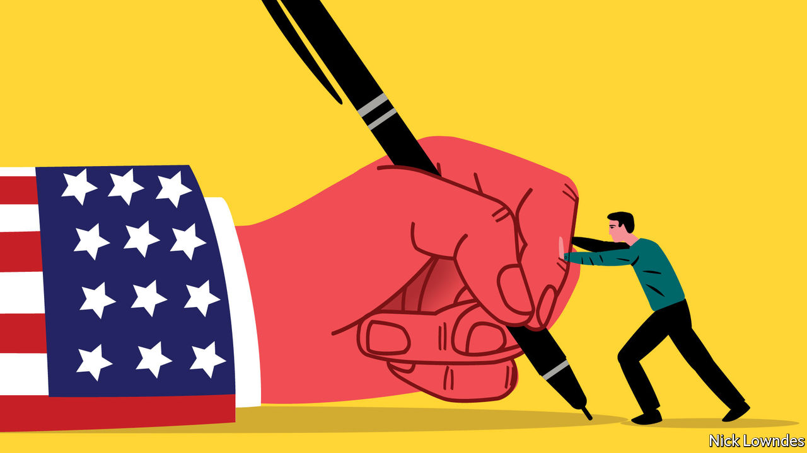

###### Johnson

# Far be it from the English to use the subjunctive 

##### A venerable grammatical nuance crossed the Atlantic and came back again 

 

> Jun 16th 2022 

It is often bemoaned in Britain that English is going to pieces—and Americans are generally to blame. Whether you call it decline or not, the moaners are on to something: America has indeed produced many of the innovations that have made their way into global (and British) English, for better or worse.

Bucking that trend is an intricate feature of old-fashioned English grammar that has not only survived in America but made a comeback in Britain, thanks to the unwitting preservation efforts of the Americans: the subjunctive. British commentators seem flummoxed by the unusual situation of Americans being more conservative than the mother country in this aspect of grammar.

The subjunctive in question is the present one, which can be distinguished by the lack of the usual - on first- and third-person singular verbs, as in  instead of . (The subjunctive of  is .) Everyone knows a host of fixed phrases using it, even if they don’t realise they are subjunctives.  These are not declarations but a sort of wish, equivalent to  Britain and America even have distinctive national refrains with a subjunctive:  and . These look a bit like imperatives, but they are not; the faithful do not order the creator of the universe around. 

The transatlantic difference is that, in America, the subjunctive remained what linguists call “productive”, meaning that people use it in sentences never uttered before. Americans naturally write or say things like or 

In Britain, the subjunctive had a very different 20th century. In 1906 the Fowler brothers, co-authors of “The King’s English”, a venerable usage guide, thought the subjunctive would not last another generation, a disappearance they approved of. But it did not disappear. An article in the in 1936 referred to “the most remarkable phenomenon in modern American syntax, viz., the pedantic revival of the subjunctive”. 

By the middle of the century, revered usage writers in Britain such as Eric Partridge and Ernest Gowers were warning of the subjunctive as “a hallmark of officialese” which had “a formal, even pedantic air”. Another British commentator, Catherine Nesbitt, feared the return of the subjunctive was “now spreading so rapidly that, if left unchecked, it will do real damage to the structure of the language”. By the end of the 20th century it was firmly associated with Americans who, wrote Kingsley Amis, a novelist, “often indulge in subjunctive forms”. 

What a strange fate. The subjunctive was common in the classic writings of the early-modern English period, particularly in the King James Bible—as in “hallowed  thy name” or “before the cock , thou shalt deny me thrice”. By the 1990s it was being treated by Amis and others as a vice a writer or speaker might “indulge” in. But such warnings were issued precisely because British scribblers were, in fact, indulging: use of the subjunctive increased markedly in the 20th century in Britain.

The case of an august part of old English grammar being regarded as a vulgar American import is an odd one. Writers of usage guides have tended to be a conservative lot. Typically, they look back to earlier stages of the language as a model, before recent corruptions. 

Apparently nationalism is an even stronger force than conservatism. Americans in the early republic tried to distance their English from Britain’s. And for its part, Britain has more recently pushed away from American English, first as an empire that could afford to condescend to its former colonies, later as a medium-sized power that both admired and fretted about American might. Those worrying about the Americanisation of British English have a point. The British English alternative to the subjunctive—using “should”, as in —has declined on the islands as the subjunctive has returned. 

But this “Americanism” was born in England, and was used by many of its greatest authors for centuries. If it had survived in Britain, while Americans had invented the “should” replacement, it is easy to imagine how the American innovation would be judged. That it went the other way, scrambling stereotypes, should make those who decry language change take a closer look at what they are really talking about. 


