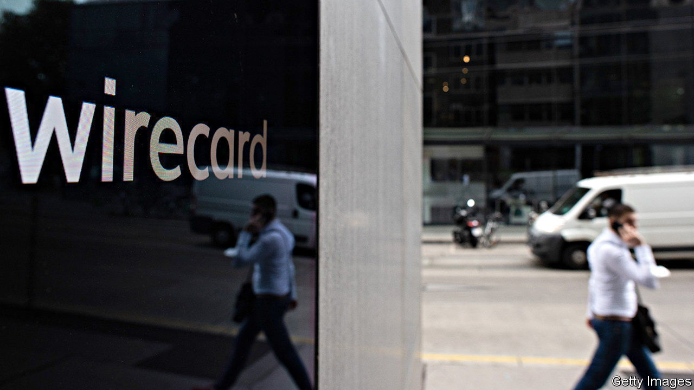

###### Wire fraud

# How one journalist exposed the Wirecard scandal 

##### Dan McCrum recounts his battle to expose the truth about the tech firm 

 

> Jun 16th 2022 

 By Dan McCrum. 

Europe has long struggled to produce world-beating technology firms. Wirecard was, for a while, viewed as a sign that this might be changing. The Munich-based payments-processor, a “fintech” star, even won a coveted place in Germany’s dax stockmarket index in 2018, when its value soared above €20bn ($23bn). But after a spectacular fall from grace in 2020, all that remains is an insolvent husk.

Wirecard might still be one of Europe’s most feted tech firms, were it not for a small band of sceptics—including Dan McCrum. The investigative journalist at the  () first heard about the company in 2013, jotting down its name with a question mark after a hedge-fund manager suggested he look under the bonnet. Over seven years, aided by a handful of short-sellers and carefully cultivated whistleblowers, he pieced together a picture of a firm built on fraud, with fake customers, invented profits and cash balances that looked flimsier the closer you got.

The battle to expose the truth had to be waged on several fronts. Wirecard fought back viciously and dirtily. Computers were hacked, offices suspected of being bugged, false stories put about. At one point, according to an ex-policeman the author interviewed, Wirecard had more than 30 private detectives “running round London” and trying to dig up dirt on Mr McCrum, colleagues and the short-sellers. This induced paranoia: Mr McCrum took to keeping his notebooks in a safe with six-inch steel walls, and jumping off Tube trains just as the doors were closing, in case he was being tailed.

The company also made full use of Britain’s strict libel law, hiring Schillings and other firms to pound the  with legal threats. Lawyers from another practice, alleges Mr McCrum, “played the part of the waiter carrying the tray, taking no view on whether its client had poisoned the drinks”. (Schillings told him it acted entirely properly and complied with all legal and regulatory obligations.) Wirecard also sued in its homeland, spuriously accusing the paper of misusing its business secrets; the suit was dropped.

This response slowed Mr McCrum down, at one point causing a damning article to be spiked for fear of an injunction. The stories he was able to publish had to be toned down. A reader complained that one was like a French film: “I’ve read all the subtitles, I’ve paid attention, but I have no idea what the ending was all about.”

Wirecard’s critics also had to contend with its boosters in markets and the media. Many investors, caught up in the general tech optimism, refused to believe Wirecard could be rotten, even as the incriminating evidence mounted. Such frauds are common in China, but in orderly Germany? The highest-profile believer was SoftBank, which poured $1bn into Wirecard in 2019, assuaging other investors’ growing doubts—and cementing its own reputation as one of the world’s least discerning tech investors. Equity analysts bought the lie, too. In 2019, more than five years after the first reports of accounting shenanigans, just two of 26 analysts covering the stock recommended selling it.

The German establishment, meanwhile, buried its head in the sand, or worse. Politicians refused to condemn Wirecard; some accused its critics of envy. The German press, including , the business newspaper of record, mostly swallowed the firm’s line that the attacks on it were illegal moneymaking schemes, or part of an Anglo-Saxon plot to destroy a continental European champion. The financial regulator investigated the  and short-sellers (for alleged market manipulation) rather than the company, and, citing Wirecard’s “importance for the economy”, banned the shorting of its stock.

Woven into the tale are colourful portraits of the two men who ran Wirecard: its perma-optimistic, turtleneck-wearing chief executive, Markus Braun, and Jan Marsalek, the cunning, narcissistic chief operating officer. Mr Marsalek, an Austrian tech whiz with a taste for the high life and a solid-gold credit card—as well as shadowy connections to intelligence services in Russia and Libya—allegedly orchestrated much of the fraudulent activity. He never stopped thinking big, even advancing an unrealised last-minute plan to distract attention from Wirecard’s sins by taking over Deutsche Bank. Mr Braun has been charged with fraud, breach of trust and accounting manipulation; he denies wrongdoing. Mr Marsalek is on the run, wanted by Interpol.

Wirecard finally ran out of road when it failed to convince kpmg, brought in to conduct a special audit, that €1.9bn it claimed to hold in two Asian banks was really there. Mr McCrum was vindicated: due reward for over half a decade of digging. The short-sellers finally made a profit—though one called it “the worst wage he’d ever made”, given all the time and money spent.

“Money Men” has flaws. Digressions into the world of payments-processing and the inner workings of the make a complicated story more so. The end is rushed: it could have done with more on the soul-searching, or lack of it, in Germany since Wirecard’s demise. Nevertheless, the book should be required reading for investors and financial regulators. It is a compelling case study of a seemingly eternal truth: when a business is built on lies, there are always clues. You just have to be willing to see them—even if that means swallowing some national pride. ■

