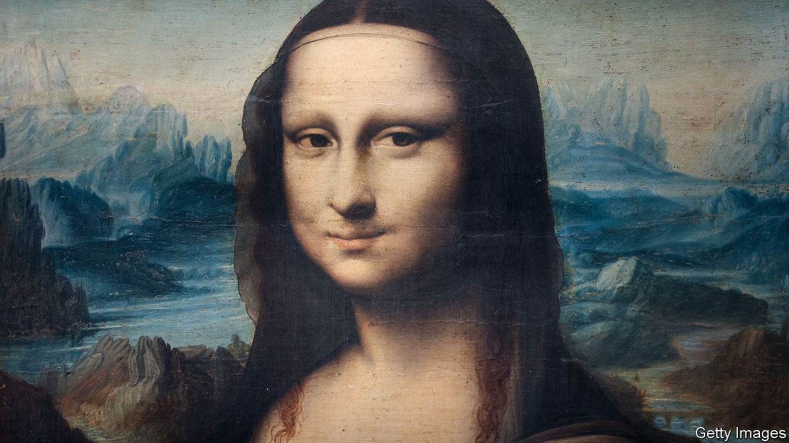

###### The other da Vinci code

# Where did the “Mona Lisa” smile? 

##### Look over her shoulders for clues 

 

> Jun 16th 2022 

For centuries, two of the most intriguing questions about Leonardo da Vinci’s “Mona Lisa” were “Who?” and “When?” A discovery made at Heidelberg University in 2005 pretty much answered both. A note written in a manuscript in the library confirmed the account of da Vinci’s first biographer, Giorgio Vasari: that the sitter was a merchant’s wife, Lisa Gherardini. The note also helped date the masterpiece to between 1503 and 1506.

A third conundrum—“Where?”—is still in dispute. But on June 3rd a French engineer, Pascal Cotte, declared that he and a collaborator had identified the landscape in the background of the painting. Arguments had previously been made for stretches of countryside in the Marche region and between Milan and Genoa. During a presentation in Vinci, near Florence, Mr Cotte contended that the artist was more plausibly depicting a part of his native Tuscany—one that keenly interested him at the time. According to this theory, da Vinci represented the area not as it was, but as, in an unrealised scheme, he intended it to be.

Mr Cotte, who was asked by the Louvre (where the “Mona Lisa” hangs) to create a digital image of the painting, is the inventor of the multispectral camera: a device that can detect not only the drawing below the surface of an oil painting, but also, where they exist, intermediate layers of work. It was among these, under what appears to be a pointed rock, that he found a preparatory sketch showing that da Vinci intended it to represent a castellated tower.

The landscape of the “Mona Lisa” also includes a huge overhanging precipice. That is similar to one that da Vinci included in a sketch of a fortress contested by Pisa and Florence in the war that flared between them in 1503 (around the time he was painting Gherardini). The fortress with the nearby precipice—and a tower, known as the Caprona tower—all overlook the river Arno as it snakes from Florence to Pisa. All three also feature in drawings made by da Vinci to illustrate a plan about which, says Mr Cotte, he became “obsessive”. 

This involved diverting the Arno to cut off Pisa’s water supply and give Florence an outlet to the Mediterranean. In the early 1500s, with the two city-states at war, the idea was under active consideration. Mr Cotte argues that a channel winding through desolate countryside at the right of the “Mona Lisa” is too wide to be a road, as some have speculated, and is instead the dried-up bed of the Arno as da Vinci envisaged it once his plan had been adopted. 

It never was. But if Mr Cotte’s theory is right, it might just explain why Gherardini, a Florentine, wears such a contented, if inscrutable, smile.

