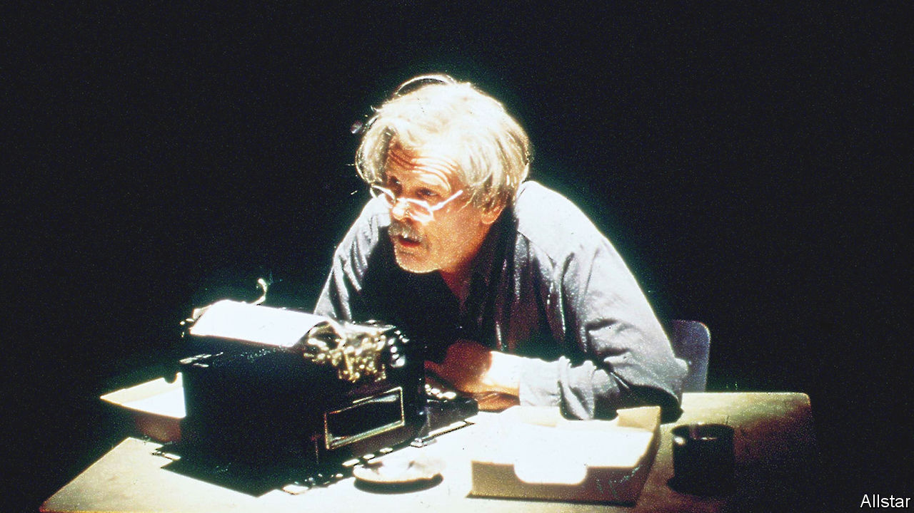

###### Home Entertainment

# “Mother Night” dramatises the power of propaganda 

##### Kurt Vonnegut’s novel points up the role of language in wartime 

 

> Jun 15th 2022 

“This is the only story of mine whose moral I know,” wrote Kurt Vonnegut of “Mother Night”. First published in 1961, his novel takes the form of a fictional memoir; the narrator, Howard W. Campbell junior, reflects on his experience as a double-agent in the second world war. The tale’s theme, as the author saw it, was that “We are what we pretend to be, so we must be careful about what we pretend to be.” 

Campbell begins his account by explaining that he is in detention in Israel, awaiting trial for war crimes. Born in America, he was brought up in Germany as Hitler rose to power. He became a playwright, joined the Nazi party and mingled with its bigwigs; his writing soon attracted the attention of Joseph Goebbels and he was recruited to produce propaganda for English-speakers. Campbell worked hard at his trade, recording broadcasts full of anti-Semitic invective. He became a household name in America—loathed or venerated, depending on the listener. 

Yet the narrator purports to be a consummate pretender, recruited by American intelligence in 1938. Though he was not motivated by any particular sense of moral duty, he agreed to conceal messages in his broadcasts, a code conveyed in “mannerisms, pauses, emphases, coughs, seeming stumbles in certain key sentences”. The problem is that no one can verify this assertion. Inconveniently, the American government denies that his handler was one of its operatives. 

“Mother Night” suggests it doesn’t matter whom Campbell was really working for, nor what he believed. He had been so convincing in his performance as “Hitler’s right-hand man” that “nobody saw the honest me I hid so deep inside”. His propaganda was ghastly and effective—witness the acolytes seeking to keep his ideas and rhetoric alive in America—so his intentions became irrelevant. And Campbell admits that, had Germany prevailed, he might have continued to ply his grim trade, “writing a daily column of optimistic doggerel for daily papers around the world”.

Vonnegut is one of America’s most celebrated writers about war. His novels explore the logic of conflict or, more often, the lack thereof. He had witnessed the horrors of fighting first-hand, enlisting in 1943 at the age of 20 before being taken prisoner during the Battle of the Bulge. Transported to Dresden, he saw the city’s destruction by the Allies in 1945. Later he satirised the glorification of martial values. “When we remember wars,” he wrote in “Cat’s Cradle”, “we should take off our clothes and paint ourselves blue and go on all fours all day long and grunt like pigs.”

“Mother Night” is less fantastical than works such as “Slaughterhouse-Five”. Its focus is not the war on the battlefield but the war of information. The novel was not a huge hit when it was published, but in subsequent decades it has been adapted into a film starring Nick Nolte (pictured) as well as stage and radio plays. It is particularly resonant in the context of today’s bloodshed in Ukraine, underscored as it is by Russian propaganda. Language still has the power that Vonnegut intuited: to warp reality and sow division. ■

