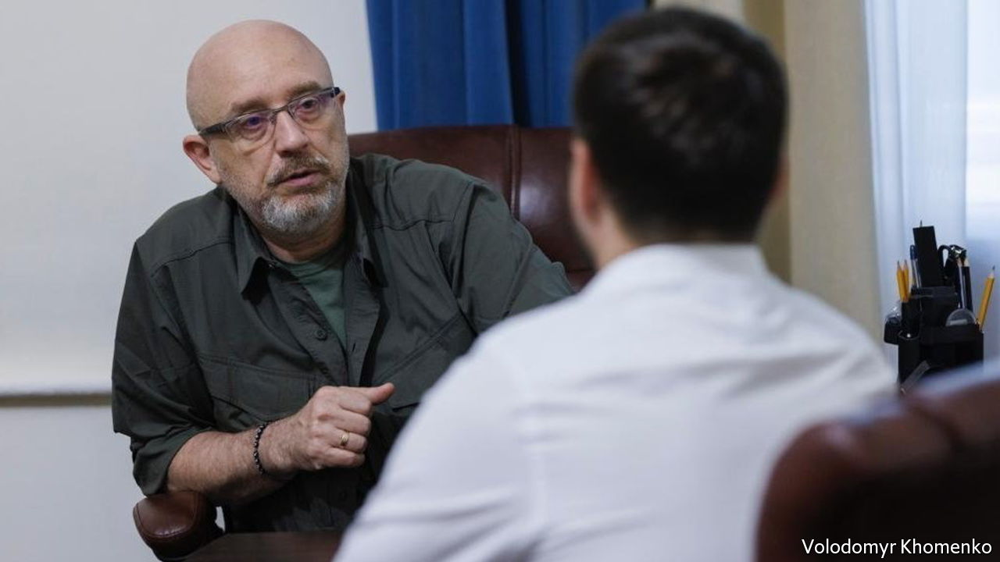
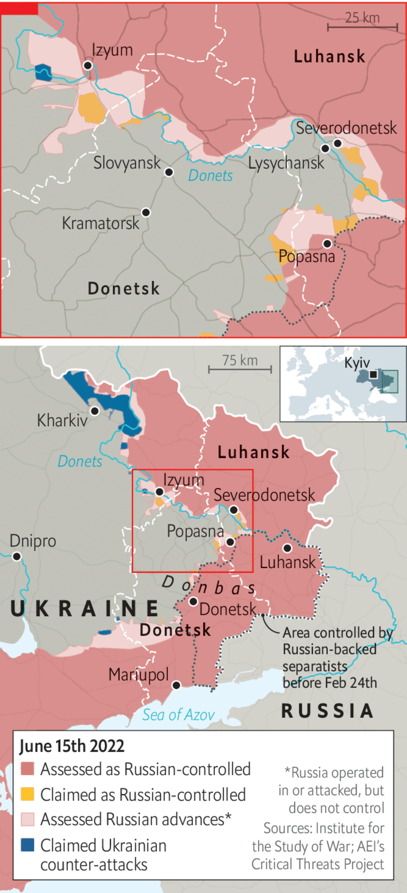

###### Saving faith

# Europe must arm Ukraine faster, urges its defence minister 

##### Give us the tools and we’ll finish the job, says Oleksii Reznikov 

 

> Jun 12th 2022 

THE DEFENCE minister of a country  doesn’t have much time for reading, but Oleksii Reznikov makes a point of studying the front pages. He is concerned by what he sees. “Either the world doesn’t quite understand what is happening,” he says, “or it does understand, is tired, and is content with a few Ukrainians dying.” When Russia attacked his country on February 24th, few expected Ukraine to survive.  transformed fatalism into hope, and led to promises of military support. But cracks in the Western alliance are appearing just as the war enters a . Ukrainian losses are now running at an average of 100-200 men a day. “We need assistance, quickly,” says the minister, “because the cost of any delay is measured in Ukrainian blood.”

When Russian tanks crossed Ukraine’s borders in the north, south and east, the 55-year-old former lawyer had been in charge of his department for less than four months. A civilian appointment to a position usually taken by former military men, Mr Reznikov had expected largely to busy himself with bureaucratic reforms. Instead he found himself reorganising defence affairs as missiles rained down on Kyiv. 

His war began with a 4am phone call from Valery Zaluzhny, the commander-in-chief of Ukraine’s armed forces, and a laconic message: “It’s started. Strikes on air defences and radars. Invasion.” That was the signal for Mr Reznikov to kiss his wife goodbye and leave for the office. The next three weeks were spent with a core team of advisers, all armed with automatic rifles. The group moved around secret locations in the capital. “One of the most uncomfortable things was waking up each morning in a new bed.”

Those tactics were part of a set of protocols developed during top-secret planning before the invasion. Publicly, the president and his defence minister played down the war threat. Privately, they prepared for the worst. Only now is Mr Reznikov able to disclose some of the details. The main trick was to declare “routine” military exercises to mirror Russian and Belarusian drills in the first weeks of February. “This was the excuse that allowed us to secretly move our military units out from their permanent bases. When the strikes came in, our guys were not all together in one place, but were ready with weapons, munitions, and scattered around the country.” 

 


The Ukrainians had other surprises up their sleeves. They hid air-defence systems and attack aircraft, replacing them with mock-ups. They enacted a new law on territorial defence to arm around 100,000 civilians in three days. Society also organised itself in ways the Russians didn’t expect. But the key moment was  decision to stay in Kyiv. “Everyone expected the president to run and form a government in exile. But Mr Zelensky had his own script.”

Western governments came to recognise the abilities of Ukraine’s leader. And with every tactical victory on the battlefield, they began to believe that his country had a chance of winning. Opposition to sending weapons began to dissipate. A conference convened by America at its Ramstein air base in Germany on April 26th appeared to endorse the principle of arming Ukraine to victory. “The West started to believe David was beating Goliath,” says Mr Reznikov. 

But vicious battles in eastern Ukraine show that assessment to be premature. Under a new commander Russian forces are exploiting Ukraine’s inferiority in artillery, multiple-launch rocket systems and aviation. Russia is squeezing Ukraine’s elite troops from a salient around the industrial town of . Fighting is also hotting up on the nearby approach to Sloviansk. 

If the news appears grim for both sides, it is worse for Ukraine. Returning soldiers talk of chaotic command and depleted ammunition. Inexperienced, young soldiers from volunteer units are sent to the front lines to replace fallen comrades. The minister says this is an inevitable consequence of Russia’s invasion. “How else can it be? Young guys end up on the front lines, where no one wants them to be, and they die… the world needs to know about it.” 

Ukraine now  to stop the onslaught, and it is not coming fast enough. In some areas Russian forces have ten times the Ukrainians’ firepower. Multiple-launch rocket systems are in the pipeline, due to arrive “soon… perhaps in a week, perhaps two.” But Ukraine needs them in large numbers, and whether or not its allies agree to send them may depend on how Russia reacts to their deployment. 

Western military chiefs have also expressed concerns that Ukraine may not be able to absorb the new hardware as fast as it would like. Mr Reznikov dismisses this: his soldiers mastered Western artillery in just two weeks, he says. The country stands ready to switch its weaponry to NATO standards within a month, he claims, rather implausibly. “As comrade Churchill said, give us the tools and we’ll finish the job.” 

Mr Reznikov strains to be polite about cracks in the Western alliance. Fatigue is “a natural psychological reaction to stress”; politicians have “domestic issues” to worry about; leaders have the “obligation to think through consequences”. But occasionally frustration shines through. If war has taught him one thing, he says, it is that Ukraine’s allies speak more about human rights and freedom than defending them. “The West’s bureaucracy and pragmatism turned out to be much stronger than its values,” he says. For France and , Ukraine is an irritating obstacle standing in the way of a comfortable life. Does he keep his emotions in check during difficult calls with counterparts in Paris and Berlin? “I’m professionally conditioned as a lawyer, so yes. But afterwards, informally, I can let out some fairly choice words.”

As deputy prime minister from 2020-21 Mr Reznikov headed Ukraine’s peace negotiations with Russia over the eastern , which had experienced fighting since 2014. It was an experience that taught him that Russia does not see peace agreements as permanent. That makes a traditional negotiated truce with the Kremlin impossible, whatever Emmanuel Macron, France’s president—who has said Russia must not be “humiliated”—might wish for. When the time comes, Ukraine will negotiate for a new security architecture in Europe, he says. That means security guarantees from countries it trusts. 

Yet Mr Reznikov insists his people will never accept territorial concessions to a regime that has spilled so much Ukrainian blood. “They are trying to create enough chaos, panic and fear to make us sign an act of capitulation,” he says. “It hasn’t worked. We’re not even a tiny bit close to being in that kind of mood.”


