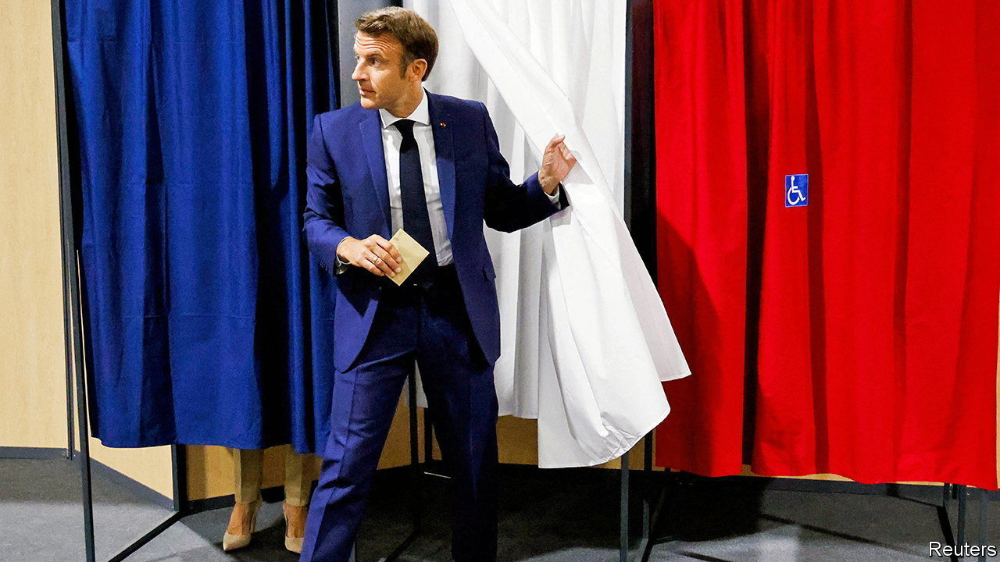

###### Losing his grip

# France’s legislative election puts Emmanuel Macron’s majority in doubt 

##### The president has a fight on his hands in the second round of voting 

 

> Jun 12th 2022 

Emmanuel macron, , is fighting to hold on to his  after the first round of legislative elections on June 12th. His centrist alliance, Ensemble, suffered at the hands of Jean-Luc Mélenchon’s , the New Popular Ecological and Social Union (nupes). Each won a quarter of the vote. 

Under France’s two-round system, Ensemble is predicted to win many more races than nupes. But Ipsos, a pollster, nonetheless projects that Mr Macron’s alliance will secure just 255-295 seats in the National Assembly at the run-off on June 19th, well down from the 350 it won in 2017. All but the upper end of the predicted range would see the re-elected president’s grouping fall short of the 289 seats it needs to retain its majority. 

In 272 of France’s 577 constituencies the run-off will pit Mr Macron’s candidates against those of Mr Mélenchon’s alliance, which includes the Socialists, Communists and Greens. The 70-year-old firebrand, who wants to pull France out of nato and bring back a wealth tax, has imposed improbable unity on the fractious French left, which dreams of seeing Mr Mélenchon become Mr Macron’s next prime minister. This remains unlikely. But nupes does look set to replace the right-of-centre Republicans as the main opposition. 

, who lost to Mr Macron in the presidential election in April, looks well placed to be re-elected as an mp. Her nationalist-populist National Rally (rn) won 19% of the national vote and is expected to claim 20-45 seats, up from eight in the outgoing parliament. , a rival on the far right, was eliminated in the first round.

In the showdown between Mr Macron’s centrists and Mr Mélenchon’s left-wing alliance, much will depend on where the votes of eliminated candidates go. Mr Macron may pick up some from the centre-right. Mr Mélenchon could draw some from Ms Le Pen, who shares a base in working-class industrial towns. 

A low turnout reflects a muted campaign, with Mr Macron appearing to treat the election as a vote of confirmation for his presidency. This week he left his electoral worries at home to visit French troops stationed in Romania as part of a nato mission, followed by a stop in Moldova and, as  went to press, by a long-awaited trip to . 

