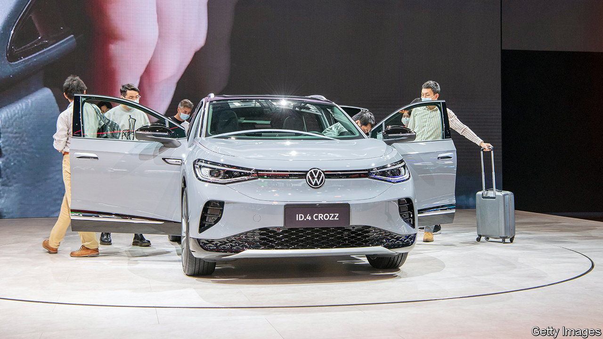
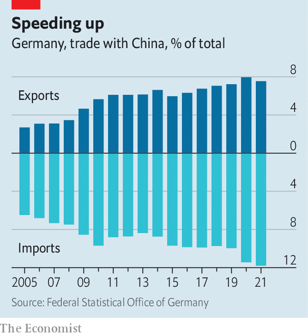

###### A new yawn

# Germany is recalibrating its close economic ties with China 

##### But only very cautiously 

 

> Jun 16th 2022 

In recent years members of parliament from parties across the political spectrum had pushed for a rethink of Germany’s China policy, without much success. Angela Merkel, Germany’s chancellor for 16 years until the end of last year, stuck to a course that prioritised ever-closer commercial ties over concerns about human rights or China’s geostrategic ambitions. This was always set to change with the advent of a new government, led by Olaf Scholz, which had promised a new China strategy in its coalition agreement. But the war in Ukraine has focused minds even more on the dangers of close business relations with an autocracy.

The most important aspect of the new China policy, whose publication has recently been postponed, will be a robust effort to reduce China’s economic leverage. Last year China was Germany’s top trading partner for the sixth consecutive year, with combined exports and imports of more than €245bn ($255bn). Exports to China represent around 8% of Germany’s total. 

“Germany is unique in the dependence of its biggest companies on the Chinese market,” says Noah Barkin, a China expert at Rhodium Group, a research firm. Volkswagen, bmw and Daimler, three big carmakers, and Infineon, a maker of semiconductors, depend on the Chinese market for the lion’s share of their business. Bosch, a car supplier, employs 60,000 people in China. Of Germany’s 15 most valuable listed firms, ten derive at least a tenth of their revenues from China, according to ’s rough estimates.

 


The war in Ukraine is a stark reminder that even close business relationships can come unstuck very quickly. vw and bmw both announced at the start of March, days after the war began, that production at their factories in Russia would be suspended, and all exports to Russia stopped. But the pain would be far greater if the two giants had to halt their much more lucrative operations in China. 

European business has hit the pause button on new investments in China, says Jörg Wuttke, the German head of the European Union’s chamber of commerce in China. This is related to travel restrictions and China’s policies to contain the covid-19 pandemic rather than the war in Ukraine. German business fell out of love with China a while ago. The government has allowed German firms only very selective access. And the mounting evidence of human-rights abuses has become impossible to ignore. This suits Mr Scholz’s ministers, who are pleading with companies to diversify their markets and supply chains away from the Asian behemoth. The government recently declined to renew risk insurance covering losses related to political strife for vw’s Chinese operations, citing China’s brutal treatment of Uyghurs, a Muslim ethnic minority.

Reshoring, near-shoring and other forms of relocation are already happening, says Wolfgang Niedermark, a member of the board of the Association of German Industry (bdi), who until 2020 headed the German chamber of commerce in Hong Kong. But there are limits. Last year the bdi published a paper on “Responsible Coexistence with Autocracies in Foreign Economic Policy Making”. Though it recommends that Western firms lead by example in protecting human rights and fighting climate change, it also states that cutting commercial ties with autocracies is not a realistic option. “We cannot defend democratic values any better if we considerably weaken ourselves economically,” says the paper.

The new government agrees. Its focus is on reducing dependence on China in areas that might limit its options in a serious geopolitical crisis, not decoupling from China altogether. Like many other countries, Germany depends on China for a big chunk of its imports of critical goods such as rare-earth minerals, solar panels and computer chips. But while lessening these vulnerabilities, Germany must continue to work with the Chinese to help them reduce their carbon emissions, say policymakers. China accounts for as much as 30% of the world’s emissions.

Germany’s foreign ministry now says it will unveil the government’s new China strategy at the end of the year, six months late. It will not shy away from mentioning the abuse of Uyghurs. But many critics fear that pragmatism will, once again, be the order of the day. ■

