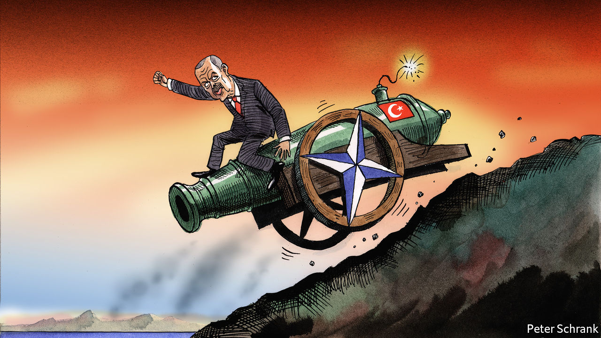

###### Charlemagne

# Is Turkey more trouble to NATO than it is worth? 

##### Recep Tayyip Erdogan’s government is the alliance’s loose cannon 

 

> Jun 16th 2022 

The received wisdom is that Russia’s invasion of Ukraine has breathed new life, and a new sense of purpose, urgency and unity into nato. Someone forgot to tell Recep Tayyip Erdogan. Over the past month the Turkish president has blocked nato enlargement, warned of a new offensive against American-backed Kurdish fighters in Syria and stoked tensions with Greece, also a member of the alliance. A few pundits, in the West but also in Turkey, are once again debating whether nato and Turkey should part ways. This time, they are not alone. “Leaving nato should be put on the agenda as an alternative,” Devlet Bahceli, leader of a nationalist party in Mr Erdogan’s coalition, recently said. “We did not exist because of nato and we will not perish without nato.”

Frustration is also mounting in Western capitals, and in Kyiv, over Turkey’s willingness to accommodate Russia. Many in those places had hoped that the war in Ukraine would force Mr Erdogan to reconsider his romance with Vladimir Putin, Russia’s president. Opportunism has prevailed instead. Turkey has sold armed drones to Ukraine and closed access to the Black Sea for Russian warships, but it opposes Western sanctions against Russia and openly courts Russian capital. According to a report in the Turkish media, dozens of Russian companies, including Gazprom, are planning to move their European headquarters to Turkey. 

Aside from a few words of condemnation at the start of the war in Ukraine, Turkey has remained on good terms with Russia throughout. When Russia’s foreign minister, Sergei Lavrov, visited Ankara this month his Turkish counterpart kindly suggested that the West should ease sanctions against Russia if Russia relaxed its blockade of Ukrainian ports. When Mr Lavrov repeated his claim that Russia had invaded Ukraine to liberate it from neo-Nazis, his host said nothing.

Mr Erdogan’s move to block Sweden’s and Finland’s accession to nato has further damaged Turkey’s standing in the alliance. The strongman has signalled that he wants the Nordic countries to extradite several members of the Kurdistan Workers’ Party (pkk), an outlawed armed group, and to drop a partial arms embargo against his country. He may also be shopping for concessions from America in exchange for withdrawing his veto, or from Russia for doing the opposite. Mr Erdogan occasionally sounds hostile to nato enlargement as a matter of principle. In a recent guest column for , he went as far as to blame Finland and Sweden for adding an “unnecessary item” to nato’s agenda by asking to join the alliance.

Mr Erdogan may have reasoned that a couple of foreign crises were needed to distract Turkish voters from their fast-diminishing circumstances, as galloping inflation, officially measured at over 70%, devours their savings and wages. In late May he warned of a new military offensive against Kurdish forces in Syria. Forced to shelve such plans, presumably because of opposition from Russia or America or both, he has since lashed out against Greece, demanding that it demilitarise Greek islands hugging Turkey’s western coast. He has also suggested that American bases in Greece pose a threat to Turkey (which hosts American forces itself). This might be bluster, and blow over. But obstructing Finland’s and Sweden’s nato membership while war rages in Europe is bound to have consequences, even if Mr Erdogan backs down. Sweden had been one of the few countries keeping alive Turkey’s hopes of membership in the European Union. That support has now gone. 

That may seem a price worth paying to Mr Erdogan if the row fires up his nationalist base. Mainstream Turkish politicians, as well as many humbler Turks, see the pkk purely as a security threat, and have long criticised the West for not taking their concerns about the group seriously. They have bristled especially at America’s decision to team up with the group’s Syrian wing to bring down Islamic State’s caliphate. Westerners, meanwhile, tend to believe that Turkey bears much of the blame for the pkk’s emergence by refusing to grant the country’s Kurds the rights they demand. They have also concluded that Mr Erdogan cannot be trusted to decide who is or is not a terrorist. By applying the label to thousands of people, including bureaucrats, academics, peaceful protesters and Kurdish politicians, and often throwing them into the same prisons as armed militants, Mr Erdogan has cheapened the term as badly as he has Turkey’s currency.

Turkey and the West will never see eye to eye on the issue, and Mr Erdogan’s antics, as well as his habit of suggesting that the West, and not Russia, is the biggest threat to his country, will only make matters worse. Already, 65% of Turks say they do not trust nato, according to a recent survey, although 60% support membership of the alliance.

Never say never

None of this spells doom for the relationship between Turkey and nato. Western countries will try to work round Turkey’s veto by providing Finland and Sweden with security guarantees. This may leave Turkey sidelined within the alliance. But its departure or eviction from nato is still fantasy. Turkey is on the front line of the war in Syria and close to other conflicts in the Middle East; it controls access to the Black Sea, which has been central to all of Russia’s recent wars; and it serves as a corridor for trade between Central Asia and Europe, especially in energy, notes Ben Hodges, a former commander of American forces in Europe. “I don’t even want to think of nato without Turkey,” he says. 

Especially in the wake of Russia’s war in Ukraine, Turkey also has no interest in surrendering the power of deterrence that nato membership offers. “I don’t believe it will ever happen,” says Tacan Ildem, Turkey’s former permanent representative to nato. There is no credible alternative, he says. Turkey will probably remain a headache for the alliance, even when Mr Erdogan is out of the picture. But it is a headache nato will have to live with. ■


