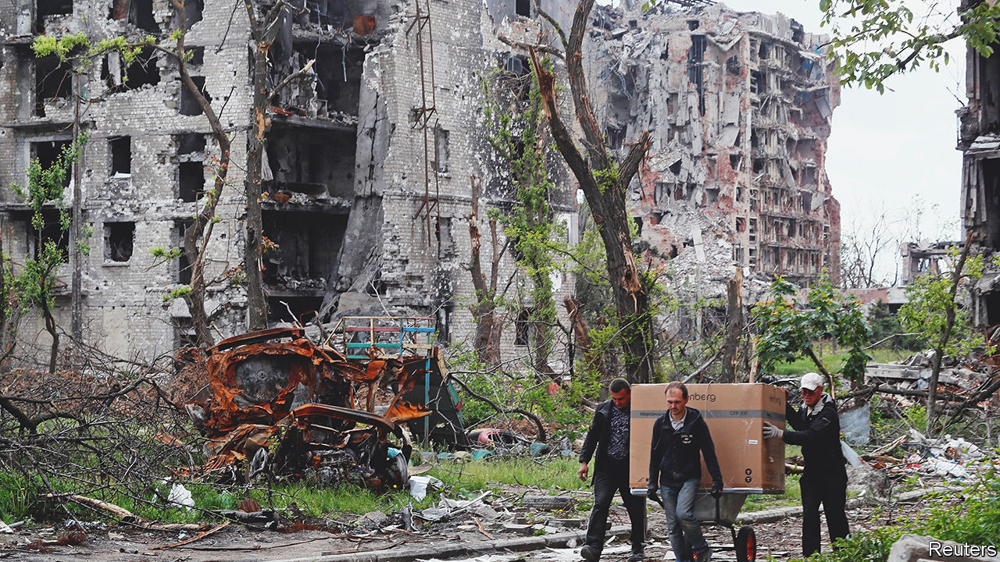

###### The $500bn question

# The EU has begun debating how to fund the reconstruction of Ukraine 

##### Where will it find the money required and how will it prevent it being wasted? 

 

> Jun 16th 2022 

On february 23rd the Azovstal factory in Ukraine’s port city of Mariupol was one of the biggest steel plants in Europe, 11 square kilometres of blast furnaces and liquid metal. Its 11,000 workers poured more than 4m tonnes of steel a year. On February 24th the war began, and three months later Azovstal lay in ruins. Russia has reduced most of Mariupol, and other towns in eastern Ukraine, to burnt-out husks. Russian missiles and artillery have smashed railway stations, ports and telecoms towers, hit more than 1,000 schools and left roads and wheat fields pocked with craters. The physical damage came to $104bn at the end of May, according to the Kyiv School of Economics and the economy will shrink by up to 50% this year. 

Ukraine’s allies have promised cash to keep the country running during the war, and to rebuild it afterwards “to help a new Ukraine rise from the ashes of war”, says Paolo Gentiloni, the eu’s economy commissioner. An accurate estimate of the total cost is impossible, but guesses are in the range of $200bn-500bn and rising. One question is where to get the money. Another is how to organise the aid without running foul of institutional rules or political sensitivities. Finally, there is the question of whether Ukraine can handle the cash.

The prospect of paying for reconstruction dwarfs more immediate issues, such as keeping Ukraine’s government solvent. “If we see that…there is no discussion of how to share the cost, then we are concerned,” says an Italian official. The eu could borrow the money collectively, as it did for its covid-recovery splurge. This idea has support among cash-strapped members. France may also see such a fund as a welcome chance to enhance Europe’s role in international affairs.

But Germany is hesitant, partly because it worries about high public debt and partly because collective eu debt tends to anger its powerful constitutional court. The Dutch government agreed to the covid-recovery fund only as a one-off, and is reluctant to break that promise to voters.

Then there is the question of who spends the money, and on what. The European Commission has proposed a “Rebuild Ukraine” platform that it would supervise alongside the Ukrainian government. It would co-ordinate aid from the eu and its member states, other countries (including America, Britain, Canada, Japan and South Korea) and international lenders such as the imf, the World Bank and the ebrd. Ukraine would take the lead in drawing up a reconstruction plan: it has already formed working groups of domestic stakeholders and international donors. 

Everyone accepts that the eu should have a leading role, not least because Ukraine aims to join the club. Some worry, though, that the eu’s bureaucracy and need for consensus will slow it down. Furthermore, not all interested parties are members of the union. America and Britain play big roles in Ukraine’s war effort, and institutions like the World Bank have their own rules and priorities. This argues for a looser sort of co-operation among different donors. The eu may focus on institutional reforms, economic integration and development, while America helps Ukraine build up its armed forces and defence industry. The imf would guide the restructuring of Ukraine’s debt and launch a new lending programme. Individual countries will take credit for their own aid projects. 

Such decentralisation risks duplication. The scramble for funds, both by Ukrainians and foreign contractors, will be fierce. It could also make it harder for anti-fraud agencies to spot corruption. Ukraine has the worst score in Europe on Transparency International’s corruption perceptions index, apart from Russia. It has improved since protests toppled a crooked government in 2014, instituting a transparent public procurement system and an independent anti-corruption investigator. Some say its poor image stems partly from Russian propaganda, but all stress the need for more accountability. 

One way to reassure donors would be to work with foreign contractors experienced in big infrastructure projects, says Natalie Jaresko, a Ukrainian-American who was Ukraine’s finance minister in 2014-16. Another might be to establish a court with foreign judges to adjudicate disputes linked to reconstruction. Bringing private-sector investment to a war-racked country with a reputation for corruption will take some doing. Yet the flowering of Ukrainian patriotism during the war will help. “Ordinary people on the streets are getting involved, scrutinising plans and discussing cost calculations of rebuilding projects,” says Oleg Ustenko, an economic adviser to Volodymyr Zelensky, Ukraine’s president. “Everybody believes that things related to the country are related to themselves.” ■


