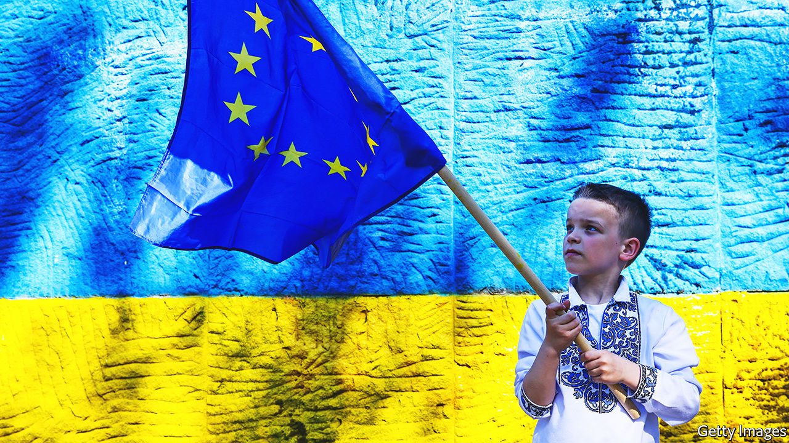
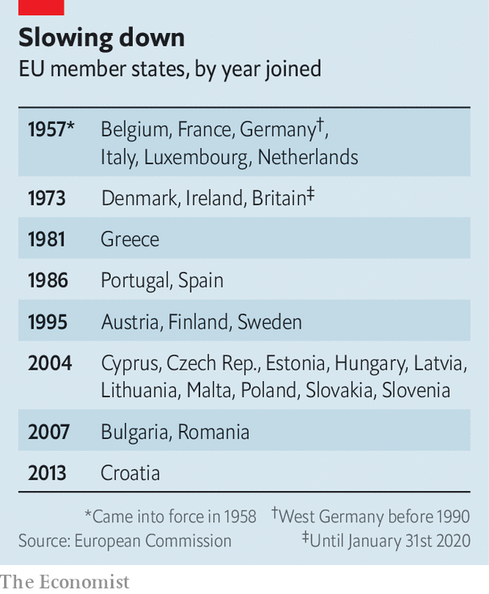

###### The unclubbable in pursuit of the unwelcoming

# War on its doorstep has rekindled talk of enlarging the EU 

##### Letting in Ukraine will be a long process 

 

> Jun 16th 2022 

Come this autumn the European Union will enter its longest stretch in five decades without having welcomed a new member. A club that expanded from six countries in 1957 to 28 when Croatia joined in 2013 had appeared to have reached its limits, give or take a few former Yugoslav republics laboriously negotiating their way in. But war on the continent’s eastern fringe has given impetus to the idea that Ukraine should join, perhaps with Moldova and Georgia in its wake. Their process of accession, a decade-long slog at best, could start on June 23rd, when eu leaders meet in Brussels to discuss the issue.

Few thought Ukraine remotely close to becoming a member of the eu before it was invaded by Russia on February 24th. Days later, even while enemy troops were marching towards Kyiv, President Volodymyr Zelensky signed a formal request for accession (Moldova and Georgia soon followed). Ukraine’s neighbours already within the bloc, most notably Poland, say giving it the nod is a moral duty. Ukrainians are dying for European values; a promise of a future within the eu would be a morale-booster on the battlefield and help the recovery once the fighting is done.

Joining the eu is arduous even for places not ravaged by war. Six countries in the western Balkans have been at it since 2003—and Turkey for even longer, though its drift towards autocracy means it is in effect no longer angling for membership. The first step is to be recognised as a “candidate country”, after which applicants get a chance to ensure that their laws are in line with existing eu legislation. On June 17th, after  went to press, the European Commission was expected to say Ukraine is ready to begin such talks.

But merely embarking on the process to become an eu member requires unanimous approval from all those already in the club. Some are sceptical. A few northern European governments, led by the Netherlands and Denmark, fret about welcoming applicants with not much of a track record of maintaining democratic standards. Ukraine is far poorer than any current eu member. It had struggled to combat corruption before the war; its courts need to be overhauled. Moldova has a well-regarded president and prime minister but a rickety state. Georgia has fallen from grace of late thanks to truculent and sometimes eu-bashing leaders. Russia controls bits of territory in all three places. 

The prospect of a super-size bloc gives pause to even the most ardent fans of enlargement. Bringing Georgia in would mean that bits of continental Europe would be closer to America than they are to the farthest reaches of the club. Ukraine, with a population of 44m before the war, would become the eu’s fifth-biggest member. Its farmers would absorb a huge slice of subsidies once earmarked for France.

 


The fact that some existing eu members such as Poland and Hungary have flouted democratic norms in recent years has made the sceptics all the warier of considering newcomers. This comes on top of fears that giving Ukraine candidate status would raise its hopes of quick accession, when in fact the process is likely to drag on for ten years or more—probably longer than the current goodwill towards Ukraine can be sustained. 

The experience of the western Balkans is a cautionary tale. Serbia, Montenegro, North Macedonia and Albania are all official candidates for accession; Bosnia-Herzegovina and Kosovo (which is not even recognised as a country by some eu members) are “potential candidates”. The lure of membership was meant to bring the region into the eu’s orbit. But the snail’s pace of talks—which have not even started, in the case of North Macedonia and Albania—has led to disenchantment. It has pushed the likes of Serbia closer to Russia and China.

For France, Germany and Italy, the eu’s founding big states, welcoming Ukraine as a candidate would be an easy sop to eastern Europeans who accuse them of complacency about Russia. Their respective leaders, Emmanuel Macron, Olaf Scholz and Mario Draghi, travelled to Kyiv on June 16th to meet Mr Zelensky. The French president has considered a looser European alliance that Ukraine and others could join quickly. But for now all are focused on membership of the eu proper. 

Assuming Ukraine is given the candidate status it craves—perhaps with caveats, to assuage the Dutch—Europe will have to rethink the way accession works. For one thing, the Balkan enlargement process will have to be reinvigorated, lest countries there feel they are being leap-frogged. The region’s leaders will be in Brussels to meet their eu counterparts on June 23rd. Moldova and Georgia, for their part, could be given a few hoops to jump through before being granted candidate status.

One idea, put forward by Charles Michel, the president of the European Council, is for countries to feel the benefits of accession before joining the eu. Currently, candidates undertake painful reforms for years to adopt the bloc’s exacting standards on everything from competition law to pet passports. Most benefits come only once they become members, many years down the line. In future there may be ways to integrate-as-you-go: a country that had met eu standards in its labour markets could join its existing schemes on the free movement of workers, for example. 

Barring reform of the eu, any current member has the power to derail any application, notes Luigi Scazzieri of the Centre for European Reform, a think-tank in London. So whatever is agreed next week will be only the first step of a long journey. Ukraine and others have been warned of this time and again. Thus far, it has not dissuaded them. ■


