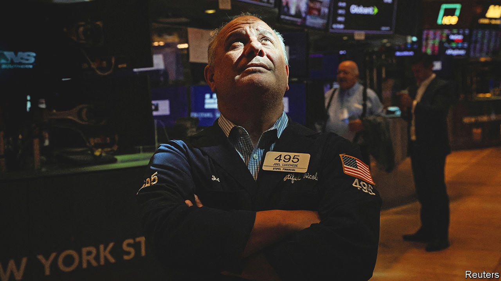
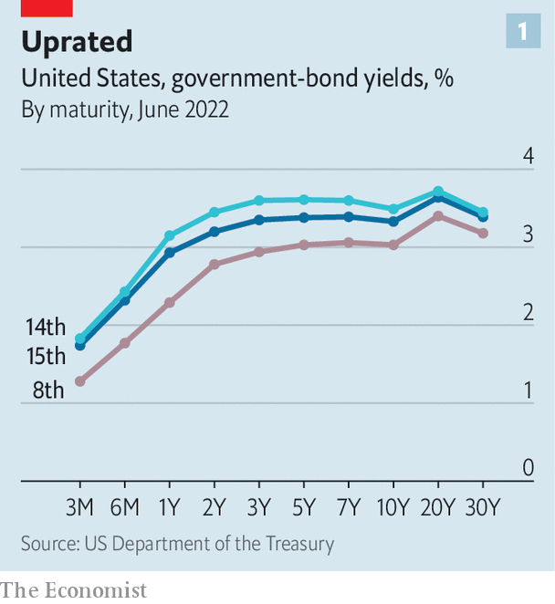
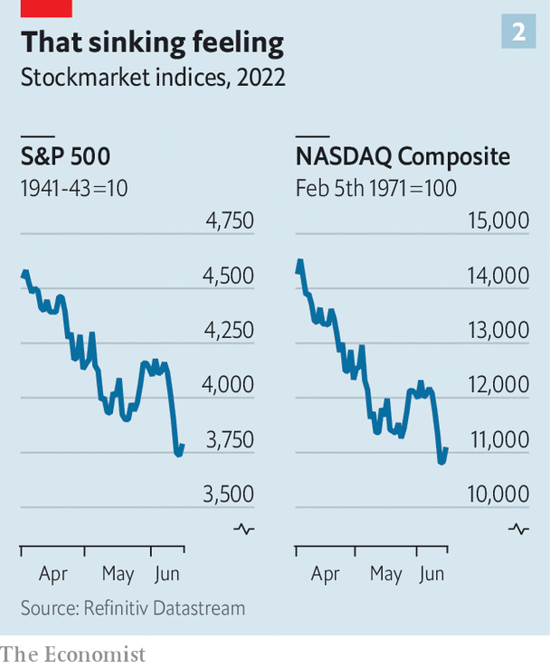

###### Twilight of the gods

# Eight days that shook the markets 

##### Investors wake up to the fact that conquering inflation will be painful 

 

> Jun 15th 2022 

“I do not expect moves of this size to be common,” said Jerome Powell, chairman of the Federal Reserve, on June 15th. The central bank had just raised its benchmark interest rate by 75 basis points (0.75 percentage points) to 1.5%-1.75%. It was the third increase in as many meetings and the biggest jump in short-term rates since 1994. The move was both expected and surprising. Mr Powell had warmed up markets weeks ago to the prospect of a 50-basis-point increase at this monetary-policy meeting. But in the days leading up to it, investors had quickly and fully priced in a larger rise—with more to come.

Mr Powell’s comment about uncommonly large increases was enough to spark a partial reversal of the sharp rise in bond yields over the preceding days and a relief rally in share prices. But however much he tried to sugar-coat the message, rates are going up by a lot more and the chances of a hard landing for the economy have surely increased as a consequence. , if not (yet) by the Fed. And the rapid changes in the market mood show just how much the Fed and other rich-world central banks have lost control of events.

The Fed’s interest-rate decision came at the end of an extraordinary few days in financial markets, in which bond yields shot up at a violent rate, share prices plunged and riskier assets, notably bitcoin but also Italian government bonds, were trashed. The story begins not in Washington or New York but in Sydney where, on June 7th, the Reserve Bank of Australia raised its benchmark interest rate by 50 basis points, citing growing worries about inflation. It continued in Amsterdam, where in the following days the European Central Bank (ecb) held its monetary-policy meeting, in a break from its usual setting in Frankfurt. Christine Lagarde, the central bank’s boss, confirmed that a 25-basis-point rate increase would be on the cards in July. But she went much further. The ecb, she said, expects to raise interest rates perhaps by 50 basis points in September and anticipates “sustained” increases thereafter. The catalyst for this more hawkish stance was a sharp upward revision in the central bank’s forecasts for inflation.

This set the stage for a dramatic shift in bond markets, which events elsewhere added impetus to. The yield on ten-year German government bonds, known as bunds, rose quickly to above 1.75% over the following days. The yield on riskier sorts of euro-zone government bonds, notably Italian btps, rose by even more. The spread (excess yield) on btps over bunds widened sharply, taking Italy’s ten-year yield above 4%. Indeed spreads had risen so swiftly that the ecb’s rate-setting council held an emergency meeting on June 15th to address the matter (see next story). 

But it was  that really moved markets. Figures released on Friday June 10th showed that annual consumer-price inflation rose to 8.6% in May, the highest rate since 1981. Underlying price (“core”) pressures were unexpectedly strong. To make matters worse, a survey by the University of Michigan showed that consumers’ expectations of medium-term inflation had risen markedly. Taken together, the reports suggested that inflation would be much harder to bring down. 

 


Treasury yields rose sharply as the bond market began to price in more and faster interest-rate increases by the Fed. The biggest moves were at the short end of the yield curve, which is most sensitive to shifts in monetary policy. Yields on two-year Treasuries rose by 57 basis points in the space of just two trading days. But longer-term rates shifted, too (see chart 1). 

 


Stocks could hardly escape the reckoning (see chart 2). The s&amp;p 500 index of leading shares fell by 3% on June 10th and by 4% the following Monday. The cumulative losses took the stockmarket firmly into bear-market territory, defined as a fall of more than 20% from its recent peak. The tech-heavy nasdaq index has fallen by even more. Higher Treasury yields have weighed on share prices, but have been a fillip to the dollar. The dxy, an index of the greenback against half a dozen rich-world currencies, is up by 10% this year. The strength is particularly marked against the yen, which has fallen to a new 24-year low. While the Fed is tightening policy to bring down inflation, Japan’s central bank is furiously buying bonds in order to raise it. 

The recent volatility, particularly in the bond market, has been quite extreme. What might explain this? As bad as the inflation backdrop had seemed before last week, investors had consoled themselves with the idea that the worst of it was now in the past. The Bank of America’s global fund-manager survey suggests that in recent weeks, investors had increased their allocation to bonds—perhaps judging that bond prices had stopped falling. (Bond prices move inversely to yields.) If so, the poor inflation figures caught them out. 

A market that leans heavily in one direction often snaps back when the wind changes. And poor liquidity amplifies the effect. Changes in regulation have made it costlier for banks to hold large inventories of bonds to facilitate client trading. The Fed, once a reliable buyer of Treasuries, is winding down its purchases. When investors want to sell, there are too few willing to take the other side of the trade. The violent market moves in the days leading up to the Fed meeting may have exaggerated the sense of panic. 

Yet it is hard to argue that investors are bullish. The Bank of America survey shows that optimism among fund managers about the economic outlook is at an all-time low. Can a hard landing be avoided? Even Mr Powell sounded rather unconvinced. Prepare for more trouble ahead. ■


