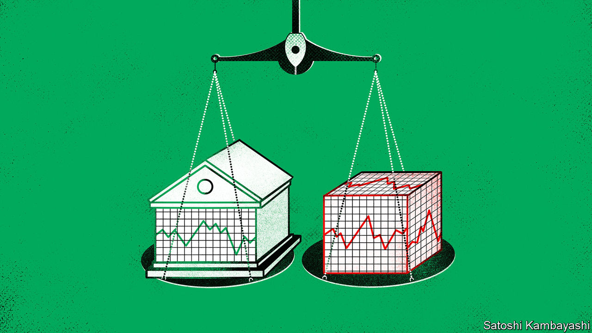

###### Buttonwood

# Is trading on America’s stockmarket fair? 

##### Gary Gensler, the head of the SEC, thinks not 

 

> Jun 16th 2022 

In everyday parlance equity means fairness. To an investor or a stockbroker, though, it is an ownership stake. The word means both things thanks to the English Court of Chancery, which operated from around the 15th to the 19th centuries and handed out rulings based on “equity”, or fairness, rather than common law. Under common law a borrower who missed a mortgage payment would forfeit their land, but in Chancery they could reclaim it by repaying the debt. Over time, “equity” came to mean the ownership stake in property itself. 

Today’s legal and regulatory systems are tasked with ensuring that finance is fair. And Gary Gensler, the head of the Securities and Exchange Commission, America’s markets watchdog, is not happy. In a speech on June 8th he worried that “market segmentation and concentration” mean there is no longer a “level playing-field” in the stockmarket. It is “not clear”, he said, that the “market system is as fair and competitive as possible for investors”.

A fair market is transparent, accessible and uses a reasonable method to arrange buyers and sellers—think of a public farmers’ market with clearly stated prices and an orderly queue. A decade ago this was a decent (if simplified) description of most equity trades. Three-quarters of them, by volume, were conducted on public exchanges; only a quarter were done “off-exchange”. No more. In 2021, during the “meme-stock” craze when retail bets sent GameStop shares soaring, the share of off-exchange trades swelled to a peak of 47%. Retail punters are far less likely to have their orders executed on public exchanges than institutional investors. More than 90% of retail orders are sent to a concentrated group of marketmakers that pay brokers to deliver the orders to them (a practice called payment for order flow). 

At first glance, this system is not obviously bad for retail investors. Brokers—Charles Schwab, say, or Robinhood—are obliged to seek “best execution” for their customers. In order to direct a retail order to a marketmaker, like Citadel Securities or Virtu, they must beat the prevailing price offered by public exchanges—the so-called “national best bid and offer” (nbbo)—a feature known as “price improvement”. That means retail traders probably get better prices than most institutions. Marketmakers are happy to pay for their business because the flows are not risky. It is easy to match retail flows against each other. By matching trades they can give a lower price than the best offer to the buyer, a higher price than the best bid to the seller, and have some left over—a slice of which they pay to the broker, and the rest of which they keep. The payments mean brokers do not need to charge customers commission.

Yet there are flaws. Post-trade price improvement makes it impossible for punters to know ahead of trading which broker would ultimately give them the best execution price. As Mr Gensler put it, “price improvement without competition…is not necessarily the best price improvement.” Marketmakers and brokers might start to hang on to more of the benefits, instead of passing them on to punters. Larry Tabb of Bloomberg, a data firm, has found that American retail investors in March 2022 collected 47% of the benefit ($3.7bn on an annualised basis), while brokers were paid 13%($900m). The marketmakers themselves took some 40% ($3.1bn).

Moreover, the system of price improvement relative to the nbbo only benefits customers if the nbbo is a good benchmark—a claim that is getting shakier. For a start, the nbbo is measured for orders of 100 shares or more. This was sensible in 2014, when just 15% of trades were in smaller quantities. By March 2022, though, the share had climbed to 55%. And if trading volumes continue to move off-exchange, the benchmarks will become ever less meaningful. 

One solution from Mr Gensler is for exchanges to hold auctions for retail stock orders, a practice typically used to fill retail orders for equity derivatives. By redirecting retail flows to exchanges, this would radically reshape American stockmarkets—to the benefit of exchanges and the detriment of marketmakers—and is therefore likely to be fiercely resisted. Hours after Mr Gensler spoke Dan Gallagher, a former sec commissioner now at Robinhood, said the current structure represented “a really good climate for retail”. A shakeup could face legal challenges, too. But Mr Gensler is right to be trying. Taking a punt on today’s violent stockmarkets is daunting enough. Investors should get a fair shot at it.


