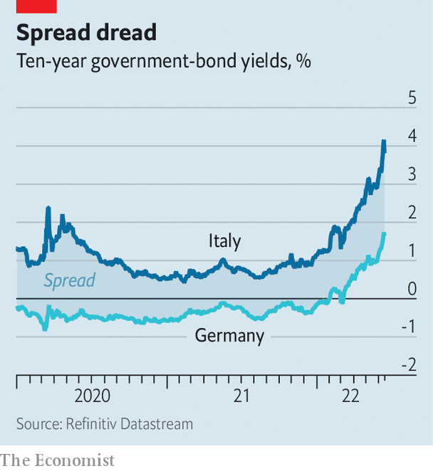

###### Moment of truth

# The European Central Bank responds to market turmoil 

##### The ECB is here to close spreads 

 

> Jun 15th 2022 

Surging inflation and a weakening economy are not the only worries preoccupying the European Central Bank (ecb). As inflation rose higher still, the bank promised on June 9th to raise interest rates over the coming months and to end its asset purchases. Then, in subsequent days, financial markets decided to remind the central bank that the new policy could mean Italy’s public debt, at 150% of the country’s gdp, might look wobbly as interest rates start to rise. Italian government-borrowing costs started to climb. 

As the yield on Italy’s ten-year sovereign bonds surpassed 4%, the central bank called an emergency meeting on June 15th. Its governing council tasked the staff with coming up with an “anti-fragmentation” tool, a government-bond-buying scheme that would help prop up sovereigns in distress. The announcement marks a fundamental change in how the ecb sees its role in bond markets.

Being a central banker in a monetary union is hard. The euro’s members differ according to their growth prospects and debt levels, leading to gaps (“spreads”) between their bond yields and the German bund yield, which is regarded as the risk-free rate. Investors routinely debate the threat of a country defaulting, or exiting the euro. By contrast, there is little doubt that the Bank of England stands behind gilts; no one worries that Britain might leave sterling. 

Differences in liquidity and the extent to which a government’s bonds are seen as benchmark assets matter, too. In a recently published paper, Hanno Lustig of Stanford University and colleagues estimate that this “convenience yield”, the yield that investors are willing to forgo for safety and liquidity, explained more than half the variation in spreads between euro countries from 2008 to 2020. 

 


In times of stress—as when the pandemic struck in March 2020—investors seeking safety drive up the spread between, say, Italian and German bonds (see chart). These spreads between government bonds then translate into differing borrowing costs for firms and households. Despite sharing a currency (and the Alps), borrowers in Tyrol, Austria, and South Tyrol in Italy could face quite different interest rates, because their respective national governments are charged different rates by investors. And too big a divergence can be a problem for the ecb, because it sets short-term interest rates for the euro area as a whole. The wider the spreads, the less likely it is that its desired interest rate is reflected in conditions on the ground. But the precise point at which spreads become wider than economic differences warrant is controversial. 

In a speech on June 14th Isabel Schnabel, a member of the ecb’s executive board, explained the bank’s thinking. She argued that safe interest rates were rising around the world at a time when threats to growth were becoming more prominent. Widening spreads meant that financial conditions had tightened more in some parts of the euro zone than in others. The ecb would seek to avoid any “disorderly repricing of risk” that could impair the functioning of monetary policy, and so pose a threat to ensuring stable inflation. 

The question is what counts as “disorderly”. Shortly before the emergency meeting, Italian ten-year spreads on bunds rose to 2.4 percentage points. Not everyone agrees that was a problem. Volker Wieland, a former member of the German council of economic experts, argues that Italy’s debt is not unsustainable and that spreads did not warrant action by the ecb. In addition, he points out, the ecb already has the means to contain panicky rises in spreads. 

Yet the existing tool, outright monetary transactions (omt)—announced in 2012 when Mario Draghi, the ecb’s former president, said he would do “whatever it takes” to preserve the euro—has become politically toxic. It comes with tough conditions—namely that the countries in need of ecb support subject themselves to an imf-style reform programme. 

Luis Garicano, a Spanish member of the European Parliament, argues that the ecb will seek to recreate omt without the toxicity. The central bank itself has been at pains to emphasise that any new tool to contain spreads would “remain within its mandate”: in other words, that any bond purchases would be either limited, or tied to conditions. 

Unless the euro zone comes closer to being a federal entity, with a common finance ministry and shared taxes and benefits, spreads will be a fact of life. Further banking or fiscal integration could help narrow them without central-bank action. But progress on those cannot be counted upon. With its announcement, the ecb has made clear that it sees managing spreads as part of its job. ■


