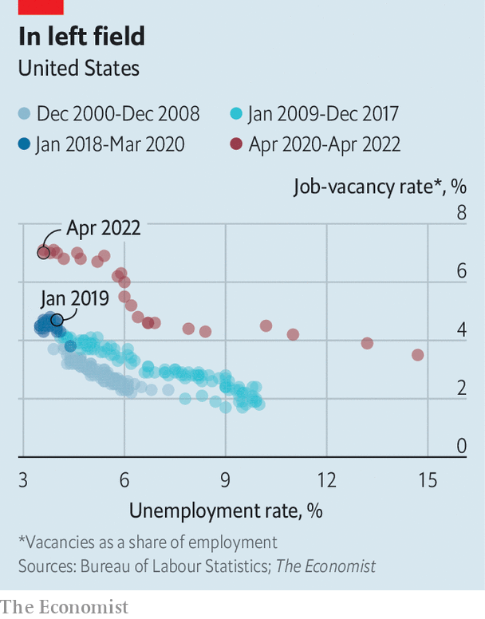

###### Free exchange

# The Fed’s flawed plan to avoid a recession 

##### The central bank thinks it can reduce job vacancies without job losses 

 

> Jun 14th 2022 

American economists are no longer hawks or doves, but optimists or pessimists. With annual inflation running at 8.6% in May, everyone agrees the Federal Reserve needs to raise interest rates sharply, and on June 15th it did so by 0.75 percentage points. The disagreement now is not over whether the Fed must  but how painful the consequences will be. Pessimists point to the long history of bouts of monetary-policy tightening being followed by recessions. Optimists say the Fed can bring inflation down to its 2% target merely by slowing economic growth.

The Fed is in the optimists’ camp. In a recent speech Christopher Waller, one of the central bank’s rate-setters, spelt out the argument. It hinges on America’s hot labour market. There were almost twice as many job openings as there were unemployed workers in April, with the ratio near a record high reached in March. And wages are more than 5% higher than a year ago. (Such is the heat that McDonalds is cutting workers from the kitchen, by shrinking its menus.) Although wage growth is slowing a little, the obvious imbalance between the demand for workers and their supply means the Fed cannot count on further cooling. Without it, prices are likely to continue , too, as workers spend their incomes and firms pass on their costs.

A pessimist would see plentiful job openings as a sign of how out of whack the labour market has become on the Fed’s watch. The central bank sees them as evidence that it can cool things down without turfing anyone out of a job. Fewer vacancies, and therefore less competition for workers, might lower wage growth and inflation without raising unemployment. This idea motivates the belief of Jerome Powell, the Fed’s chairman, that the economy could face only “some pain” from disinflation—akin to suffering from the side-effects of an inoculation, rather than the disease.

 


The argument can be cast as one about the slope of the “Beveridge curve”, which traces the relationship between the vacancy and unemployment rates. It is named after William Beveridge, a British economist who in 1944 established the importance of vacancies in determining unemployment. The curve is a mysterious beast. It often shifts outwards during recessions, as it did after the global financial crisis, when more vacancies were needed to support any given level of unemployment. Economists speculated that it had become harder to match workers to jobs, perhaps because they were in the wrong place or had the wrong skills.

Since covid-19 struck, the Beveridge curve has moved outwards more dramatically still, perhaps reflecting the rise of home working, the decline of city centres and changing patterns of consumer spending (see chart). Its recent shape suggests that were vacancies to return to their 2019 level, when the labour market was arguably last in balance, the unemployment rate would rise from 3.6% today to more than 6%. That is hard to imagine without an accompanying economic contraction. A rise of just 0.5 percentage points in the three-month average unemployment rate, from its low over the preceding 12 months, is an indicator of recession. Every time it has occurred since 1950, it has either coincided with, or shortly been followed by, a downturn—a principle known as the “Sahm rule” (named for , an American economist). 

Mr Waller, however, thinks that the shape of the Beveridge curve will change again as vacancies fall. The curve’s outward shift during the pandemic reflects firing as well as hiring: lots of workers lost their jobs early on. Layoffs increase the unemployment rate for a given level of vacancies and push out the Beveridge curve. Today, though, few workers are being sacked. Perhaps the Fed can manage to cool the economy, and as a result lower the vacancy rate, but without increasing layoffs. In this scenario the curve would be steeper on the way down than it was on the way up. Reducing the vacancy rate to its 2019 level while holding layoffs constant would imply only a modest rise in unemployment, to around 4.5%. Though that would still trigger the Sahm rule, “the past is not always prescriptive of the future,” said Mr Waller, noting that vacancies have never before been so high.

The perils of positive thinking

The Fed’s maths are sound. Yet its argument looks like the latest instance of over-optimism among monetary policymakers, who have downplayed the extent of the inflation scare and underestimated the action needed to fight it. Why would tighter policy shrink vacancies but not increase layoffs? Higher interest rates reduce consumption and investment, which might cause the weakest firms to shrink or even shut down. Mr Waller said that “outside of recessions, layoffs don’t change much”. Yet recession is precisely the outcome that pessimists fear will follow from higher rates. 

The historical record backs up that worry—and provides little support for the Fed’s argument. Research by Alex Domash and Larry Summers, both of Harvard University and firmly in the pessimists’ camp, finds that there has never been an instance in which the vacancy rate has fallen substantially without unemployment rising significantly within two years. A reduction in vacancies of 20% is associated with, on average, a three-percentage-point rise in the unemployment rate—comparable with what is implied by the recent Beveridge curve. Mr Waller’s argument implies a drop in vacancies of fully 35%.

A final problem with the Fed’s plan is that it does not preclude persistent inflation. Even if the labour market returns to balance, inflation could stay high if workers and firms come to expect rapid price increases. In economics textbooks it is high inflation expectations, not the difficulty of bringing demand back into line with supply, that makes it hard to slow price rises without causing a recession. That is why it is such bad news that people’s long-term inflation expectations have recently risen noticeably, according to a survey of consumers by the University of Michigan. Getting expectations down typically means running the economy cold. Each time the Fed is proved to have been overly optimistic, its credibility ebbs, making a dire outcome more likely. ■


