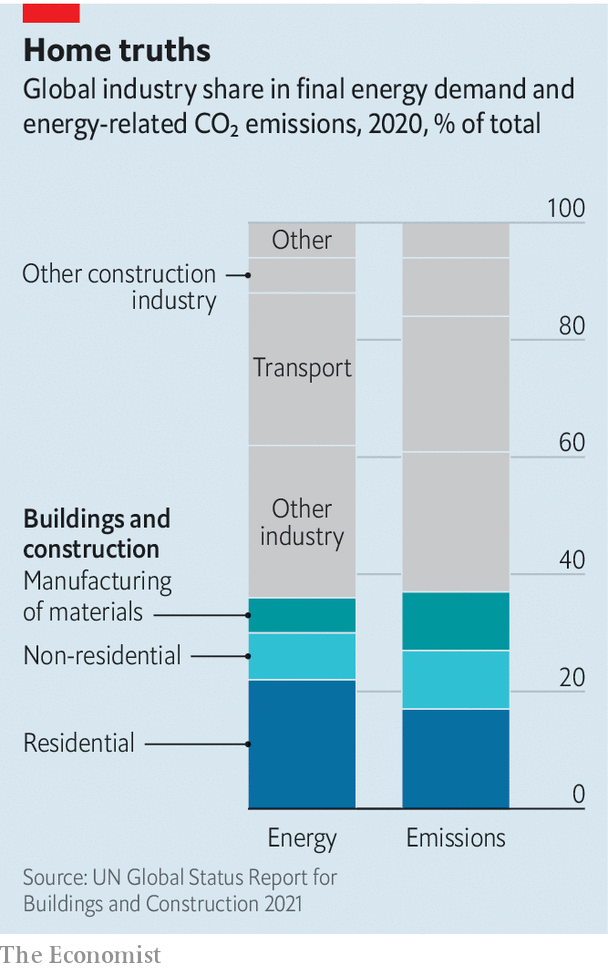

###### A tall order

# The construction industry remains horribly climate-unfriendly 

##### Governments are falling well short in their efforts to turn things around 

 

> Jun 15th 2022 

Covid-induced lockdowns may have upended the world of work, but they have not killed the skyscraper. Even as workers stay home to avoid the commute, cities’ penchant for these concrete marvels of engineering continues unabated. In midtown Manhattan, JPMorgan Chase has knocked down its old headquarters in favour of a new glass tower that will rise 18 storeys higher. Across the city, more than a dozen supertall structures—which rise higher than 300m—are in the works. In London, where gleaming new landmarks are given irreverent nicknames such as “Walkie Talkie” or “The Gherkin”, more than 200 towers have transformed the skyline since 2009. The construction frenzy is not limited to big cities. By one estimate, the planet will add floor space the size of New York City every month until 2060. 

Some worry that this pace of construction could literally cost the Earth. Today, buildings are responsible for almost 40% of global energy-related carbon emissions, with homes alone accounting for nearly 20%. Property emissions are a combination of two things. The first is the day-to-day running of a building: energy used to light up, heat or cool homes, office blocks and shopping malls. The carbon produced in this way is “operational”, in the vernacular, and accounts for 27% of all annual carbon emissions globally. The other type is “embodied” carbon, which refers to emissions tied to the building process, maintenance and any demolition. Overall, embodied carbon is responsible for around 10% of annual emissions, though it will vary depending on the type of building.

Worryingly, the carbon footprint of buildings is growing. On the current path, carbon emissions related to buildings are expected to double by 2050. It is true that in 2020 emissions from managing property fell, after hitting a record high in 2019, according to the Global Alliance for Buildings and Construction (Globalabc), an industry body. But that was mostly owing to lockdowns, which lowered emissions from all sorts of other activities too. Efforts to build greener played a minimal role. 

 


Worse still, advances in building energy efficiency are stalling. The global rate of annual improvement fell by half between 2016 and 2019, according to Globalabc’s tracker, which measures indicators such as incremental investment in the energy performance of buildings, along with the share of renewable-energy use. 

Policymakers are scrambling to find solutions. New energy-efficiency standards for buildings in England and Wales mean that one in ten offices in central London risks becoming obsolete in 2023. Nearly 60% could become unusable by 2027. Across the eu, where nearly two-thirds of the building stock relies on fossil fuels for heating and cooling, officials want nearly half of a building’s energy to come from renewable sources by 2030. Cities are setting lofty targets, too. New York is aiming for carbon-free electricity by 2040; Los Angeles, for zero-emissions buildings by 2050. 

Hot property

Homeowners are also being urged to go green. In Britain energy-performance requirements for new homes will be dramatically tightened from 2025. In Italy the government has pledged to cover the full cost of green renovations, plus an extra 10% to incentivise those still unsure about switching, through tax deductions of up to €100,000 ($104,000) per home. More than €21bn has been paid out since the scheme was launched in July 2020.

Even so, progress is slow. To meet the goals of the Paris climate agreement, global emissions must hit net zero between 2050 and 2070. Today, less than 1% of buildings are net-zero. Nudging homeowners is proving challenging. Total greenhouse-gas emissions for American houses have fallen by 2% since 2005, versus the 7% that would be consistent with the Paris agreement, according to Citigroup, a bank. This is mirrored in many big economies. In Britain the CO-equivalent emissions of homes fell by around 1m tonnes between 2018 and 2019—less than half the cuts made by the transport sector. 

Three obstacles make it harder to build sustainably. First, the property industry has focused almost entirely on making buildings more efficient to run at the expense of embodied carbon emissions. As a result, little progress has been made on monitoring and restricting embodied carbon. Britain, for example, has passed legislation requiring new homes to produce at least 75% less carbon from 2025. Yet it places no limits on the upfront carbon emissions needed to build or dispose of them.

There are exceptions. The Netherlands has required whole-life carbon assessments for some large buildings since 2013. California imposes carbon-intensity limits on certain construction materials. For now, embodied carbon accounts for a smaller share of global emissions than the operational sort. But that will change as buildings become more energy-efficient. In many modern buildings, embodied carbon already represents as much as half of total lifetime emissions. 

The second hurdle is the indestructible appeal of the wrecking ball. The building sector would sooner knock down a structure than reuse it, resulting in a carbon-intensive cycle of demolition and construction. This is partly because the costs of revamping properties often exceeds their value. Tax structures across the rich world incentivise demolition over reuse. For example, until March 2022 most new buildings in Britain were exempt from value-added tax, while most renovation and repairs were liable for vat at 20%. vat has since been scrapped on some energy-efficiency measures but will rise from 2027.

This economic model is costly for the planet. Construction gobbles up nearly all of the world’s cement, half of all steel production and around a quarter of aluminium output and plastics, all of which spew vast amounts of emissions a year. In the process, construction generates around a third of the eu’s waste, measured by weight. In Britain construction, demolition and excavation amounts to nearly two-thirds of all waste produced. 

Pockets of the sector are innovating. Startups, venture capitalists and some cement-makers are all looking either to replace concrete or to make it greener. New methods such as modular construction, which reduces waste by assembling components in a factory before moving them on-site, are also gaining traction. Nearly half of new homes in Finland, Norway and Sweden are factory-built. 

Yet the overall pace of innovation is desultory, because of a third obstacle: the chronically underwhelming productivity of the construction sector as a whole. Global productivity growth in the industry has long lagged behind that of the wider economy. Building methods for new homes have barely evolved in over a century. At the same time, the pandemic has exacerbated long-standing labour shortages in construction. The sector was already struggling to produce enough tradespeople skilled in building sustainably. 

Meanwhile, calls to go green will only grow more urgent. Population growth and voracious demand for housing mean the size of the built environment is expanding at a faster rate than efforts to slash energy use. An explosion of new buildings in China, South-East Asia and Africa will continue to fuel construction. In these places, more than half of all buildings that will exist 30 years from now have not yet been built. If the world is to reach net-zero emissions, the construction sector will need to make enormous strides—and fast. ■


