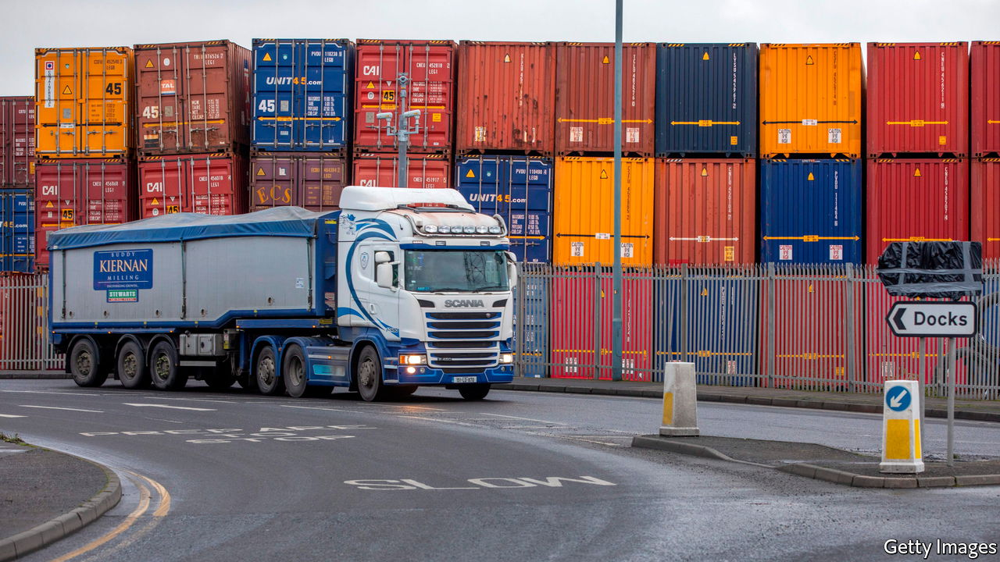

###### The misrule of law

# Britain’s bill to rip up the Northern Ireland protocol is a terrible idea 

##### Changes are needed. But that calls for pragmatism, not intransigence 

 

> Jun 14th 2022 

When the Conservatives won the 2019 general election, they did so on the promise of getting Brexit done. A withdrawal agreement with the eu soon followed. But far from being done, that deal is  by the Tories themselves. On June 13th, the government introduced a bill that would give it powers to override large chunks of the . This bit of the treaty keeps the province (but not Great Britain) in the European Union’s single market for goods, ensuring that there are no border controls on the island of Ireland but creating a customs and regulatory border in the Irish Sea instead. 

That the protocol needs adapting is beyond dispute. It imposes pettifogging bureaucracy on imports from the mainland into Northern Ireland; sending beef-flavoured crisps across the Irish Sea requires a vet to give the all-clear. Such absurdities do not just load costs onto firms and consumers. The protocol has also stoked fierce opposition from the largest pro-unionist party, the Democratic Unionist Party (dup), which is refusing to rejoin the devolved executive until it is scrapped or radically changed. Although a majority of assembly members in the province want to keep the protocol, the political infrastructure of Northern Ireland requires nationalists and unionists to co-operate. 

The government’s decision to legislate to dismantle parts of a treaty that Boris Johnson hailed as “oven-ready” is a thoroughly misguided way of tackling this horribly messy problem. It is reputationally toxic, self-defeating and risks wider damage. 

Start with the damage to Britain’s reputation as a law-abiding state. The government is citing “the doctrine of necessity” to justify ripping up chunks of the protocol; this doctrine allows states to breach their international obligations in situations of “grave and imminent peril” in order to protect their essential interests. The government seems to have shopped around to get the right legal opinion, and it still bought a dud. The politics of Northern Ireland are fragile, to be sure, but the province has survived without a devolved government for about three of the past five years. The government could have invoked Article 16 to suspend the operation of the protocol. Instead it plans a unilateral abrogation of a treaty commitment on flimsy legal grounds. 

That is not just shameful, but also self-defeating. The government says that it wants to renegotiate the protocol, but negotiations thrive on good faith. Rather than caving in, the eu will harden its position: it is already planning to restart legal action against Britain for not enforcing parts of the protocol. The bill will encounter opposition domestically, from moderate Tory mps and from the House of Lords, raising doubts about whether it can actually get passed. And that in turn will discourage the dup from rejoining the executive until it is confident that something will get done. Each act of intransigence will beget another. 

How much relations between Britain and the eu will sour is impossible to say, but the risk of wider damage is real. The participation of British scientists in the bloc’s Horizon Europe research programme is under threat; a trade war is possible. The balance of power does not favour the smaller economy. Britain’s gdp shrank in April; it has a . This predicament is not down to Brexit alone, but the departure from the bloc has not helped. The Centre for European Reform, a think-tank, estimates that the economy was 5.2% smaller in the final quarter of 2021 than it would have been without Brexit—and that’s when the relationship is working. By introducing the bill, the government has exacerbated political uncertainty and the risk that more businesses will hold back on investment.

The eu is not guiltless. It has shown flexibility before by, among other things, liberalising rules on medicines. It should do so again, for example by relaxing customs rules for imports into Northern Ireland that are not destined for the eu. But the chances of a pragmatic solution have nosedived this week, and for that the government in London takes the blame.■


