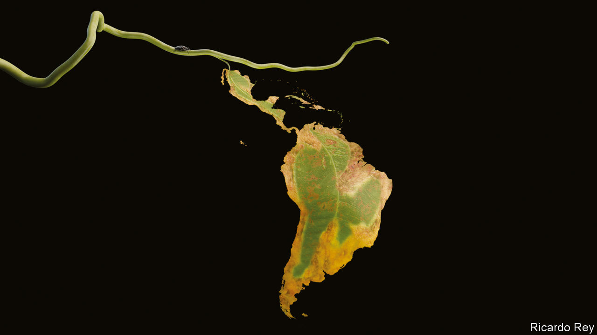

###### How democracies decay

# Latin America’s vicious circle is a warning to the West 

##### Economic stagnation, popular frustration and polarised politics are reinforcing one another 

 

> Jun 16th 2022 

When they vote in a  this weekend Colombians face a grim choice between two ill-qualified populists. On the left, Gustavo Petro has still not wholly shaken off his long-standing sympathy for Hugo Chávez, the  who destroyed Venezuela’s economy and its democracy. On the right, Rodolfo Hernández is a bullying former mayor with no team and not much of a programme beyond expelling “the thieves”, as he calls the political class. This line-up reflects voters’ deep scorn for Colombia’s mainstream politicians, even though the country has done relatively well over the past 20 years. It is the kind of polarised choice that has become worryingly familiar in Latin American elections. In a region that was discontented even before the pandemic, there no longer seem to be many takers for the moderation, compromise and gradual reform needed to become prosperous and peaceful.

That matters not just to Latin America, but to the world. Despite everything, the region remains largely democratic and should be a natural ally of the West. It can play a vital role, too, in helping solve other global problems, from climate change to food security. It is home not only to the fast-diminishing Amazon rainforest and much of the world’s fresh water but also to a wealth of commodities needed for green energy, such as lithium and copper. It is a big food exporter and could provide more.

Not so long ago, Latin America was on a roll. A commodity boom brought healthy economic growth and provided politicians with the money to experiment with innovative social policies, such as conditional cash-transfer programmes. That, in turn, helped bring about big falls in poverty, reducing the  long associated with the region. The middle classes grew. That helped underpin political stability. Democratic governments generally respected human rights, even if the . Growing prosperity and more responsive and effective politicians appeared to be reinforcing one another. The future was bright.

Now that virtuous circle has been replaced by a vicious one. Latin America is stuck in a worrying development trap, as  this week explains. Its economies have suffered a decade of stagnation or slow growth. Its people, especially the young, who are more educated than their parents, have become frustrated by their lack of opportunity. They have turned this anger against their politicians, who are widely seen as corrupt and self-serving. The politicians, for their part, have been unable to agree on the reforms needed to make Latin America’s economies more efficient. The  with developed countries has widened since the 1980s. With too many monopolies and not enough innovation, Latin America is falling short in the 21st-century economy. 

These challenges are becoming more acute. The impact of the pandemic, , will increase inequality. Governments need to spend more on health care and education, but the cost of servicing debt is rising. The region thus needs to raise more tax, but in ways that do not undermine investment. Chile and its young left-wing president, Gabriel Boric, seemed to offer the chance of a new social contract along those lines. Instead his fledgling government is hostage to a constitutional convention shot through with the familiar Latin American vices of Utopianism and over-regulation.

The consolidation of democracy used to be seen as a one-way street. But Latin America shows that democracies can easily decay—and that is a warning for democrats everywhere. Its politics are now marked not just by polarisation but also by , making stable governing majorities hard to assemble (see ). This downward spiral is accelerated by the malign influence of social media and the import of identity politics from the north. Technocrats are discredited and jobs in government are increasingly seen, on both the left and the right, as perks to be doled out rather than crucial responsibilities to be reserved for capable administrators. Organised crime, already a big factor in the region’s epidemic of violence, is starting to taint its politics, too.

Many of these are ills of the democratic world in general, but they are particularly acute and dangerous in Latin America. Most Latin Americans still want democracy, albeit a better version than they have. But there is a growing audience for those advocating the supposedly effective hand of autocracy. Venezuela and Nicaragua have become left-wing dictatorships like Cuba. In El Salvador, Nayib Bukele has centralised power and locked up some 40,000 people in a draconian war on gangs. He is the region’s most popular president. The leaders of its two biggest countries, Jair Bolsonaro of Brazil and Andrés Manuel López Obrador of Mexico, are contemptuous of checks and balances. Mr Bolsonaro will seek a second term at an election in October. It is cold comfort that he is likely to lose to Luiz Inácio Lula da Silva, a former president whose governments were linked to corruption and who lacks new ideas.

The risk is not just that democracies devolve into dictatorships, but that Latin America . In much of the region, China is now the main trade partner and is investing in infrastructure. Some of the region’s left-wing governments seem keen to return to the non-alignment of the cold-war era. Five of the region’s presidents, including Mr López Obrador, chose to boycott this month’s Summit of the Americas in Los Angeles. The United States—and Europe—could do more to engage Latin America, through trade, investment and technology. But Latin America in turn needs to recognise that it has much to gain from rebuilding closer ties, and that its role in a world dominated by China would be that of a neo-colony.

Stopping the rot

The temptation in the region will be to ignore the economic and political malaise and simply surf the new commodity boom triggered by the war in Ukraine. That would be a mistake. There are no short cuts. Latin Americans need to rebuild their democracies from the ground up. If the region does not rediscover a vocation for politics as a public service and relearn the habit of forging a consensus, its fate will get only worse. ■


