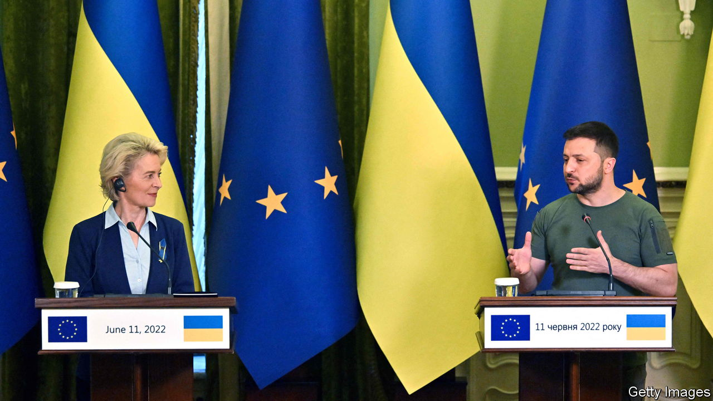

###### Ever wider

# The EU should declare Ukraine a candidate for membership 

##### To do otherwise would be to appease Russia 

 

> Jun 16th 2022 

What is the point of the European Union? In a nutshell, to spread peace and prosperity on the continent. That mission has seen its membership expand steadily from the six founders of its precursor in the 1950s to 27 countries today. But in recent years its growth has slowed. No new member has been admitted since Croatia in 2013 (and one has left). Now war has ignited on the eu’s borders—just the sort of horror its founders hoped to banish from the continent. To be true to the eu’s mission, to bolster an embattled democracy and to face down the sort of nationalist aggression to which the eu considers itself the antidote, the club’s leaders, who meet in Brussels next week, should .

The fainthearted will object, saying that Ukraine is too poor, too corrupt and now too war-torn to join the cosy club. That is true, but it misses the point. No one imagines that Ukraine will be ready to become a member for many years yet. It will have plenty of hoops to jump through before that can or should happen. If Ukraine does not make sufficient progress, it should not be admitted. The progression from candidate to member is by no means inexorable:  since 1987.

The conferral of candidate status initiates a flurry of paperwork. It can create a powerful incentive for the government of the would-be member to institute big administrative and economic reforms. But its main significance is as an expression of intent, from both sides, to make the applicant part of the European family. In Ukraine’s case, the symbolism of such a statement is huge. The eu would be saying that it considers Ukraine a sovereign European country no different from France or Finland, and potentially with just as bright a future. That, of course, is the opposite of what Vladimir Putin, Russia’s president, believes, and a complete rejection of everything he is hoping to achieve with his invasion.

Consider the alternative. Ukraine has asked to become a candidate for membership. If the eu rejects the request, it would be signalling to Mr Putin that Ukraine is somehow different from the other poor and corrupt places on Europe’s eastern fringes that are slowly being absorbed into the club—that it is not truly European, or truly sovereign. That is tantamount to confirming Mr Putin’s view that Ukraine is a cartographic fiction that should fall into his sphere of influence, not the West’s. To send such a signal when Ukraine is fighting for its very existence would not just undermine the principles the eu claims to hold dear; it would encourage the biggest enemy of European stability and dishearten his latest victim.

It is true that even starting negotiations on Ukrainian membership will bring big practical problems. It is not easy to convene working groups with missiles raining down. Assuming that Ukraine will struggle to reclaim all the territory seized by Russia, at least in the near term, it will be difficult to decide how to treat people and goods from the occupied areas. But the eu admitted Cyprus even though it does not control a third of its territory. The best solution is not to shy away from making Ukraine a candidate, but to give it more weapons, and so help it beat back Russia’s army, which is grinding forward bloodily in the Donbas region. In particular,  could help .

The eu likes to think of itself not as a self-interested club of well-to-do countries, but as the embodiment of the idea that openness and integration are superior to narrow, prickly nationalism. It has had great success in propagating that idea through expansion. It would be not only ironic, but tragic, if it were to retreat from its principles in the face of Mr Putin’s warmongering. Now is the time to signal not just to Ukraine, but also to other countries bullied by Russia, such as Georgia and  (and indeed long-rebuffed bits of the Balkans), that the eu remains determined to spread peace and prosperity ever more widely. ■


