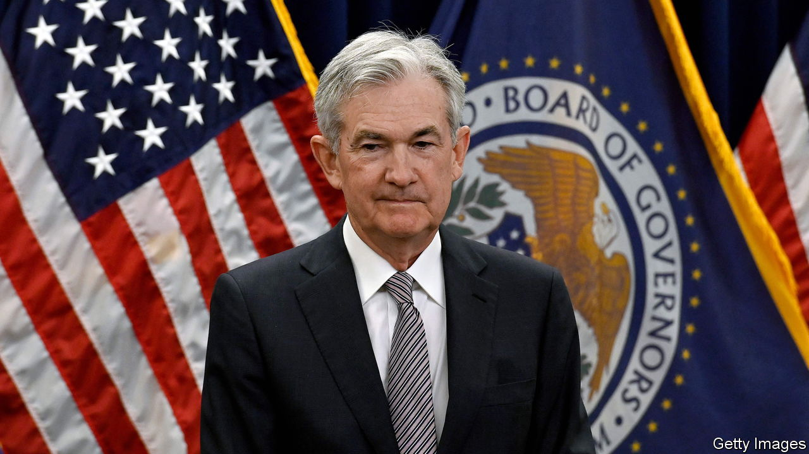
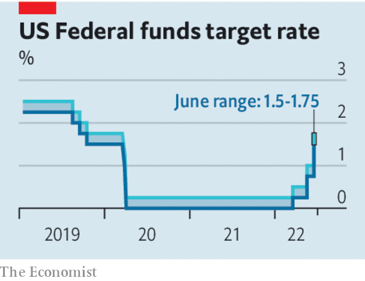

###### The week central banks changed course

# The Fed and the ECB turn on a dime 

##### The contradictions in policymakers’ goals are being exposed 

 

> Jun 15th 2022 

The multi-trillion dollar world of central banking has just turned on a dime. A week ago the Fed was expected shortly to raise interest rates by half a percentage point. The European Central Bank (ecb) had just announced an end to its bond purchases. The Bank of Japan was unusual in its commitment to maintaining monetary stimulus despite growing disquiet about the plummeting yen. By the time our weekly edition was published, however, the Fed had raised rates by three-quarters of a point; the ecb had held an emergency meeting and said it was working on ; and the Bank of Japan, ahead of its meeting on June 16th-17th, had joined the government in lamenting the yen’s weakness.

Turmoil in policy has coincided with . Tighter monetary policy has been crushing American stocks, which are down by almost 20% from their January peak. Cryptocurrencies are crashing, eviscerating investors who were late to the party. The spread between ten-year yields on safe German debt and risky Italian debt reached over 2.4 percentage points the day before the ecb’s announcement. Bond yields have risen and traders have punished currencies, like the yen and sterling, issued by central banks that are unlikely to keep pace with the Fed.

The turbulence is exposing central banks’ contradictory goals. The Fed insists it will tame inflation, which reached an annual rate of 8.6% in May. Yet it is loth to admit that doing so will probably . Even its hawkish pivot this week leaves monetary policy looking muddled. Rules of thumb for how central bankers should respond to underlying inflation say rates should be much higher. The Fed’s dawdling over the past year has worsened the conflict between its competing goals of stable prices and low unemployment.

 


The ecb faces an even tougher dilemma. A side-effect of tighter monetary policy is a squeeze on indebted countries. Governments’ finances will be put under pressure both by the rise in underlying rates and the increase in spreads permitted by a lack of bond-buying. Without a backstop, Italy’s debts of over 150% of gdp could become unsustainable—a possibility which would leave the country vulnerable to a self-fulfilling market panic. The ecb says it will not tolerate the threat such a crisis would pose to the integrity of the currency union. But it is not supposed to sacrifice its inflation target to debt-sustainability concerns. Nor can it underwrite governments to the extent that they can run up vast tabs at the expense of the central bank.

The Bank of Japan is trading off economics against politics. The yen’s weakness could help the country hit its 2% inflation target, having undershot it for almost the entire period since it was announced in 2013. The trouble is that expensive imports are squeezing living standards, alarming the government. Earlier this month Haruhiko Kuroda, the bank’s governor, had to apologise for saying that households were becoming more accepting of price rises.

In this environment the central-banking playbook of the 2010s is failing. It was built around low global inflation and designed to dispel the notion that rates might rise. Pivots are rare because policymakers have been unwilling to surprise markets by breaking their “forward guidance”—even the Fed’s decision this week appears to have been leaked two days earlier. Restricting themselves to sequential policy changes, signalled in advance, makes central banks slow on their feet. The result is more volatility in markets and interest rates, not less. As competing goals make the course ahead harder to predict, central banks would do well to stay nimble. ■

