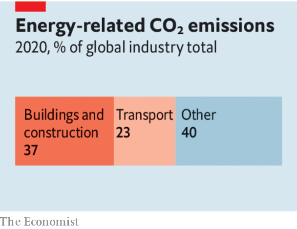

###### Climate change

# The property industry has a huge carbon footprint. Here’s how to reduce it 

##### Some buildings should be retrofitted, others torn down 

 

> Jun 16th 2022 

Buildings have a dirty secret: they are among the . Heating, cooling and powering existing offices, homes and factories accounts for 27% of global energy-related carbon-dioxide emissions. Constructing new ones involves mountains of steel and colossal amounts of cement, and combined with demolition accounts for another 10% of the global CO emitted each year. Building debris generates a third of the European Union’s annual waste by weight. 

What is more, landlords and homeowners, and the construction industry, have a . Only a tiny fraction of properties are carbon neutral, and on the current trajectory it will take nearly a century to decarbonise the rest. As the world urbanises, a dirty building boom beckons: by one estimate, cities will need to add 13,000 buildings every day until 2050, just to keep up with global population growth. 

The pandemic has thrown another spanner in the works. Doubts over the level of future demand for office blocks have reduced landlords’ incentives to undertake green refurbishments, and demand for larger homes to accommodate remote working will crank up residential energy use. 

What can be done? The problem can be divided into three parts. The first goal is to incentivise owners to make existing properties more energy-efficient. In the long run, as electricity generation shifts towards renewables, the emissions arising from air-conditioning and day-to-day power use will fall. But retrofitting offices and homes with insulation, cleverer control systems and heat pumps rather than fossil-fuel boilers can have an immediate impact. In big cities, building codes and city-wide net  can prod commercial landlords to upgrade buildings.

 


Residential housing is more difficult, because many homeowners may have less spare cash and move houses rarely. Subsidies can be hugely expensive: in Italy, you can claim the full cost of green home renovations, plus an extra 10%, through generous tax credits worth up to €100,000 ($104,000) per home. An eye-watering €21bn has been paid out under this scheme since its launch in July 2020, often to wealthy homeowners.  to invest in addressing the knowledge gap and skills shortages associated with green-building technology and refurbishment—and to eliminate red tape so that property-owners who want to improve their energy efficiency, as oil and gas prices surge, can do so more easily. 

The second goal is to facilitate more rational decisions about when to retrofit buildings and when to demolish them and rebuild, which generates waste and pollution but in some cases can reduce emissions overall. Regulations and tax codes are often skewed arbitrarily and can be reformed. In Britain, for example, until earlier this year most new buildings were exempt from value-added tax, but spending on renovations and repairs was not. 

The final goal should be to ensure that the construction of new buildings that does take place is far cleaner than it has been in the past. Green building codes are a powerful tool; in the long run, higher carbon taxes would also force the entire construction and building-materials supply chain to clean up its act. 

The good news is that there is huge room for improvement: new industrial processes can reduce the emissions from cement and steel. Better construction methods, including prefabricated houses, are more energy- and carbon-efficient but rarely used. The construction industry has a dire record on productivity growth—a sign that there has not been enough fresh thinking. Time to start building a new approach.■


